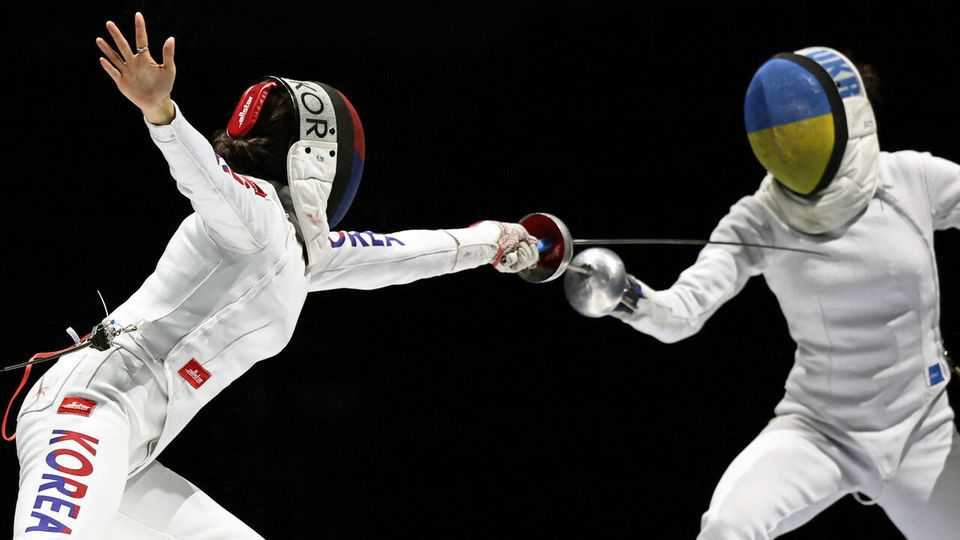

Science & technology | Human biology
In some sports, left-handed athletes seem to have an innate advantage
It is more than just their novelty factor
September 25th 2025

THE LEFT-HANDED have long struggled in a right-handed world. But they are over-represented in one field: one-to-one sports such as fencing and tennis. The conventional explanation for this is that the scarcity of lefties (around one person in ten), means right-handed athletes lack familiarity with them as opponents. But this may be only part of the story. Tim Simon at the University of Trento, in Italy, a fan of fencing, suspected the left-handed enjoy some innate advantage in these sports, over and above their unfamiliarity. As he and his colleagues describe this week in Royal Society Open Science, for some of them that turns out to be true.

To test his idea Dr Simon reasoned that were unfamiliarity the sole explanation for left-hander advantage, then the difference should diminish at the highest levels of a sport, where players would be wise to leftists’ tricks. If, however, some innate factor associated with left-handedness were a cause, then the difference might actually increase. He therefore analysed the performances over more than a decade of the world’s top athletes in badminton, table tennis, tennis and three types of fencing.

The upshot was that in foil and épée fencing, and table tennis, there was indeed an increase in left-handedness at the summit. For example, 18% of the top 200 male épée fencers and 23% of the top male foil fencers were lefties, but that went up to 28% and 31% respectively when only the top 100 were considered. The other three sports, however, did not show this effect.

The difference, Dr Simon suspects, is that foil and épée involve stabbing with small and rapid movements. Table tennis requires similar deftness. Sabre fencing, by contrast, involves larger slashing movements similar to those employed in tennis and badminton. He theorises that this difference may be why lefties dominate in the first three sports but not the others.

He posits that the explanation may stem from left-handed people’s greater reliance than right-handers on their brains’ right hemispheres. The right hemisphere is more important than the left for processing visual, spatial and temporal inputs, and generating motor responses. Though the benefits thus granted are probably tiny, they matter at the top—where being a split second faster than an opponent separates victory from defeat. In Italian, the term for a lefty is sinistro. But there is nothing evil about their ability with a blade. Their neural connections are just better. ■

Curious about the world? To enjoy our mind-expanding science coverage, sign up to Simply Science, our weekly subscriber-only newsletter.

This article was downloaded by zlibrary from https://www.economist.com//science-and-technology/2025/09/24/in-some-sports-left- handed-athletes-seem-to-have-an-innate-advantage