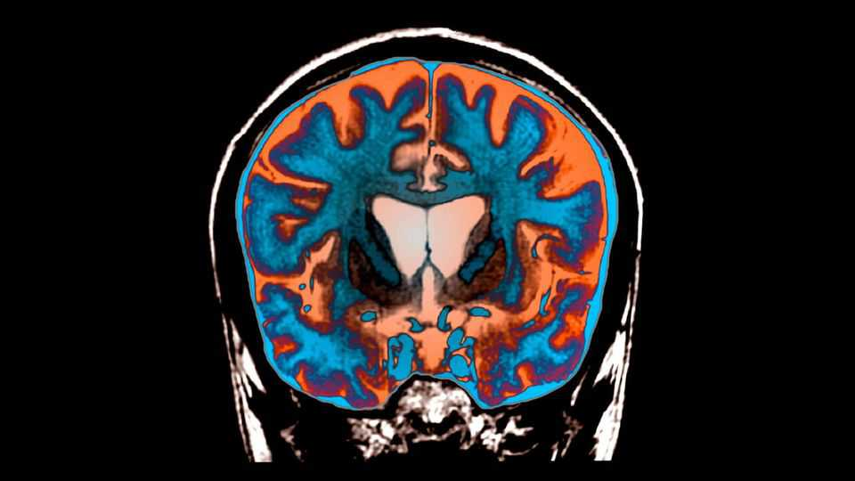

Science & technology | Huntington’s disease
A clever genetic technique may treat a horrible brain condition
It stops the toxic protein that causes it from forming
September 25th 2025

HUNTINGTON’S DISEASE is arguably the nastiest inherited illness around. Symptoms include involuntary jerking, difficulty swallowing and speaking, lapses of memory, lack of concentration, depression, anxiety, mood swings, irritability and personality changes. Eventually, the patient dies. September 24th, though, saw the announcement of a possible treatment, a type of genetic material called a microRNA that halts manufacture of the protein responsible for causing it. Huntington’s is the result of a strange mutation that amounts to a genetic stutter. Three letters of the genetic code, C, A and G, are repeated over and over again in the DNA that encodes a protein called huntingtin. Unlike most

genetic disorders, for which a faulty gene must be inherited from both parents for someone to be affected, Huntington’s requires only one parent to have the stutter for it to be passed on.

Everyone has some CAG repeats in their huntingtin genes, but if there are too many of them, trouble ensues. Something goes wrong with the resulting protein, causing it to accumulate in the cells that produce it, thereby wrecking them. These cells are in the brain.

But none of this happens immediately. Symptoms appear in later life, usually middle age, and are caused because, if the number of genetic repeats a person is born with exceeds 36, the repeat-chain may lengthen over the course of life until the resulting protein becomes toxic. If it is 40 or more repeats, this will definitely occur.

The exact mechanism is debated. But it seems likely that if production of the toxic protein could be suppressed, then the disease’s progress might be slowed or halted. And that is what researchers at uniQure, a firm in Amsterdam, think they have done in their newly announced trial.

They dub their microRNA molecule AMT-130. It is generated by a genetically modified but harmless virus inserted into the brains of Huntington’s patients using a trick called MRI-guided, convection-enhanced stereotactic delivery. This is an established technique capable of great precision in the hands of a trained surgeon. The targets of uniQure’s initial experiments were the caudate nucleus and putamen areas of a deeply buried brain structure called the striatum. These are the places first affected by the illness.

Once they have arrived in a cell’s nucleus the viral genes turn out AMT-130. RNA is a molecule similar to DNA, though with a slightly different chemistry. Like DNA, two strands of RNA will bind together if their genetic letters complement each other. AMT-130 is designed to glom onto the messenger RNA molecules that carry instructions about how to make huntingtin from the DNA in a cell’s nucleus to its protein factories. The resulting double-stranded RNA is quickly recognised by a cell as alien, and destroyed. As a bonus, the AMT-130 has a similar effect on what is known

as the toxic exon-1 isoform. This is an additional toxic molecule which is a fragment of affected huntingtin.

UniQure’s trial includes 29 people in America and Europe, and has been going on for three years. It reported a 75% slowing of disease progression, according to one widely used measure of Huntington’s development, and a 60% slowing of progression by another. It reported, too, that a biochemical signal associated with disease severity, which can be sampled from the cerebrospinal fluid, was reduced. There were few worrying side-effects.

This is clearly good news, though there is no claim of a cure and if it can be turned into a treatment, that will surely be an expensive one. But uniQure estimates that 100,000 people in America alone carry the overlong repeat segments in their huntingtin genes, of whom 40,000 already have symptoms. This result will surely give them some hope. ■

Curious about the world? To enjoy our mind-expanding science coverage, sign up to Simply Science, our weekly subscriber-only newsletter.

This article was downloaded by zlibrary from https://www.economist.com//science-and-technology/2025/09/24/a-clever-genetic- technique-may-treat-a-horrible-brain-condition