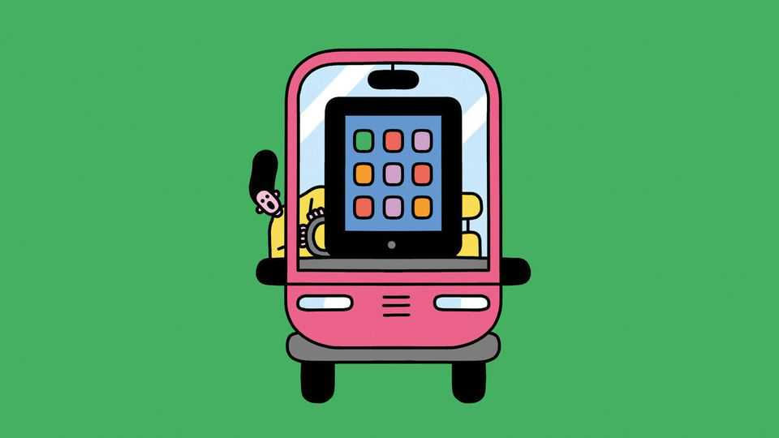

Science & technology | Well informed
Are touchscreens in cars dangerous?
Probably—and safety organisations are beginning to take note
September 25th 2025

It might not have been the first to have a touchscreen, but it was Tesla’s Model S, with its minimalist cabin built around a huge full-colour display, that set the trend. For years almost every new car sold has come with a high- tech, futuristic screen, which controls everything from the air conditioning and satnav to the music. Even safety features like automatic lane-keeping are sometimes screen-controlled. But are touchscreens safe? The case for the prosecution is straightforward. If fiddling with the screen of a smartphone while driving is distracting, and therefore dangerous (and in many countries will earn you a fine), then doing likewise with your car’s is probably risky too.

Drivers can learn where physical controls are, and press buttons or twiddle dials without taking their eyes off the road (not least because a lot of the most useful ones are often on the steering wheel). A touchscreen offers no physical feedback, making that harder. And a screen does dozens of jobs, so finding a particular setting often means tapping through several sub-menus. The result, say critics, is a dangerous distraction built into the car itself.

Research backs that up. In 2022 Vi Bilagare, a Swedish motoring magazine, measured how long it took drivers to do things like switching to a new radio station or changing the temperature, while driving at 110 kilometres per hour. It compared 11 cars with touchscreens to a single older model with real buttons.

In the old car, drivers were able to do all their tasks within about ten seconds, during which time the car travelled around 300 metres. In the worst-performing modern car (an MG Marvel R) the same tasks took 45 seconds, during which the car travelled 1.4km. Even in the best-performing models (from Volvo, a pricey Swedish brand, and Dacia, a cheap Romanian one), testers still took several seconds longer than they had done in the old car.

Another study—done in 2024 by researchers at SINTEF, a Norwegian contract-research organisation—used gaze-tracking cameras to compare how long drivers were distracted while performing different tasks on a touchscreen. Even the quickest job—changing the temperature—meant three and a half seconds, on average, of not looking at the road. Finding a new radio station took 11 seconds, and putting a new address into the satnav took 16. An analysis published in 2020 by the Transport Research Laboratory, a British organisation, found that touchscreens impaired a driver’s reaction time more than driving over the legal alcohol limit.

Safety organisations are beginning to notice. From January new rules from Euro NCAP, an organisation that provides safety ratings for cars sold in Europe, will mean no car can get a full five-star score unless certain crucial functions—indicators, for instance, or the windscreen wipers—are controlled by real switches. Euro NCAP’s safety guidelines have no legal force. But carmakers use its ratings as a selling-point.

Carmakers that revert to buttons may reap other benefits, too. Many drivers dislike touchscreens for reasons other than safety, finding them fiddly and annoying to use. Volkswagen, Hyundai and Porsche, among others, have begun restoring at least some buttons to their new models, citing drivers’ aversion to screens. But innovation never stops. Even as touchscreens are falling out of favour, many manufacturers are turning their attention to voice control—though that is a subject for another story. ■

Curious about the world? To enjoy our mind-expanding science coverage, sign up to Simply Science, our weekly subscriber-only newsletter.

This article was downloaded by zlibrary from https://www.economist.com//science-and-technology/2025/09/19/are-touchscreens-in- cars-dangerous

Culture

The market for Indian art is booming Who was the greater singer: Pavarotti or Fischer-Dieskau? First, they come for the comedians Why you should read Tawada Yoko’s books Golf videos going viral? These days it is par for the course SKAI ISYOURGOD: the Chinese rapper thrilling global audiences