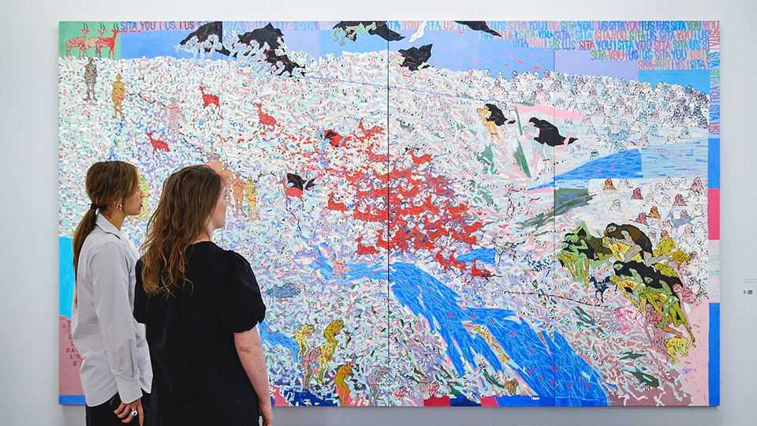
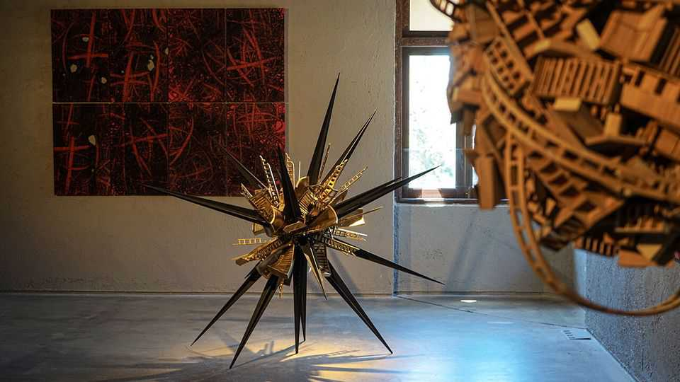

Culture | Land of colours
The market for Indian art is booming
A healthy economy is driving demand among domestic and diaspora buyers
September 25th 2025

THE BUDDHA wears a tranquil expression, with downcast eyes and pursed lips. Look closely, however, and you notice that his face is made up of a jumble of pots, pans and other kitchen utensils. The immense black-and- brass sculpture is by Subodh Gupta, one of India’s leading contemporary artists, who, like Marcel Duchamp, repurposes everyday objects. (For this reason Mr Gupta has also been dubbed the “Damien Hirst of Delhi”.) “Buddha Head” dominates Shalini Passi’s garden. Inside her house in Delhi there is enough modern and contemporary Indian art to fill a small museum: striking paintings by M.F. Husain, another of India’s most admired artists, hang alongside prints, photographs and video installations. Ms Passi—a

collector, philanthropist and the breakout star of “Fabulous Lives of Bollywood Wives”—is one of a growing number of Indians with the taste and money to build an impressive art collection.

Auction houses, collectors and gallerists at home and abroad say the same thing: Indian art is having a moment. Artsy, an online art marketplace, says that Indian artists saw the largest surge in demand on their site in 2024. In March a painting by Husain, who died in 2011, sold for $13.8m—a record for a modern Indian artist. Sotheby’s is selling several works by F.N. Souza, a contemporary of Husain’s, in its Modern and Contemporary South Asian Art auction on September 30th. “Houses in Hampstead” (1962), an eerie city scene, and “Emperor” (1957), of a long, forbidding face, have estimates between £800,000 and £1.5m ($1m and $2m).

In the world of high-end art sales such sums no longer stop the presses. It is worth noting, however, that in 2000 and 2002 those same works by Souza sold for £3,000 and £1,200 (about £5,750 and £2,250 in today’s money). Does that remarkably steep appreciation point to a reorientation of the global art market, similar to the one Chinese buyers pulled off earlier this century? Or is this simply another bubble, like the one Indian art saw two decades ago?

Many are happy to make the bull case. The comparison to the boom in 2006- 07, they argue, is inapt. “Back then,” says Manjari Sihare-Sutin, Sotheby’s head of Indian and South Asian art, “there was this thing about the BRICs,” meaning Brazil, Russia, India and China, “and there was lots of speculation.” Western gallerists and art journalists looking for the next big thing came to India; contemporary artists attracted wildly inflated prices. That boom ended with the global financial crisis of 2007-09. The speculative market crashed and the trend-hunters moved on.

It is different today, says Roshini Vadehra, a gallerist in New Delhi. Twenty years ago, she explains, “international speculators pushed up prices. Now the domestic market is strong and driving prices here…It feels more stable.” That is largely a result of India’s buoyant economy: excluding the pandemic year of 2020, India’s GDP has grown annually by an average of 7.1% since 2009. Prices are rising accordingly. Ms Sihare-Sutin notes that her sale in March was expected to bring in $4.6m, but made $16.8m (including the

record price for the Husain). The average lot price was $464,000, up from $110,000 in 2022.

It is not just auction houses that are benefiting from India’s strong domestic market. India has developed a calendar of art fairs in Delhi, Kochi and Mumbai. As Ms Vadehra explains: “There is a new crop of buyers post- covid, a generation of people in their 30s and 40s…They know that having good art on their walls gives them an entirely different social and cultural status.” Martand Khosla, who makes masterfully complex paintings and sculptures evoking urban construction and decay, says that many of his works are bought by interior designers to enhance new homes.

Decorative art is vivifying India’s corporate buildings, too. The grounds of Maker Maxity, a vast complex in Mumbai with five office towers, a mall and a private club, show off Indian contemporary art. The entryway of one building features a piece by Srinivasa Prasad. A bullock cart is mid- explosion—its contents are secured in the air by strings—in a comment on migration.

And major institutions outside India are taking an interest. Sohrab Hura, a photographer, painter and film-maker whose work has a darkly comic quality, recently had a solo show at PS1, part of the Museum of Modern Art

in New York. This year Arpita Singh, who makes huge, dreamlike oil paintings that reflect on India’s development, had her first solo show outside India at the Serpentine Gallery in London (pictured top).

All the same, there is a bear case. India’s “modern masters”—a group of painters including Husain, Souza, S.H. Raza and others who studied with, and were influenced by, European Modernist artists—may fetch high prices at auction. But there are not many other blue-chip artists. Gallerists complain that too many domestic buyers simply follow trends and are too price-conscious. Meanwhile buyers in the diaspora, one gallerist notes, can be “really conservative. They just want gods and goddesses and Krishnas.”

Then there is policy. India’s instinct for protectionism extends to culture as well as industry: it wants to keep its best artists’ work at home. The Antiquities and Art Treasures Act of 1972 heavily restricts the export of any object more than 100 years old, as well as work by nine artists designated “national treasures”. Some worry about that list being expanded. Gallerists also fret over a thicket of confusing regulations, leaving them uncertain whether they can import art to sell on consignment.

None of that hinders the growth of a robust domestic market, however. Though some in India’s art world are concerned that the ecosystem for finding and nurturing young artists is underdeveloped, it is growing. Perhaps India does not want to become a destination for international art sales, like London or New York. It may be content to keep its best works at home, look inward and focus on developing stronger museums, galleries and arts education. That is one advantage of being the world’s most populous country: it needs foreign buyers less than artists in, say, Belgium or Guyana might. But it also ensures that even if the bull case is right, and the market for Indian art is maturing and deepening rather than entering another bubble, it will remain more isolated and have less of an impact on the global market than it otherwise would. ■

For more on the latest books, films, TV shows, albums and controversies, sign up to Plot Twist, our weekly subscriber-only newsletter

This article was downloaded by zlibrary from [https://www.economist.com//culture/2025/09/25/the-market-for-indian-art-is-booming](https://www.economist.com//culture/2025/09/25/the-market-for-indian-art-is-booming)