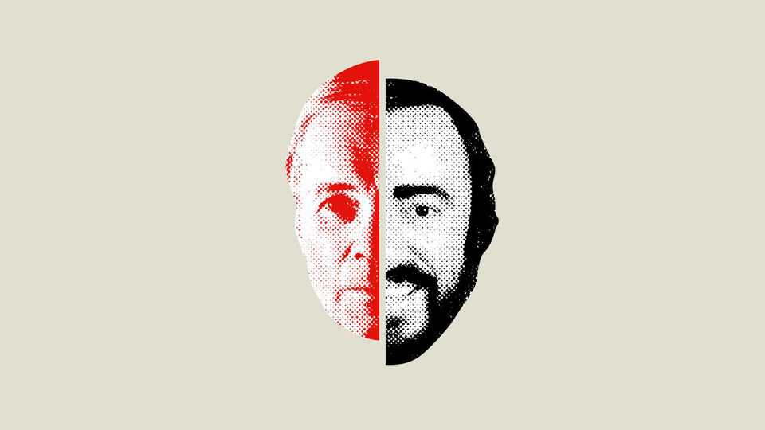

Culture | Classical music
Who was the greater singer: Pavarotti or Fischer- Dieskau?
Their 90th and 100th birthdays offer an opportunity to consider them together
September 25th 2025

THE CONCERT may be better remembered than the football World Cup final that followed it (West Germany beat Argentina 1-0). On July 7th 1990 three tail-coated tenors, backed by more than 200 musicians, belted out arias and songs in the Baths of Caracalla in Rome, watched by 800m people on television. The concert’s emotional climax was “Nessun dorma” (“No one shall sleep”), from Giacomo Puccini’s opera “Turandot”. The aria itself culminates in a triumphant declaration—Vincerò! (“I will win!”)—that crests and breaks like a wave. Luciano Pavarotti, already famous enough to have appeared on the covers of Time and Newsweek, became much more so after his ringing high B.

That month Dietrich Fischer-Dieskau gave a rather different concert in Munich: a recital of songs by Hugo Wolf, an Austrian composer of the 19th century, accompanied by a lone pianist. Leonard Bernstein, a conductor and the composer of “West Side Story”, thought Fischer-Dieskau “the most significant singer of the 20th century”. If tv cameras were on hand for the recital in Munich, there is no record of it.

Both singers are being feted this year—Fischer-Dieskau was born 100 years ago in May, Pavarotti would have been 90 in October—with concerts and re- releases of their recordings. Pavarotti’s commemorations, unsurprisingly, are on a grander scale: the two surviving tenors, Plácido Domingo and José Carreras, will join other stars for a concert in Verona on September 30th. Although Fischer-Dieskau and Pavarotti were very different singers who almost never shared a stage (they performed “Aida” in Berlin in 1982), they are worth remembering together. The achievements of one illuminate those of the other, and cast light on the careers of their successors.

Their voices consigned them to different fates. Tenors are the top guns of the operatic world, performing aerobatic feats and often winning, or tragically losing, the damsel. Decca, Pavarotti’s record label, marketed him as “king of the high Cs”. Baritones like Fischer-Dieskau, who sing closer to the pitch of normal speech, generally have less glamorous roles.

The singers’ temperaments diverged more than their voices did. Born in Modena in northern Italy, Pavarotti was an exuberant lover of pasta and Lambrusco. He did not read music well and had trouble learning the words of the arias he sang so thrillingly. Fischer-Dieskau, born in Berlin, had a less sunny start in life. The Nazis starved his disabled brother to death, and drafted the future baritone into the army. It is said that on the Russian front he sang to the horses that were his charges. He ended the war, and began his career, singing for fellow prisoners at an American pow camp near Pisa, not far from Modena.

Though Fischer-Dieskau was an opera singer, his speciality was Lieder, German songs. His “Nessun dorma” was probably “Winterreise”, a haunting song cycle by Franz Schubert, which Fischer-Dieskau recorded seven times. Whereas Pavarotti threw out a net, his “glorious voice and rich sound reaching every corner of the hall”, Fischer-Dieskau wanted to “pull the net

back with fish in it”, drawing the audience to him, says Benjamin Appl, a baritone who was his last student and has recorded an album in homage to him. The experience was intimate, as much intellectual as emotional. Fischer-Dieskau was obsessed with words, to the point where some critics accused him of sacrificing to them the song’s melodic line.

Pavarotti’s sins, said detractors, were sloth and selling out. Especially after the first Three Tenors concert, he sang for stadium-size audiences and with the likes of Elton John and Celine Dion, usually for charity. He performed in “tinselly pop concerts in which he mouths his way through songs he has no idea how to sing”, wrote his former manager in a catty biography.

The fragmentation of the media means that another classical musician may never experience fame like Pavarotti’s (and many do not aspire to it). But his spirit lives on in the growing number of performers who use social media to build genre-straddling careers. Anna Lapwood, an organist with 1.4m followers on TikTok, is as likely to play music from “Star Wars” as a Bach fugue. Ray Chen, meanwhile, has 620,000 fans on TikTok. On his album “Player 1” he plays video-game and anime music on a Stradivarius violin made in 1714.

As for Fischer-Dieskau, “My students now, most of them don’t know his name,” laments Mr Appl. Every music lover should. Treat yourself to his recording of “Winterreise” from 1971, with Gerald Moore at the piano. ■

For more on the latest books, films, TV shows, albums and controversies, sign up to Plot Twist, our weekly subscriber-only newsletter

This article was downloaded by zlibrary from https://www.economist.com//culture/2025/09/25/who-was-the-greater-singer-pavarotti- or-fischer-dieskau