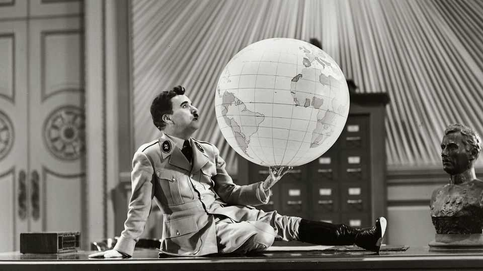

Culture | Back Story
First, they come for the comedians
But, try as strongmen might, the jokes always get away
September 25th 2025

Josef Stalin loses his pipe and informs his security chief. Later he finds it behind the sofa. “That’s impossible,” says the henchman, “three people have confessed to stealing it!” Lots of jokes were told about the Soviet generalissimo, proliferating long after he died. For instance: Stalin’s ghost visits Vladimir Putin. “Kill your opponents and paint the Kremlin blue,” he advises. “Why blue?” asks Putin. The ghost smiles. “I knew you wouldn’t query the first part.” While the tyrant lived, it was reckless to tell such jokes in public or to anyone who might report them. Even hearing them could be calamitous. “Who built the White Sea canal?” runs a gag about a monstrous

infrastructure project. “The right bank was dug by the joke-tellers—the left by those who heard them.”

“Every joke”, wrote George Orwell, “is a tiny revolution.” To silence the comedians, some autocrats use torturers and the gulag; in today’s Egypt and other stifled places, the penalties for ridicule can be prison and exile. In America the relatively mild tools include menacing regulators, as Jimmy Kimmel, a talk-show host, has learned. Yet whatever the comics’ fate, the jokes themselves get away.

Authoritarians are inherently funny. Humour thrives on pretence and delusion—and the strongman is always pretending. He poses as a saviour but is actually a brute; he purports to be omnipotent but is as flawed as other mortals, or more. If he has an ideology, it is deficient too. Prickly and narcissistic, strongmen can rarely take jokes, which makes them risky but funnier. The Nazis banned “The Great Dictator” (pictured), in which Charlie Chaplin sent up Adolf Hitler, but the Führer reputedly watched it twice. Saddam Hussein tried to murder the cast of a satirical film.

Political jokes, meanwhile, are the ideal weapon of the weak. Even without the internet, they travel at warp speed, traversing a country before the censors have their pens out. (According to a report cited in a BBC documentary, the KGB found a joke could cross Moscow in a matter of hours.) Crucially, a good gag is collusive, recruiting listeners to the teller’s side—or rather, making clear which side they are already on. They can’t help finding it funny, and it is funny because, at bottom, it is true. This bond can be a launch pad for politics, as it was for Beppe Grillo in Italy and Volodymyr Zelensky in Ukraine.

Naturally, autocrats fret about people knowing that other people are thinking like them. According to the maximalist logic of repression, the fact that laughter is intimate, spontaneous and ephemeral heightens its appeal as a target: if rulers can suppress wit, they can control everything. But they can’t. As Ben Lewis recounts in “Hammer & Tickle”, a book about humour under communism, trying to squish a joke tends to spread it instead.

When the laughter police give up this unequal fight, it is sign of liberalisation, voluntary or otherwise. At the fag-end of the Soviet Union,

even Mikhail Gorbachev, its last leader, wisecracked about discontent and shortages. (“The working classes consume plenty of cognac—through their chosen representatives.”) A big comedy festival in Riyadh, beginning on September 26th, is supposed to advertise Saudi Arabia’s new freedoms. Hmmm: Tim Dillon, an American stand-up due to attend, says he was disinvited over a riff the organisers didn’t like.

Canny authoritarians see the benefits of letting the gags flow. “If they are telling jokes about me,” Leonid Brezhnev is said to have remarked, “it means they love me,” and he wasn’t altogether wrong. Scabrous as it may be, satire always contains a trace of homage; after all, nobodies are never satirised. Humour can be a safety-valve for dissent and a homeopathic dose of plurality. It can also offer raw intel on the national mood, relaying hard truths and bad news as medieval jesters sometimes did to kings.

But the wiliest strongmen, including some populists today, commandeer the audience. In an age when the struggle for power is a battle for attention, they are the carnival-barkers of the public square, dealing as much in one-liners and theatrical taunts as in policy. As politics is repackaged as entertainment, crackdowns—on comics and others—become part of the show, the threat to free expression blurred by the spectacle.

The story of Bim-Bom, a circus-clown duo, is an ominous parable. Performing in Moscow in 1918, they made jokes about the Bolsheviks that the secret policemen in attendance disliked. The goons rushed the stage to arrest them. Thinking the chase was part of the act, the crowd hooted with laughter.■

For more on the latest books, films, TV shows, albums and controversies, sign up to Plot Twist, our weekly subscriber-only newsletter

This article was downloaded by zlibrary from [https://www.economist.com//culture/2025/09/22/first-they-come-for-the-comedians](https://www.economist.com//culture/2025/09/22/first-they-come-for-the-comedians)