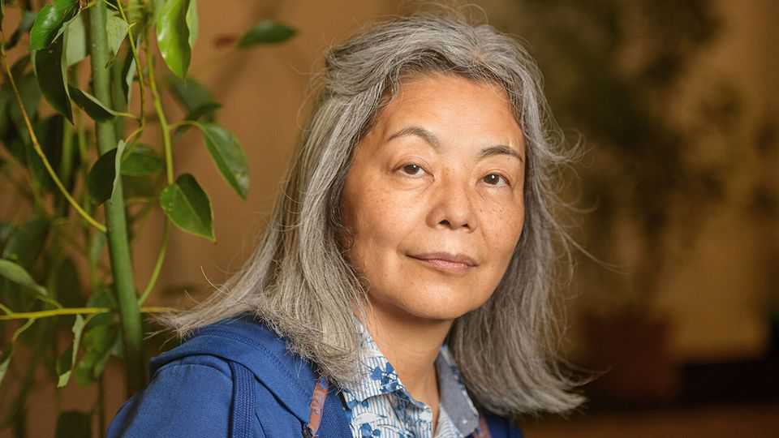

Culture | Writing on the borderline
Why you should read Tawada Yoko’s books
The author, who writes in both Japanese and German, is regarded as a future Nobel laureate
September 25th 2025

TAWADA YOKO (pictured) is often asked what language she dreams in. She finds the question tiresome. The author grew up in Japan, lives in Germany and writes in both Japanese and German. Implicit in such probing, she writes, is the assumption that “It’s impossible for people to truly speak two languages—that one of them must be the ‘fake’ language and the other must be the ‘real’ language.” Ms Tawada resists such notions: “Maybe what I really want is not to be a writer of this or that language in particular, but to fall into the poetic ravine between them.” For nearly 40 years, Ms Tawada has wandered that ravine, producing work of uncanny beauty and uncommon potency. She regularly switches between

writing in Japanese and German, which she learned after moving to Hamburg in her 20s. In “The Naked Eye” she went so far as to alternate between the two within a single project, writing five sentences in German and translating them into Japanese, then writing five sentences in Japanese and translating them into German, until she was left with two translations of a book with no “original” version.

Ms Tawada is hardly the first author to write in a language that is not her mother tongue—Chinua Achebe, Milan Kundera and Joseph Conrad, among others, all did—but she takes the practice further than most. Her writing has rightly earned praise from around the world. She has won literary prizes in both Japan and Germany. “The Emissary”, a disorienting dystopian novel, was about Japan in the wake of a disaster; it won America’s National Book Award for translated literature in 2018. Many literary folk reckon she will one day win the Nobel prize.

Two books newly published in English offer a glimpse of her kaleidoscopic world. “Exophony”, an essay collection, is the first of Ms Tawada’s non- fiction works to become available to Anglophones. The essays unspool the idea of “exophonic literature”. In contrast to so-called “immigrant literature”, with its connotations of outsiders entering, in exophonic literature “a writer is going from the inside out”. She reflects on the expressive possibilities that are available “when you step outside the cocoon of your own mother tongue”.

The second title, “Archipelago of the Sun”, is the final volume in an acclaimed trilogy of novels. The series follows a travelling band of eclectic multilingual friends: Hiruko, a young woman living in Europe when her homeland disappears in an environmental disaster (though never named, it is clearly Japan); Susanoo, an enigmatic Japanese man; Nanook, a Greenlander who lives in Denmark and pretends to be Japanese; Knut, a Danish linguist enamoured of Hiruko; Nora, a German librarian enamoured of Nanook; and Akash, an Indian student in the process of transitioning from male to female. They board a boat hoping to travel east to find Hiruko’s lost homeland, but mostly end up circling the Baltic Sea with their fellow passengers, many of whom turn out to be dead writers and mythological figures.

Both titles demonstrate Ms Tawada’s distinctive style—somehow both delightfully dreamlike and cuttingly sharp—and her enduring interest in inbetween-ness of all kinds. She explores the spaces between cultures, genders, epochs and species. (An earlier novel, “Memoirs of a Polar Bear”, is written from three bears’ perspectives.)

She posits foreignness as a healthy, even necessary, condition for a writer— and a balm against nationalism. “In Argentina, no one cared about what made Poland great,” a dead Polish writer tells the travellers aboard the boat in “Archipelago of the Sun”. “A life surrounded by foreigners can cure you of the disease called ‘our-country-is-best-itis’.”

That is a timely message as nationalism is on the march in countries around the world. But Ms Tawada’s interest is in language more than politics. Her writing hinges on wordplay that her deft translators mostly manage to convey. The characters in “Archipelago of the Sun” speak at least half a dozen tongues between them. Akash’s English is “like a suit of old clothes, worn until the soft folds followed his every move”. Hiruko often slips into Panska, a pan-Scandinavian language she invented after wandering the region.

In Ms Tawada’s telling, language, like the ocean, flows beyond borders. As well as carrying the travellers along, the water provides a recurring metaphor in “Archipelago of the Sun”. As the group approaches the end of the book— but not their intended destination—characters see themselves in the blue. “We were like those waves,” Hiruko says. “We pushed against each other, bumped into each other, lost our shapes and found new ones.” ■

For more on the latest books, films, TV shows, albums and controversies, sign up to Plot Twist, our weekly subscriber-only newsletter

This article was downloaded by zlibrary from https://www.economist.com//culture/2025/09/25/why-you-should-read-tawada-yokos- books