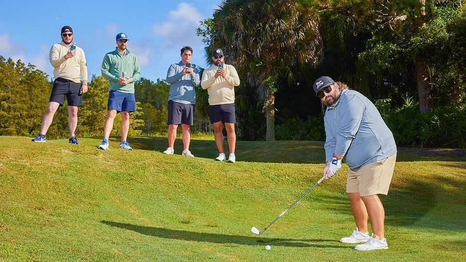
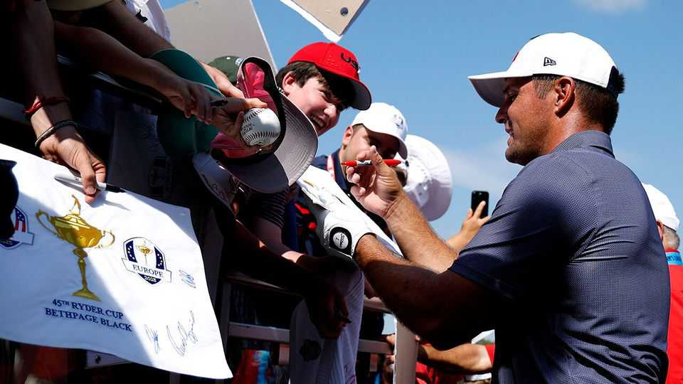

Culture | Putt on a good show
Golf videos going viral? These days it is par for the course
Influencers have transformed a staid sport into high-spirited entertainment
September 25th 2025

THE BEST golfers make every drive, chip and putt look easy, but anyone who has ever picked up a club knows that each shot can go wrong in myriad embarrassing ways. Grant Horvat, a skilled amateur golfer, has found fame online by illustrating the chasm between the experts and the weekend crowd. His videos have been watched more than 250m times on YouTube; in one series he meets pros and tries to beat them over a few holes. To promote the Ryder Cup, a biennial tournament played between teams from America and Europe, the Professional Golfers’ Association (PGA) pitted Mr Horvat, an American, against Tommy Fleetwood, a British pro

golfer. They played at Bethpage Black, the fiendishly hard course in New York that will host this year’s contest between September 26th and 28th. (Mr Horvat, who was given a three-hole lead with only five to play, prevailed.)

It is telling that the organisers of one of golf’s most prestigious events enlisted a YouTuber. The sport is hugely popular online: on Instagram more than 40m posts are tagged #golf and on TikTok the hashtag has 125bn views. Broadcast-television ratings for the sport, however, have been in long-term decline. This is partly because the best professional players are split across the PGA Tour and LIV, a rival Saudi-backed tour set up in 2021, which has made formal contests a bit less competitive and exciting. And it is partly because golf videos are a great deal of fun.

A generation of fans is celebrating the best bits of the sport and ignoring the stuffy aspects. Bob Does Sports (pictured top) films camaraderie on the green. The group’s stunts—which often bring together hard liquor and hard shots—have accumulated 285m views on YouTube. Other creators focus on trick shots, thereby emphasising the dexterity and accuracy that top players need, and reminding viewers why golf is so hard to master. In 2021 Matt Scharff, part of Good Good Golf, another group, hit a hole-in-one from 285 yards; the video has been viewed almost 6m times. A duo called Max and Harry try to hit eggs, wine bottles and vases from a distance.

Bryson DeChambeau (pictured above), a two-time US Open winner from California, has got in on the action. Previously considered somewhat humourless for his monomaniacal focus on physics to improve his swing, Mr DeChambeau has reinvented himself online. In his YouTube videos, which have 450m views, he completes some sort of semi-serious challenge (“Can I Break a Public Course Record in One Try?”) or enjoys a round with a famous figure (such as Donald Trump). Mr DeChambeau’s output has made him even more of a superstar.

Golf companies now pay YouTubers and TikTokers, as well as promising young players, to advertise their wares. Kai Trump, the president’s teenage grand-daughter, ticks both boxes: she aspires to be a professional golfer after college and has 3m TikTok followers. She has signed lucrative deals with TaylorMade, an equipment firm, among others.

The golf world is wise to embrace content creators. As any novice player knows, turning up for the first time at a club can be daunting: perhaps the members will chastise you for wearing the wrong shoes or scoff at your shanked drive. By contrast, many of the most popular golf videos on social media make the game feel more welcoming. LIV has made a series of films in which it pairs its pros with YouTube amateurs. The PGA Tour has organised competitions just for influencers, dubbed “Creator Classics”, in the past year.

Yet organisers could make better use of online celebrities. Mr Horvat recently declined an invitation from the PGA Tour to play in one of its events because he would not be able to film his round. The PGA Tour’s broadcast partners need not see YouTubers as competitors. The National Basketball Association, for example, shares footage with select influencers to republish on their own channels.

Indeed, YouTubers and TikTokers may be teeing up golf’s next star. As a child Rory McIlroy, the winner of the Masters in April, would practise chipping balls into his mother’s washing machine. It takes only one viral video for a youngster to get into the swing of things. ■

For more on the latest books, films, TV shows, albums and controversies, sign up to Plot Twist, our weekly subscriber-only newsletter

This article was downloaded by zlibrary from https://www.economist.com//culture/2025/09/25/golf-videos-going-viral-these-days- it-is-par-for-the-course