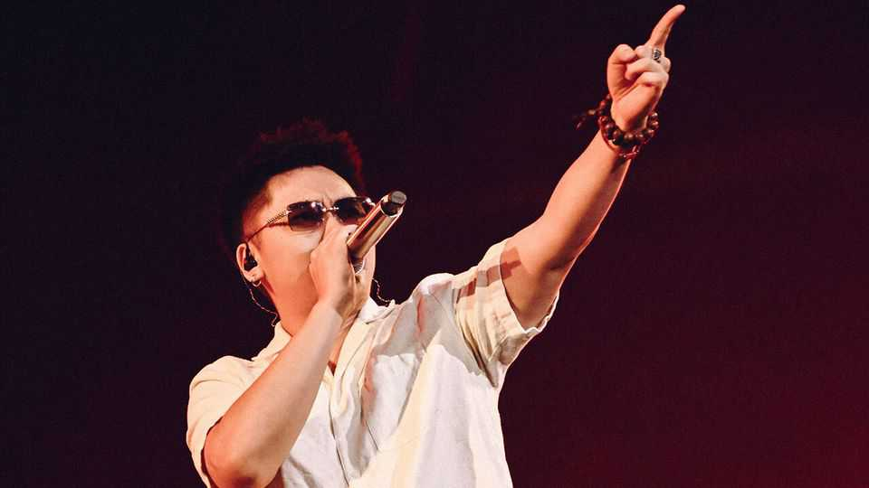

Culture | From Huizhou to Hackney
SKAI ISYOURGOD: the Chinese rapper thrilling global audiences
He is playing to crowds in Australia, Britain, France and Italy
September 25th 2025

Up-and-coming rappers have long flocked to east London. Dizzee Rascal and Tinchy Stryder grew up in the area and went on to conquer the British music charts. Local venues and radio stations have championed acts from Los Angeles to Lagos. On September 26th and 27th E1, a nightclub, will host another hot new talent. SKAI ISYOURGOD (pictured) will perform hits including “Blueprint Supreme”, “Karma Code” and “Stacks from All Sides”. Two things are unusual about this. One is that SKAI ISYOURGOD—the wordy stage name of Chen Xukai, a rapper from Huizhou—raps in Chinese. Chinese music has rarely found a wide listenership outside the country,

despite China’s huge diaspora, and yet Mr Chen has quickly become a global star. On Spotify, a streaming platform, Mr Chen has 4.6m monthly listeners, by far the most of any Chinese artist, and up from just 400,000 earlier this year. On YouTube Music he has a monthly audience of 350m people. (The figure counts various formats, including videos that feature his songs.) That makes Mr Chen’s reach on the platform greater than that of household names in Western hip-hop, such as Eminem (300m), Kanye West (150m) and Drake (110m).

The other unusual thing is that Mr Chen’s lyrics are often devout instead of dirty, somewhat closer to monk life than thug life. The 27-year-old raps about such subjects as divine remonstrations and earthly trappings, blending hip-hop beats with traditional Chinese instruments. “God reminds me not to lose my kindness in this life,” Mr Chen says in “Karma Code”. By contrast with boastful American rappers, on “Blueprint Supreme” he warns that “People obsessed with wealth have no sense of righteousness.”

China has a longer tradition of hip-hop than perhaps many realise. In the late 1990s and early 2000s underground hip-hop groups, such as Yin Ts’ang, started to emerge; later acts such as Jay Chou, a Taiwanese pop star, incorporated rap verses into their tracks. A turning-point for the genre came in the 2010s, says Zou Sheng, a media scholar at Hong Kong Baptist University. Hip-hop artists started performing on music shows, which propelled rap into the mainstream. The first season of “The Rap of China” in 2017, which featured artists facing each other down in “rap battles”, racked up 2.5bn views online. By 2020 rap was the second-most-streamed genre on NetEase Cloud Music, a Chinese streaming service, second only to pop.

What sets Mr Chen apart from his peers? He studied at a performing-arts school and, since he started releasing music in 2020, has experimented with different sounds. His fans point to his songs’ catchy beats, flowing lyrics and memorable loops. These attributes have also helped the songs go viral on social media and reach audiences who are curious about foreign-language fare. On TikTok there are almost 600,000 videos which feature “Blueprint Supreme” and 460,000 which use “Stacks from All Sides”. Roland, a 39- year-old man from Zurich, does not speak a word of Chinese, but knows the lyrics to “Blueprint Supreme” by heart.

After Britain, Mr Chen will perform to audiences in France, Italy and Australia and he is expected to announce an American tour soon. Though Chinese rap has a way to go before it rivals K-pop and other regional cultural exports, it may be that Mr Chen will encourage curiosity about Chinese hip-hop, as Bad Bunny, a Puerto Rican rapper, did with Spanish- language songs. For his part, Mr Chen seems confident he is up to the task. On “Green in Drought” he portrays himself as the man enlivening his country’s hip-hop scene: “SKAI ISYOURGOD brings green belts to plant in the cultural desert.” ■

For more on the latest books, films, TV shows, albums and controversies, sign up to Plot Twist, our weekly subscriber-only newsletter

This article was downloaded by zlibrary from https://www.economist.com//culture/2025/09/25/skai-isyourgod-the-chinese-rapper- thrilling-global-audiences

Economic & financial indicators

Economic data, commodities and markets