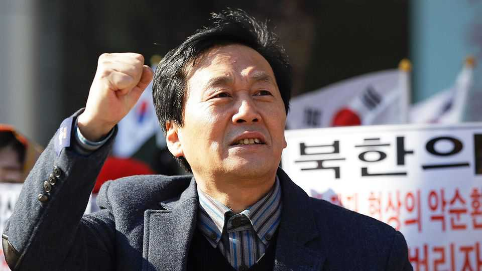
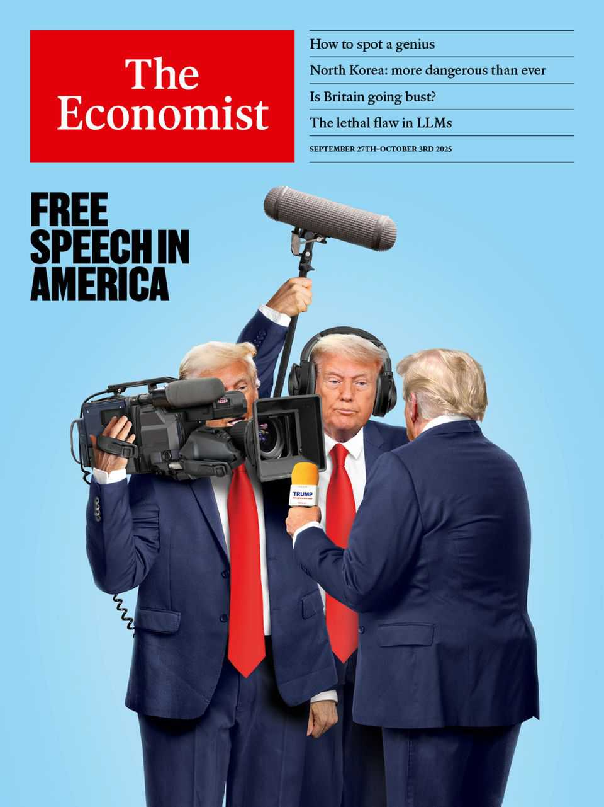

Obituary | Last train to freedom
Kim Seong Min risked everything to escape from North Korea
The activist, poet and broadcaster died on September 12th, aged 63
September 25th 2025

He could not shake the shackle off. At the other end of it was a North Korean officer, who went with him everywhere. If Kim Seong Min as much as used the lavatory, the officer came along too. For three days they were yoked like this, hostile twins, while the train crept through northern North Korea. The punishment for his crime, leaving North Korea without permission as a captain in the army, was public execution. But he was hatching a plan. As the lavatory became ever filthier, the officer at last let him go by himself. Once in, jumping to swing on a ceiling beam, he kicked out the wood-frame window and tumbled after. The train was going at around 50 miles an hour, but he was lucky; he landed in the soft-turned soil of a sesame field. Then, his broken shackle still dangling, he ran away.

It was his second escape. On his first, a well-tried route from Pyongyang to China by wading across the Yalu river, he had been picked up by the Chinese police, lightly tortured, handed to North Korean agents, tortured more and put on the train. After his jump, he was more successful. Undetected he got back to China, worked in a coal-briquette factory, managed to get counterfeit papers and three years later, in 1999, flew to South Korea as easily as any businessman. Yet his business was very different. It was to broadcast truth, by all means possible, back into his home country.

His reasons for escaping from North Korea were both proximate— disciplinary trouble in his army unit, illegal letters to his uncle in China— and slower-growing. For all his boyhood and for most of his ten years of military service he was completely loyal to the Supreme Leaders, Kim Il Sung and Kim Jong Il: singing the songs of gratitude, cursing his country’s enemies. He never made much of a soldier, because he wanted to be a poet; a fine poet, like his father. It was rare that he even put on a uniform; assigned as he was to the arts and propaganda unit in Camp 620, he sat writing most of the time. On marches or when training he made up poems to help the tedious stuff along.

What began to bother him more were the leaflets. On some mornings, when he left his tent, the ground would be white with them, dropped from South Korean planes. They described how much food there was in South Korea, and how high car production was. He also had a radio, illegally tinkered with, that could pick up South Korean signals. These told him one day that Kim Jong Il had been born not under a rainbow on the slopes of sacred Mount Paektu, but in a military camp in Russia’s far east.

He wanted to dismiss these tales as propaganda, which of course he wrote himself. All the same, he knew that North Korea made relatively few cars, and that not only scarcity, but famine, stalked the land. In one scathing poem he talked of a man sacrificing his sister’s chastity for a handful of rice, and wondered why that rice should be cherished “above all else”. It was common to see corpses in the streets; he had once come upon a pile of 20, emaciated and writhing with maggots, outside a railway station. As for the Supreme Leader’s newly humdrum birthplace, it sounded like a lie, but could be true. A doubt was sown.

The leaflets also talked a lot about “freedom”. He was not sure exactly what that meant. But if it was a place, it might be worth going to. By 2004, after five years in South Korea, he knew it was. Freedom was “our breath”. Since the South Korean government, under its short-lived “Sunshine” policy of conciliation with the hermit kingdom, had stopped proclaiming freedom northwards, he set up Free North Korea Radio (FNKR) to do the job instead. He used short-wave to reach them; his tiny staff, almost all exiles, used pseudonyms. A brave band of stringers north of the demilitarised zone interviewed ordinary North Koreans, using small digital recorders, phones with prepaid Chinese SIM cards and Chinese memory sticks. Those were transferred hand-to-hand back to Seoul. When any of his team in the North fell silent, presumably arrested or killed, he was devastated.

North Koreans who dared to tune in found a station that was, in some ways, familiar: broadcasting in their own dialects, often on subjects they especially enjoyed. “Hello, my compatriots!” cried Mr Kim. Quite unfamiliar was the sound of their own countrymen (their voices electronically distorted) attacking the regime. They could also hear from exiles in Seoul about bright clothes, mains hot water and overflowing food tables, the things that had most dazzled Mr Kim. At his first debrief in 1999 he had not only been offered a Coke, a Sprite and rice wine, but a different drink for every day of the year. In the buffet, realising his new power, he took five fried eggs. The cook merely replaced them.

Money for his station was a struggle. The Americans gave funding, and also helped send out his programmes, but he did not want to be seen as their puppet. Attacks on FNKR were legion, as were threats to himself. He was sent untraceable, disturbing packages containing dolls stuck with knives, or dead mice. But nothing could deter him. His countrymen had been told repeatedly that they lived in heaven on earth. He and his team told them, for one hour twice a day, 365 days a year, that on the contrary they were slaves of the dictator, trapped like frogs in a deep well. Real heaven was freedom: to dress, to practise religion, to hold contrary opinions, as you liked. Heaven was freedom of choice.

Several of his poems, though, told a more nuanced story. He mourned the things he could not forget: the white forsythia at the foot of Moran Hill, the path at the edge of his village, the shyness of a sister, one of four, he had left

behind. He remembered his mother in her sweat-stained apron, knitting late at night, or standing by the Taedong river in her homespun jacket. She was always smiling. But he felt he had “gently laid a handful of dirt” on her. In South Korea, “this foreign land that is not foreign”, he kept calling for her. Some ties were more easily cast off than others. ■

This article was downloaded by zlibrary from https://www.economist.com//obituary/2025/09/25/kim-seong-min-risked-everything-to- escape-from-north-korea

Table of Contents

The world this week Politics Business The weekly cartoon Leaders Donald Trump is trying to silence his critics. He will fail The desperate search for superstar talent Fixing the rot in Ukraine The deadly allure of a bad deal with North Korea How to stop AI’s “lethal trifecta” Britain is slowly going bust Letters How can Britain compete in artificial intelligence? By Invitation Yulia Navalnaya on why Europe needs a better Russia strategy Two scholars ask whether democracy can survive if AI does all the jobs Briefing North Korea is becoming even more repressive and threatening Can Donald Trump muzzle America’s press? United States Democratic mayors and the president are converging on drugs policy The president’s border czar was caught in a sting operation Rail travel is booming in America Women’s pro-ballers want more cash The president is wrong on Tylenol It is getting much harder to get evicted in New York City Immigrants are narrowing the black-white wage gap in America Donald Trump is raising the stakes for holding power The Americas Argentina’s finances just got even more surreal Is Colombia at the “gates of hell”? Asia Would you shelter under Pakistan’s nuclear umbrella? Indian cities have a devilish animal problem

The world’s most persecuted people Asian countries are nabbing a lot more foreign students China Why Xi Jinping now accepts Kim Jong Un at the grown-ups’ table China is turning up its nose at American soyabeans All eyes on the NBA as its players return to China A restaurant scandal sticks in China’s throat Middle East & Africa Could Tony Blair run Gaza? It will take more than speeches to change Israel’s policy toward the Palestinians Syria’s new leader makes a star turn in New York Measuring mortality is getting even harder in Africa Burkina Faso’s strongman has gone viral Europe Ukraine faces deepening military, political and economic problems What happens when Ukraine stops fighting? Why France is thinking of targeting the super-rich Can’t anyone get Germany’s trains to run on time? Europe wants to turn frozen Russian assets into Ukrainian firepower Britain Why Labour’s growth mission remains grounded Why British bond yields are higher than elsewhere Should Britain deploy the navy to prevent small-boat crossings? Old routes to Britain’s sacred sites are getting more foot traffic The Orthodox Church is thriving in Britain, thanks to immigration Where should Britain hide its nuclear waste? Keir Starmer’s Kevin Keegan moment International Europe’s astonishing drop in illegal migration A made-in-China plan for world domination Business The individual usurps the firm as the leading actor in business The perverse consequence of America’s $100,000 visa fees Nvidia’s $100bn bet on OpenAI raises plenty of questions A fast-growing German coffee chain causes a stir How AI is changing the office

Novo Nordisk v Eli Lilly: return of the weight-loss wars Finance & economics How to spot a genius Russia’s besieged economy is clinging on Will Dubai’s super-hot property market avoid a crash? Investing like the ultra-rich is easier than ever The AI talent war is becoming fiercer Science & technology Why AI systems may never be secure, and what to do about it People are using big data to try to predict Nobel laureates In some sports, left-handed athletes seem to have an innate advantage A clever genetic technique may treat a horrible brain condition Are touchscreens in cars dangerous? Culture The market for Indian art is booming Who was the greater singer: Pavarotti or Fischer-Dieskau? First, they come for the comedians Why you should read Tawada Yoko’s books Golf videos going viral? These days it is par for the course SKAI ISYOURGOD: the Chinese rapper thrilling global audiences Economic & financial indicators Economic data, commodities and markets Obituary Kim Seong Min risked everything to escape from North Korea