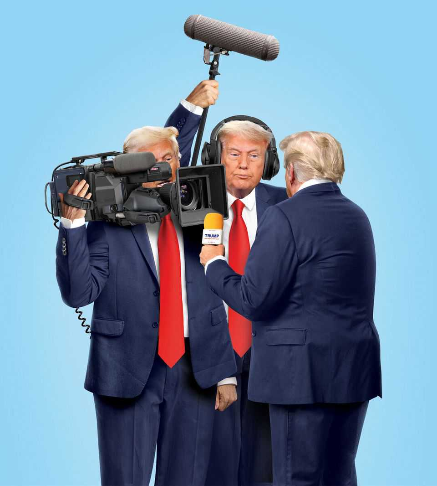

Leaders | Free speech in America
领导人专栏｜美国言论自由

Donald Trump is trying to silence his critics. He will fail
唐纳德·特朗普试图压制批评者。他终将失败

But the country could still lose
但国家仍可能受损

September 25th 2025
2025年9月25日

DONALD TRUMP hates being the butt of jokes; so his henchman seized on a slender pretext to get Jimmy Kimmel off late-night TV. The president is fed up with being criticised when he should be feted; so his lawyers sued the New York Times for $15bn. He sees everything as a fight; so his team want wealthy allies to buy control of the American arm of TikTok from its Chinese parent. These alarming skirmishes are part of a war against the American media. Yet Mr Trump has hardly enjoyed a resounding success. Mr Kimmel is back on air; a federal judge laughed the lawsuit out of court; and who knows how obedient those multibillionaire tycoons will be. It should not need saying in the home of the First Amendment, but a craven press leads inexorably to rampant corruption, poor government and cynical, disaffected voters. In a country where elections are won by small margins, even a partially cowed or captured media could tip the scales. Yet wanting something is not the same as getting it. As Mr Kimmel and the rest show, dominating America's sprawling, unruly media and opinionated citizens will be hard.

唐纳德·特朗普厌恶成为笑柄；于是他的手下抓住一个微不足道的借口，将吉米·坎摩尔赶出深夜电视节目。总统厌倦了在应该受到赞美时却遭到批评；于是他的律师起诉《纽约时报》，索赔150亿美元。他把一切都视为战斗；于是他的团队希望富有的盟友从中国母公司手中买下TikTok美国分部的控制权。这些令人担忧的小规模冲突，都是对美媒战争的一部分。然而特朗普几乎谈不上取得了什么显著成功。坎摩尔已重返荧屏；联邦法官将诉讼案当庭驳回；谁知道那些亿万富翁大亨会有多听话。在《第一修正案》的故乡，本无需赘言，但怯懦的媒体必然导致腐败猖獗、政府无能，以及愤世嫉俗、心怀不满的选民。在一个选举胜负往往取决于微弱优势的国家，即便是部分被吓倒或被收买的媒体，也可能左右天平。然而想要得到什么，并不等于就能得到。正如坎摩尔等人所展示的，要主宰美国庞大、不羁的媒体和固执己见的公民，绝非易事。

备注：

<ul>
<li>- <strong>butt of jokes</strong>：/[bʌt]/ "笑柄、嘲弄对象"；此处强调特朗普对成为公众笑谈的敏感。</li>
<li>  · butt 原义"靶子、目标"，引申为"被攻击或嘲笑的对象"。</li>
<li>- <strong>henchman</strong>：/[ˈhentʃmən]/ "亲信、追随者"；带有贬义，暗示盲从和忠诚。</li>
<li>  · 源自古英语 hench（马夫），后指"忠实追随者"，现多含负面色彩。</li>
<li>- <strong>slender pretext</strong>：/"薄弱借口"；强调理由站不住脚。</li>
<li>  · slender 本义"纤细的"，引申为"微弱的、不足的"。</li>
<li>- <strong>skirmishes</strong>：/[ˈskɜːmɪʃɪz]/ "小规模冲突"；军事术语，此处比喻媒体战中的局部交锋。</li>
<li>  · 与"war"形成大小对比，突出局部冲突的累积效应。</li>
<li>- <strong>resounding success</strong>：/"响亮的成功"；强调显著、彻底的胜利。</li>
<li>  · resounding 原义"回响的"，引申为"彻底的、显著的"。</li>
<li>- <strong>laughed out of court</strong>：固定搭配，"当庭驳回"；法官以轻蔑态度处理案件。</li>
<li>  · 体现司法系统对无理诉讼的蔑视态度。</li>
<li>- <strong>First Amendment</strong>：美国宪法第一修正案，保护言论自由。</li>
<li>  · 在"言论自由故乡"强调讽刺意味。</li>
<li>- <strong>craven</strong>：/[ˈkreɪvən]/ "怯懦的、胆小的"；形容媒体缺乏勇气。</li>
<li>  · 与"free press"形成对比，强调媒体应有的独立性。</li>
<li>- <strong>tip the scales</strong>：固定搭配，"左右天平、决定胜负"。</li>
<li>  · 天平意象强调微弱优势的关键作用。</li>
<li>- <strong>sprawling, unruly</strong>：/"庞大而不羁的"；形容美国媒体生态的复杂性和难以控制。</li>
<li>  · sprawling 强调地理和规模上的广泛性，unruly 强调难以管束。</li>
</ul>

Mr Trump's desire to control what people see and read about him is obvious. He seems less motivated by the—once justified—conservative gripe that much of the American media had a built-in soft-left bias than by the fact that he craves attention, and that he increasingly expects attention to mean adulation. His people prove their loyalty by striving to ensure he gets it.

特朗普控制人们对他所见所闻的欲望显而易见。他似乎较少受到保守派抱怨的驱动——这种抱怨一度有其合理性，即美国媒体大多具有内在的温和左翼偏见——而更多地受到以下事实驱动：他渴望关注，并且越来越期望关注意味着崇拜。他的手下通过努力确保他得到这种关注来证明自己的忠诚。

备注：

<ul>
<li>- <strong>built-in bias</strong>：/"内在偏见"；指媒体机构根深蒂固的倾向性。</li>
<li>  · built-in 强调偏见是系统性的，而非偶然的。</li>
<li>- <strong>soft-left</strong>：/"温和左翼"；相对于激进左翼的中间偏左立场。</li>
<li>  · 在政治光谱中定位媒体的意识形态倾向。</li>
<li>- <strong>craves attention</strong>：/"渴望关注"；强调对注意力的病态需求。</li>
<li>  · crave 比 want 更强烈，暗示无法满足的渴望。</li>
<li>- <strong>adulation</strong>：/[ˌædʒəˈleɪʃən]/ "奉承、崇拜"；过度的赞美，带有贬义。</li>
<li>  · 与正常的"attention"形成对比，强调期望的不合理性。</li>
</ul>

They have some formidable weapons. One is a Trump speciality: bullying and threats. The Wall Street Journal has been sued too, for a scoop about Mr Trump and a dead sex-criminal, Jeffrey Epstein. So has the Des Moines Register, for a poll just before the 2024 election that had Mr Trump losing the vote in Iowa. The Pentagon is curbing the freedom of correspondents to report, on pain of losing their credentials. Disney was attacked by Brendan Carr, the boss of the Federal Communications Commission (FCC). Liking what he saw, Mr Trump then suggested that television networks which criticise him should lose their licences.

他们拥有一些强大的武器。其一是特朗普的专长：霸凌和威胁。《华尔街日报》也遭到起诉，因为一篇关于特朗普与已故性犯罪者杰弗里·爱泼斯坦的独家报道。《得梅因纪事报》同样被起诉，因为在2024年大选前的一项民调显示特朗普在爱荷华州败选。五角大楼正在限制记者报道的自由，违者将失去采访资格。迪士尼遭到联邦通信委员会（FCC）主席布伦丹·卡尔的攻击。看到这一幕后，特朗普随即建议批评他的电视网络应该被吊销执照。

备注：

<ul>
<li>- <strong>formidable weapons</strong>：/"强大的武器"；将法律和政治手段比作武器。</li>
<li>  · formidable 强调令人畏惧的力量，暗示威胁性。</li>
<li>- <strong>Trump speciality</strong>：/"特朗普专长"；讽刺性地突出其惯用手段。</li>
<li>  · speciality 通常指专业技能，此处用于讽刺其"专长"是霸凌。</li>
<li>- <strong>scoop</strong>：/[skuːp]/ "独家新闻"；新闻行业术语。</li>
<li>  · 原义"勺子"，引申为"抢先获得"，强调新闻的独家性。</li>
<li>- <strong>on pain of</strong>：固定搭配，"违者将..."；正式法律用语。</li>
<li>  · 强调后果的严重性和强制性。</li>
<li>- <strong>credentials</strong>：/[krəˈdenʃəlz]/ "证件、资格"；此处指记者采访证。</li>
<li>  · 记者失去采访资格意味着无法进行正常报道工作。</li>
</ul>

These cases are feeble in law, but they can have a chilling effect, as they are expensive to defend against. In 2008, 92% of America's 100 largest newspapers by circulation endorsed a presidential candidate. Last year three-quarters did not.

这些案件在法律上站不住脚，但可能产生寒蝉效应，因为辩护成本高昂。2008年，美国发行量最大的100家报纸中，92%支持某位总统候选人。去年，这一比例降至四分之三。

备注：

<ul>
<li>- <strong>feeble in law</strong>：/"在法律上站不住脚"；强调法律依据薄弱。</li>
<li>  · feeble 原义"虚弱的"，引申为"无力的、不充分的"。</li>
<li>- <strong>chilling effect</strong>：/"寒蝉效应"；法律术语，指对言论自由的抑制效果。</li>
<li>  · 源自"寒蝉不敢鸣"，比喻因恐惧而不敢发声。</li>
<li>- <strong>endorse</strong>：/[ɪnˈdɔːs]/ "支持、背书"；正式的政治支持。</li>
<li>  · 原义"在背面签名"，引申为"公开支持"。</li>
</ul>

Another weapon is ownership. Mr Trump is the first American president to have his personal news service, Truth Social. Hungary under Viktor Orban shows how friendly businessmen can bolster "official" news, either out of conviction or a desire to trade favourable coverage for commercial advantage. X is owned by Elon Musk, who campaigned for Mr Trump. TikTok looks likely to come under the control of other allies, including the Ellisons and the Murdochs. David Ellison's purchase of Paramount and, potentially, Warner Bros Discovery would also give him control over CBS and CNN.

另一件武器是所有权。特朗普是首位拥有个人新闻服务的美国总统——Truth Social。欧尔班治下的匈牙利展示了友好的商人如何支持"官方"新闻，无论是出于信念还是希望以有利报道换取商业优势。X（原Twitter）由为特朗普助选的埃隆·马斯克所有。TikTok看起来很可能落入其他盟友的控制，包括埃里森家族和默多克家族。大卫·埃里森收购派拉蒙，以及可能收购华纳兄弟探索，也将让他控制CBS和CNN。

备注：

<ul>
<li>- <strong>bolster</strong>：/[ˈbəʊlstə(r)]/ "支持、加强"；提供物质或精神支持。</li>
<li>  · 原义"长枕"，引申为"支撑、加强"。</li>
<li>- <strong>trade favourable coverage</strong>：/"以有利报道换取"；暗示媒体与商业利益的交换。</li>
<li>  · trade 强调交换性质，favourable 暗示偏向性。</li>
<li>- <strong>campaign for</strong>：/"为...助选"；政治支持活动。</li>
<li>  · campaign 原义"战役"，在政治语境中指竞选活动。</li>
</ul>

And a last weapon is the use of pressure points. Two networks, ABC and CBS, settled winnable multi-million-dollar lawsuits with Mr Trump, because they feared regulators' retribution that could cost them billions of dollars. Imagine that Alphabet and Meta were induced by a promise or threat to their artificial-intelligence businesses to ensure that YouTube and Instagram leaned towards MAGA. With the fate of the company at stake, wouldn't their duty to their shareholders be to fall into line?

最后一件武器是利用压力点。ABC和CBS两家电视网与特朗普达成了本可获胜的数百万美元诉讼和解，因为他们担心监管机构的报复可能让他们损失数十亿美元。试想，如果Alphabet和Meta因对其人工智能业务的承诺或威胁而被诱导，确保YouTube和Instagram倾向于MAGA，在公司命运攸关的情况下，他们对股东的责任难道不是保持一致吗？

备注：

<ul>
<li>- <strong>pressure points</strong>：/"压力点"；比喻关键的施压位置。</li>
<li>  · 源自医学/军事术语，指能产生最大效果的关键位置。</li>
<li>- <strong>winnable lawsuits</strong>：/"本可获胜的诉讼"；强调和解的不合理性。</li>
<li>  · winnable 暗示媒体本有胜算，但因压力而妥协。</li>
<li>- <strong>retribution</strong>：/[ˌretrɪˈbjuːʃən]/ "报复、惩罚"；正式的报复行为。</li>
<li>  · 强调报复的严重性和系统性。</li>
<li>- <strong>induced</strong>：/[ɪnˈdjuːst]/ "被诱导的"；被外部因素影响。</li>
<li>  · 强调不是主动选择，而是被动受影响。</li>
<li>- <strong>fall into line</strong>：固定搭配，"保持一致、服从"。</li>
<li>  · 强调被迫服从和保持一致。</li>
</ul>

All this is worrying, but Mr Trump is not as strong as he appears. Television news obsesses the elderly man with the remote in the White House, but it is vulnerable mostly because it is a declining industry. Outside debate season, CBS is a main source of political news for just 3% of Americans. The media conglomerates are focused instead on the streaming wars—one reason Disney reinstated Mr Kimmel was pressure from outraged "talent" in Hollywood. For newspapers, news and opinion is their main business. If they tough it out, they will win in court, and each time Mr Trump brings a nuisance libel case he will be further exposed as a vain bully.

这一切都令人担忧，但特朗普并不像他看起来那样强大。电视新闻让白宫里拿着遥控器的老人着迷，但它之所以脆弱，主要是因为这是一个衰落的行业。在辩论季之外，CBS只是3%美国人的主要政治新闻来源。媒体集团反而专注于流媒体战争——迪士尼重新启用坎摩尔的原因之一是好莱坞愤怒的"人才"施加的压力。对报纸而言，新闻和评论是他们的主业。如果他们坚持到底，将在法庭上获胜，而特朗普每次提起骚扰性诽谤诉讼，都会进一步暴露自己是一个虚荣的霸凌者。

备注：

<ul>
<li>- <strong>obsesses</strong>：/[əbˈsesɪz]/ "使着迷、困扰"；强调过度的关注。</li>
<li>  · 暗示对电视新闻的病态依赖。</li>
<li>- <strong>declining industry</strong>：/"衰落的行业"；指传统电视新闻的式微。</li>
<li>  · 强调行业趋势，而非个人能力。</li>
<li>- <strong>streaming wars</strong>：/"流媒体战争"；指Netflix、Disney+等平台的竞争。</li>
<li>  · 媒体集团的战略重点已转向数字流媒体。</li>
<li>- <strong>tough it out</strong>：固定搭配，"坚持到底、硬撑下去"。</li>
<li>  · 强调在困难中坚持的决心。</li>
<li>- <strong>nuisance libel case</strong>：/"骚扰性诽谤诉讼"；指没有实质内容的恶意诉讼。</li>
<li>  · nuisance 强调诉讼的骚扰性质，而非法律价值。</li>
<li>- <strong>vain bully</strong>：/"虚荣的霸凌者"；对特朗普性格的概括。</li>
<li>  · vain 强调虚荣心，bully 强调霸凌行为。</li>
</ul>

America's media market is also hard to control because it is fragmented. In the Italy of Silvio Berlusconi only a few channels mattered and he owned nearly half of them. A market of 9.5m Hungarian-speakers is small enough to be captured. America is different. Moreover, each social-media network is itself a fragmented universe of individual content-providers. Unlike William Randolph Hearst, their proprietors cannot call editors and tell them what to print—and the FCC has no jurisdiction. Algorithms can steer users, but to kill news one story at a time requires a Chinese-style army of censors. The Biden administration tried to get social networks to mute vaccine scepticism. It seems to have had the opposite effect.

美国的媒体市场也难以控制，因为它是分散的。在贝卢斯科尼时代的意大利，只有少数几个频道重要，而他拥有其中近一半。950万匈牙利语使用者的市场小到足以被控制。美国则不同。此外，每个社交媒体网络本身都是一个由个人内容提供者组成的分散宇宙。与威廉·伦道夫·赫斯特不同，它们的拥有者不能打电话给编辑告诉他们该印刷什么——而且FCC没有管辖权。算法可以引导用户，但要逐个故事地扼杀新闻，需要一支中国式的审查大军。拜登政府试图让社交网络压制疫苗怀疑论。这似乎产生了相反的效果。

备注：

<ul>
<li>- <strong>fragmented</strong>：/[fræɡˈmentɪd]/ "分散的、碎片化的"；强调市场的分散性。</li>
<li>  · 与集中控制的媒体市场形成对比。</li>
<li>- <strong>Silvio Berlusconi</strong>：意大利前总理，媒体大亨，曾控制意大利主要电视台。</li>
<li>  · 作为媒体控制的典型例子，与美国的分散市场形成对比。</li>
<li>- <strong>William Randolph Hearst</strong>：美国报业大亨，曾直接控制报纸内容。</li>
<li>  · 代表传统媒体的集中控制模式。</li>
<li>- <strong>jurisdiction</strong>：/[ˌdʒʊərɪsˈdɪkʃən]/ "管辖权"；法律术语。</li>
<li>  · 强调FCC对社交媒体的监管权限有限。</li>
<li>- <strong>Chinese-style army of censors</strong>：/"中国式的审查大军"；指大规模的内容审查系统。</li>
<li>  · 强调美国缺乏类似中国的大规模审查机制。</li>
<li>- <strong>mute vaccine scepticism</strong>：/"压制疫苗怀疑论"；指限制反疫苗言论。</li>
<li>  · mute 强调压制，scepticism 指对疫苗的怀疑态度。</li>
</ul>

Free speech in America is protected by a constitutional guarantee, a vast media market and the appetites of the half of the country that does not vote Trump. A captured media, if it were possible, would be a huge business opportunity for the other side. America has deep capital markets and lots of risk-takers. It has never been easier to start a video show or a podcast or publish words. Building new networks is hard, but look at Threads and TikTok as alternatives to X, or how the pecking order of social networks has changed in the past. As so often with Mr Trump, his great asset is speed. The courts follow procedure; businesses have to work out how to fight back; new ventures need time to get off the ground.

美国的言论自由受到宪法保障、庞大媒体市场以及不投票给特朗普的那一半国家民众的需求保护。如果媒体被控制，这将为另一方带来巨大的商业机会。美国拥有深厚的资本市场和大量风险承担者。创办视频节目、播客或发表文字从未如此容易。建立新网络很困难，但看看Threads和TikTok作为X的替代品，或者社交媒体等级在过去是如何变化的。就像特朗普经常遇到的情况一样，他的最大优势是速度。法院遵循程序；企业必须想办法反击；新企业需要时间起步。

备注：

<ul>
<li>- <strong>constitutional guarantee</strong>：/"宪法保障"；指第一修正案的保护。</li>
<li>  · 强调法律层面的保护机制。</li>
<li>- <strong>captured media</strong>：/"被控制的媒体"；指被政治力量控制的媒体。</li>
<li>  · 强调媒体的独立性和多样性。</li>
<li>- <strong>deep capital markets</strong>：/"深厚的资本市场"；指美国金融市场的深度和流动性。</li>
<li>  · 为新媒体提供资金支持的基础设施。</li>
<li>- <strong>risk-takers</strong>：/"风险承担者"；指愿意承担投资风险的企业家和投资者。</li>
<li>  · 强调美国创业文化的特点。</li>
<li>- <strong>pecking order</strong>：/"等级秩序"；指社交媒体平台的排名和影响力。</li>
<li>  · 源自鸟类啄食顺序，比喻社会等级。</li>
<li>- <strong>get off the ground</strong>：固定搭配，"起步、开始运作"。</li>
<li>  · 强调新企业需要时间发展。</li>
</ul>

MAGA is unlikely to dominate America's media. Yet even if Mr Trump does not win his battle, America could still lose. In a fragmented attention economy the best way to break through is to call everything an apocalypse, urge revolution or denounce fascism. If all the rewards go to divisive political entertainment, then founding good government on a common understanding of facts becomes ever harder. America survived a partisan press in the 19th century; it will probably do so in the 21st. But the vaudevillisation of the public square is a heavy burden on an overburdened democracy. ■

MAGA不太可能主宰美国媒体。然而，即使特朗普没有赢得这场战斗，美国仍可能失败。在分散的注意力经济中，突破的最佳方式是称一切为世界末日、呼吁革命或谴责法西斯主义。如果所有回报都归于分裂性的政治娱乐，那么基于对事实的共同理解建立良好政府将变得更加困难。美国在19世纪经历了党派媒体的考验；在21世纪很可能也会如此。但公共广场的杂耍化对已经负担过重的民主制度来说是一个沉重的负担。■

备注：

<ul>
<li>- <strong>MAGA</strong>：/"让美国再次伟大"；特朗普的竞选口号缩写。</li>
<li>  · 代表特朗普的政治运动和意识形态。</li>
<li>- <strong>attention economy</strong>：/"注意力经济"；指以注意力为稀缺资源的经济模式。</li>
<li>  · 强调现代媒体竞争的核心是争夺注意力。</li>
<li>- <strong>apocalypse</strong>：/[əˈpɒkəlɪps]/ "世界末日"；夸张的灾难性描述。</li>
<li>  · 强调极端言论的吸引力。</li>
<li>- <strong>divisive political entertainment</strong>：/"分裂性的政治娱乐"；指加剧社会分裂的政治内容。</li>
<li>  · 强调政治内容的娱乐化倾向。</li>
<li>- <strong>partisan press</strong>：/"党派媒体"；指具有明显政治倾向的媒体。</li>
<li>  · 19世纪美国媒体的特点，与今日形成对比。</li>
<li>- <strong>vaudevillisation</strong>：/"杂耍化"；指公共讨论的娱乐化和浅薄化。</li>
<li>  · 源自vaudeville（杂耍），强调严肃议题的娱乐化倾向。</li>
<li>- <strong>overburdened democracy</strong>：/"负担过重的民主制度"；指面临多重挑战的民主体制。</li>
<li>  · 强调民主制度面临的系统性压力。</li>
</ul>

