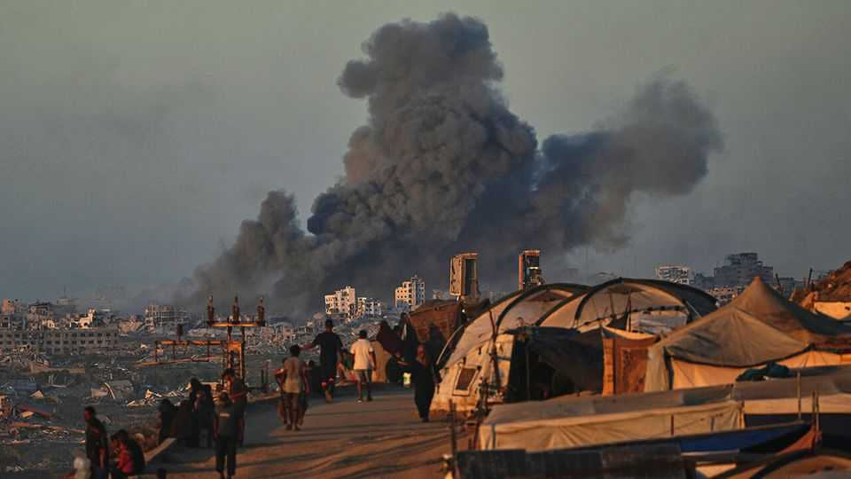
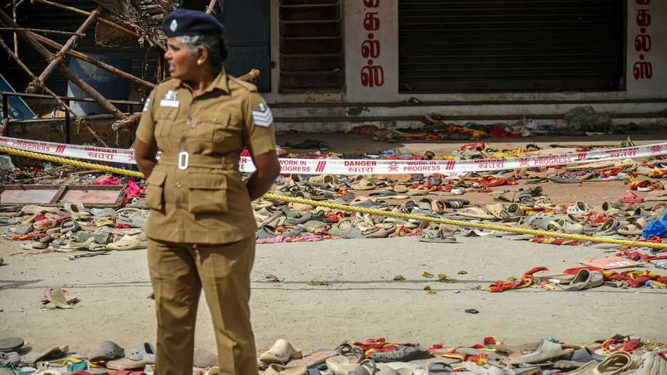

The world this week
Politics
October 2nd 2025

Donald Trump announced a 20-point plan to end the war in Gaza. Along with Binyamin Netanyahu, Israel’s prime minister, Mr Trump committed to a ceasefire proposal that was endorsed by many Arab and Muslim countries. Under the scheme the war would end, Hamas would release its remaining hostages and Israel would allow aid into Gaza without limits. Hamas would disarm, Israeli troops would withdraw in phases and an international stabilisation force would take responsibility for security. A “technocratic apolitical Palestinian committee” would take over the civil government. Mr Trump would lead a Board of Peace to oversee reconstruction. Sweeping sanctions were reimposed on Iran ten years after they were lifted. Britain, France and Germany, the three European partners to the JCPOA, the multinational deal meant to restrict Iran’s nuclear programme, activated the “snapback” mechanism, accusing Iran of “continued nuclear escalation”.

Iran suspended inspections of its nuclear sites after America and Israel bombed them in June.

Protesters in Madagascar demonstrated against persistent power cuts, water shortages and rampant corruption and called for the resignation of Andry Rajoelina, the president. In response Mr Rajoelina sacked his cabinet, imposed a curfew and deployed his security forces against the crowds. At least 22 people were killed.

Joseph Kabila, a former president of Democratic Republic of Congo, was sentenced to death in absentia by a military court in Kinshasa, the capital. He was found guilty of colluding with rebels and complicity in war crimes. Mr Kabila has denied any wrongdoing and says his successor is using the court for political gains.

America’s relations with Colombia worsened, when the State Department revoked the visa of Gustavo Petro, Colombia’s leftist president, after he took part in a pro-Palestinian rally outside the UN in New York. At the rally Mr Petro called on American soldiers to “disobey the orders of Trump”, and for the creation of a worldwide army to aid Palestinians. His comments were described as “reckless and incendiary” by the State Department.

An American proposal to double the size of the international security force in Haiti was backed by the UN Security Council. Criminal gangs have de facto control of the country and the current international force led by Kenya has not curtailed the violence. China and Russia abstained from the UN vote, claiming the new force could be used by America to further its aims in the region.

Nicolás Maduro, Venezuela’s autocratic president, was preparing to strengthen his powers over the security forces and declare a state of emergency, as speculation about an American invasion gripped the country. America’s military has struck alleged Venezuelan drug-trafficking boats in the Caribbean and it is stepping up its navy’s presence in the region.

Mr Trump criticised Venezuela at a rare gathering of America’s senior generals and admirals. The main purpose of the meeting was for Pete Hegseth, the “secretary of war”, to reiterate that the woke era is over. Mr

Hegseth blamed woke policies for deteriorating standards, including fitness, and for making the top brass walk on “egg shells” over claims of discrimination. Any officer who disagrees should resign, he said.

Government services in America were left without funding after a spending bill was held up in the Senate over a row about health-insurance tax credits. Although it has come close in recent years, this is the first federal government shutdown since 2019.

Eric Adams pulled out of New York’s mayoral election. Mr Adams, the incumbent mayor, was running as an independent after a slew of scandals. His departure is unlikely to alter the dynamics of the race much. Zohran Mamdani, the official Democratic candidate and a socialist, is far ahead in the opinion polls.

A gunman opened fire at a Mormon church in Michigan and set fire to the building, killing four people. The suspect, who was shot dead by police, is reported to have held a grudge against the religion.

In India police opened an investigation into the deaths of at least 40 people who were crushed during a political rally for Vijay, an actor turned politician. Investigators are considering whether charges of negligence and homicide should be brought against senior figures from Vijay’s party who

organised the event in Tamil Nadu. Around 20,000 people turned up at a location that was meant to accommodate half that number.

An earthquake in the Philippines killed at least 72 people. Aftershocks hampered rescue efforts in central Cebu province, which bore the brunt of the quake.

South Korea’s president, Lee Jae-myung, announced an 8.2% increase in the defence budget, the biggest rise since 2008. Mr Trump has been pressing Asian allies to spend more on defence. Mr Lee remarked that this is an era “where it’s every man for himself”.

A suicide-bomber targeted a security-forces building in the Pakistani city of Quetta, killing at least ten people. Islamist militants and rebels agitating for the independence of Balochistan province are active in the area.

Internet services started to gradually resume in Afghanistan, after the Taliban government briefly shut it down across the country claiming it was promoting immorality. The internet blackout had affected airports’ IT systems and operations.

The pro-EU Party of Action and Solidarity won a parliamentary election in Moldova with 50% of the vote. The pro-Russian Patriotic Block took just 24%, confounding opinion polls that had projected a higher share. Russia has been accused of interfering in the election campaign. The Kremlin denies this, and claimed that Moldova had provided only two polling stations for the hundreds of thousands of Moldovans who live in Russia in order to suppress their vote.

J.D. Vance, America’s vice-president, suggested that the Pentagon could provide Ukraine with long-range Tomahawk missiles, signalling the White House’s annoyance with Russia for ignoring Mr Trump’s attempts to de- escalate the conflict. Russia warned that America would risk a direct confrontation by supplying Tomahawks, which have a range of 2,500km (1,550 miles). Russia continued to pound Ukraine with drone attacks.

Eleven people were arrested in Serbia in connection with several hate crimes that have taken place in Berlin and Paris. The incidents include daubing the

Star of David on Jewish buildings in Paris in 2023, and more recently the placing of pigs heads near mosques. Serbia said the 11 suspects had acted on the orders of a “foreign intelligence service” and that its leader was still on the run. Many suspect Russia of trying to stir up trouble in the cities.

At least two people were killed in a car-ramming-and-stabbing attack on a synagogue in Manchester, in the north of England. The incident happened on Yom Kippur, the holiest day in the Jewish calendar. The suspect was confronted by police and shot.

Sir Keir Starmer, Britain’s prime minister, tried to stanch the haemorrhaging of support in the polls for his governing Labour Party. In a speech to flag- waving party members Sir Keir insisted he was overseeing “national renewal” and fighting “for the soul of our country”, pitching his address to “working people”. He said the populist Reform UK was his party’s main threat and that immigration policy was a pressing issue, but he claimed Reform’s plans to remove non-citizen migrants were “racist”.

This article was downloaded by zlibrary from [https://www.economist.com//the-world-this-week/2025/10/02/politics](https://www.economist.com//the-world-this-week/2025/10/02/politics)