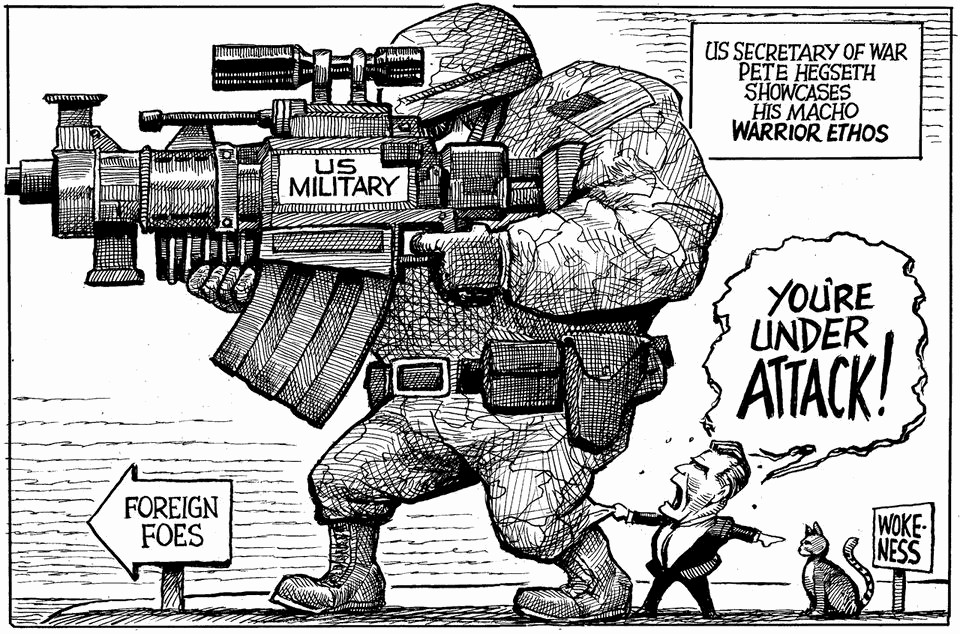

The world this week
The weekly cartoon
October 2nd 2025

Dig deeper into the subject of this week’s cartoon: The president tries to enlist the top brass for “the war from within” Vladimir Putin is testing the West—and its unity Armed forces are using 18th-century technology to spy on enemies The editorial cartoon appears weekly in The Economist. You can see last week’s here. This article was downloaded by zlibrary from https://www.economist.com//the-world-this-week/2025/10/02/the-weekly-cartoon

Leaders

Vladimir Putin is testing the West—and its unity The White House’s plan for Gaza deserves praise Donald Trump’s cure for drug prices is worse than the disease The new SCOTUS term will reshape America’s constitution Unleash the robotaxi revolution