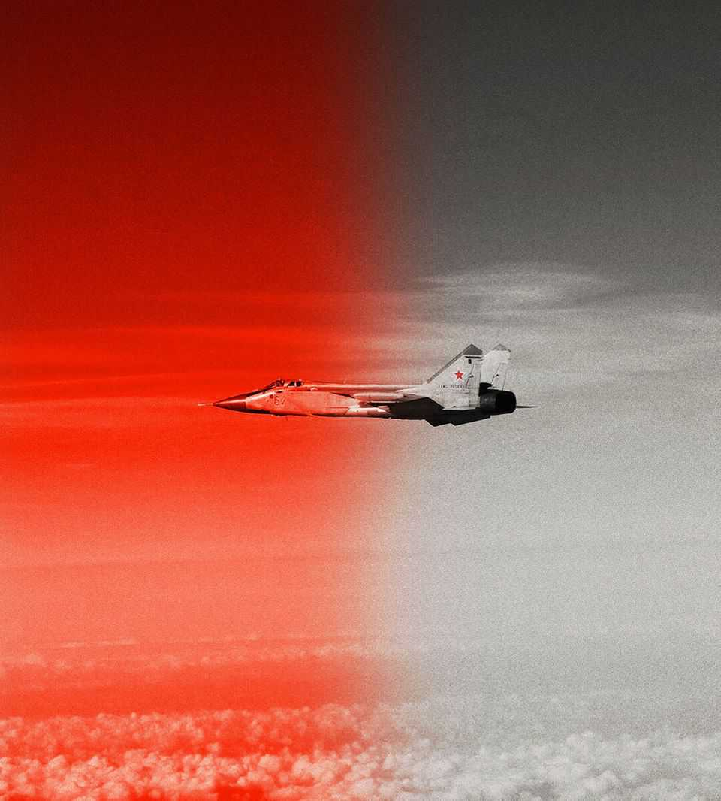

Leaders | The grey zone
Vladimir Putin is testing the West—and its unity
NATO must resist Russia’s efforts to corrode it from within
October 2nd 2025

DRONES OVER Poland; MiG fighters traversing Estonian airspace; telecom cables damaged deep beneath the Baltic Sea; airports paralysed by cyber-attacks and quadcopters; mysterious explosions and assassinations; bot swarms pumping out propaganda to disrupt elections: none of these on its own is a casus belli, but together they are adding up to something new and dangerous. Vladimir Putin is waging a grey-zone campaign against NATO: a cheap, deniable and calibrated effort to unsettle Europe that is carefully short of outright conflict. “We are not at war,” Germany’s chancellor, Friedrich Merz, said this week. “But we are no longer at peace, either.” The damage has never been serious, so what is the point? Mr Putin knows he cannot defeat NATO in a stand-up fight, yet his aim, given the grand sweep

of his writings and speeches, is more than just to be a nuisance. He is trying to achieve three things, and he needs to fail at all of them.

First, Mr Putin aims to break the unity of NATO. His goal is to make Europeans doubt each other and in particular question America’s commitment to the alliance it created in 1949. He aims to sow suspicion that Article 5, which treats an attack on one as an attack on all, cannot be relied on; and, eventually, to prise America away from Europe altogether. NATO, Mr Putin has often stated, is devoted to dismembering Russia; so it must itself be destroyed from within.

At the turn of the century America was mightier than all its enemies and friends put together. Osama bin Laden began the unravelling. His strike on the twin towers in 2001 lured America into overreach in Afghanistan and Iraq, prompting a backlash at home against foreign commitments. China’s rulers dream of a similar American exit from East Asia. That is why Xi Jinping, too, is using grey-zone incursions to make Taiwan feel vulnerable— and to cast doubt on America’s commitment to its Asian partners. With his carelessness for the security order that has underpinned the world since 1945, Donald Trump is making Mr Xi’s task easier.

The same is true in Europe. Mr Trump’s response to the drone incursion into Poland was to say that it “could have been a mistake”, even though a show of solidarity was called for. It is not hard to connect those words to the violation of Estonian skies by three MiG-31s ten days later. Mr Trump needs to stress his commitment to military action in Europe if it becomes necessary. If sabotage and violations of airspace are shrugged off as routine, deterrence becomes a matter for debate—and once it is debated, it is weakened.

Mr Putin’s second objective concerns Ukraine. His summer offensive has failed, so he wants to raise the cost to European countries that support Ukraine’s army. A focus of the grey-zone attacks has been the countries that are its strongest backers. Poland, Estonia and Denmark have suffered drone incursions, GPS jamming and sabotage. Germany has faced cyber-attacks on its defence and logistics firms. Moldova and Romania, as front-line states, have had their elections interfered with—in both cases unsuccessfully, which shows that Mr Putin does not always get his way. His message to voters and

politicians is blunt: rather than sending weapons to Ukraine, you should focus on appeasing Russia or defending yourselves.

The third explanation for this campaign is deeper and older. Mr Putin hates classical liberal democracies whose wealth and resilience show up his failures and his repression. They outperform him economically. Russia’s GDP is smaller than Italy’s even though its population is well over twice as large. The more he can sow discord and confusion within the West, the stronger he looks. The more he can discredit centrist governments, the more it will benefit populist nationalists who share his suspicion of a united Europe.

What should the allies do? First, they must expose everything. The temptation is to ignore small provocations or, lacking proof of Russia’s responsibility, hold back from accusations. But to ignore the grey zone is to concede it. And once conceded, it expands. Sabotage, cyber-attacks, election interference: each should be attributed and publicised swiftly, with evidence. That strips Russia of plausible deniability and educates Western voters that they are the targets of a campaign.

NATO and the European Union must also improve their resilience. Grey- zone defence includes spare parts and repair crews for cables and pipelines, rapid cyber-response teams and hardened electoral commissions. It is the tedious but vital business of building in redundancy and preparedness. At the same time, the Europeans must also harden their defences. Patrols in the Baltic Sea must be continuous; more sensors are needed. Europe needs cheap interceptors that can take out the drones Russia is making by the tens of thousands. Scrambling F-35s and using missiles costing millions of dollars against drones costing only thousands will eventually exhaust Europe’s defences, leaving it vulnerable.

Last, the alliance must impose clearer costs. Drones over borders should trigger sanctions on suppliers and shell companies. Cyber-attacks should meet cyber-countermeasures. It is now time to use Russia’s frozen assets to pay for the defence of Ukraine, which is in reality the defence of Europe, too. And yes, that defence may mean shooting down a warplane that poses a threat to life or property. Fainthearts worry about escalation, but declining to act threatens escalation of a different kind. If Russia thinks it can get away

with limited acts of aggression, something really dangerous might one day happen—such as Mr Putin grabbing a pocket of land around Narva on the Estonian side of the border, a city filled with Russian-speakers whose rights Russia pretends to champion.

All this is hard to do even if America’s guarantee is solid. It is harder still when Mr Trump is an uncertain member of the alliance. This year he says he backs NATO, but last year he suggested he would “encourage Russia to do whatever it wants” to members who don’t pay enough. Such words are taken as an invitation to probe and divide. Mr Putin has been listening. ■

For subscribers only: to see how we design each week’s cover, sign up to our weekly Cover Story newsletter.

This article was downloaded by zlibrary from https://www.economist.com//leaders/2025/10/02/vladimir-putin-is-testing-the-west- and-its-unity