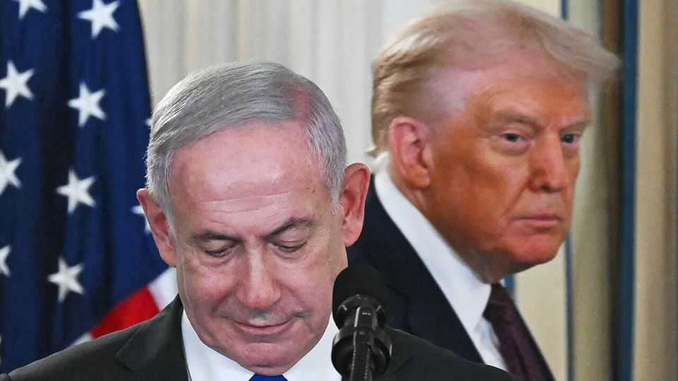

Leaders | A big step forward
The White House’s plan for Gaza deserves praise
America, Israel and perhaps Hamas have changed their positions
October 2nd 2025

On September 29TH President Donald Trump stood with Binyamin Netanyahu, Israel’s prime minister, and set out a 20-point plan for “eternal peace” in Gaza. It is tempting to be dismissive. Although the hyperbole was exceptional, it is hardly the first peace plan since the war began in 2023. And while the talking continues, the horror in Gaza persists. Yet dismissal would be a mistake. This proposal is a milestone because it sets parameters for a way out of the nightmare and marks a change in the positions of America and Israel, and, just possibly, Hamas. The principles of the plan are clear, even if the sequencing and details are not. The hostages would be released almost immediately. Hamas leaders and fighters would disarm and be granted amnesty or exile. A technocratic

administration that excludes Hamas would take over, supervised by an international board under Mr Trump. The Israeli army would withdraw from Gaza in stages, handing security to an international force and newly vetted Palestinian police. In the long run the rehabilitation of Gaza, and reforms to the Palestinian Authority (PA) in the West Bank, could yet lead to statehood. Eight Muslim countries, including the main Arab powers and Turkey, back the deal.

This is new for America. In February Mr Trump entertained the idea of Gaza being ethnically cleansed of Palestinians to make space for a new Middle East “Riviera”. Since then, he has given tacit approval to the nihilistic fantasies of the hard-right parties in Israel’s coalition government, who dream of settling Gaza. Now, having lost patience with Mr Netanyahu after Israel’s strikes on Qatar in September, Mr Trump has signalled that “Israel will not occupy or annex Gaza” keeping open the prospect of a two-state solution.

By supporting the proposal, Mr Netanyahu has pivoted, too. Until recently he was committed to a forever war in Gaza and indulged his hard-right coalition partners, partly because a ceasefire might end the government and his time in office (an election must be held by late 2026). Now he has suggested that he intends to fight the election on the platform that the peace plan secures Israel’s original war aims of getting the hostages back and Hamas out of power. Although he is unpopular, the plan is not: almost three- quarters of Israelis support it.

The final shift may be from Hamas. It has yet to formally respond and may have detailed objections to the sequencing of the Israeli withdrawal and the absence of guarantees if Israel changes its mind. But were it to accept in principle and in public that it is prepared to relinquish its weapons and its claim to govern Gaza, that would be a huge shift, in effect signalling it accepts that it is not the legitimate representative of the Palestinian people.

The pitfalls are obvious. Hamas could reject a deal, condemning Gaza to more misery. Mr Netanyahu and Hamas may sign up insincerely, with the real goal of sabotaging the deal later. The details over sequencing are hellish. Rebuilding Gaza may prove impossible to organise or fund. Israel’s politics could pull Mr Netanyahu or his successor back towards annexation. The PA

may be incapable of reform and the interim government overstay its welcome. Notwithstanding proclamations at the UN, there is little evidence that a majority of either Israelis or Palestinians still have confidence in a two-state solution. It will take decades to rebuild trust.

Yet for all that, Mr Trump’s plan offers the best pathway out of the tragedy in Gaza. Its success would require sustained pressure from Mr Trump on Israel, and from the Arab states and Turkey on Hamas. But today’s unending mass suffering is unacceptable and so are the alternatives of occupation, anarchy or rule by a reconstituted Hamas. For dragging the negotiations to reality, Mr Trump and his team deserve praise. ■

Subscribers to The Economist can sign up to our Opinion newsletter, which brings together the best of our leaders, columns, guest essays and reader correspondence.

This article was downloaded by zlibrary from https://www.economist.com//leaders/2025/10/01/the-white-houses-plan-for-gaza- deserves-praise