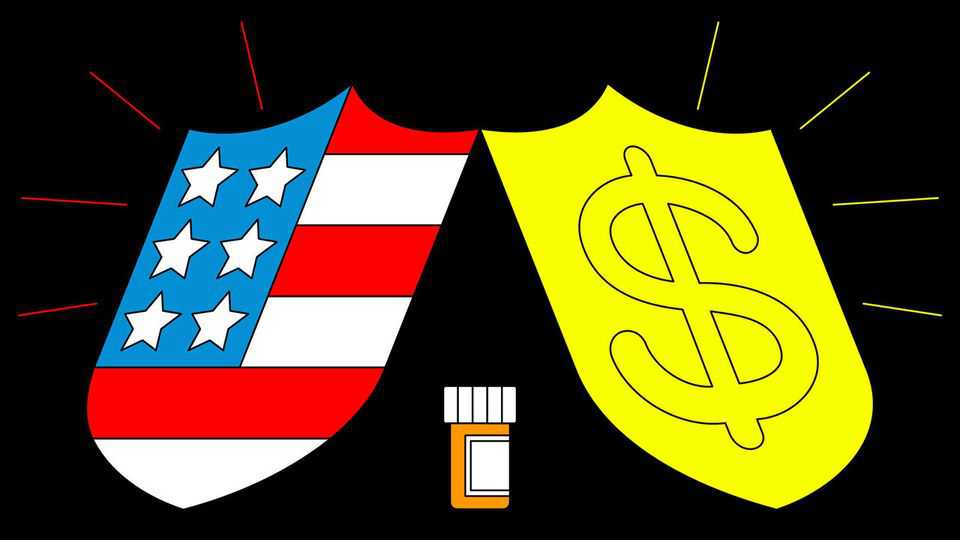
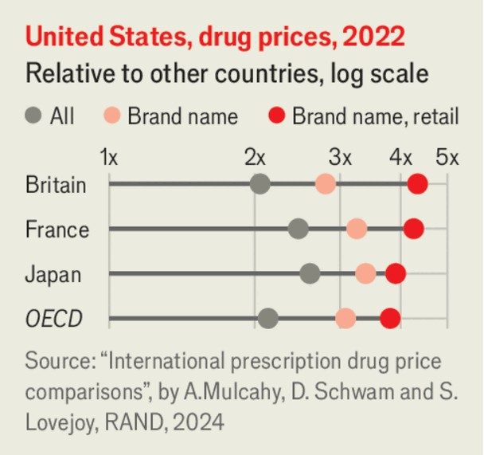

Leaders | Bad medicine
Donald Trump’s cure for drug prices is worse than the disease
The problem is not greedy pharma firms
October 2nd 2025

Few things infuriate Americans as much as drug prices. Republicans and Democrats alike agree that poorly patients are being ripped off by greedy pharma firms. They point to the fact that America’s list prices for branded drugs are, on average, more than four times those in other rich countries. Donald Trump agrees with them and he has set out to do something about it. He has asked drugmakers to cut their prices to “most-favoured nation” levels, ie, to the cheapest price out there. If they don’t, he says, he will use “every tool in our arsenal” against what he calls abusive drug pricing. But the president’s battle to bring down prices is doomed to fail. Indeed, it could even make health care in America worse.

Anyone familiar with the country’s byzantine health system knows that inefficiencies and rents abound. Yet these tend to be concentrated not among drugmakers, but further along the supply chain. Our analysis of 220 listed health-care firms finds that three-fifths of the excess profits, defined as those that are above a 10% return on capital, are taken by others, including hospitals, and middlemen, such as insurers, distributors and pharmacy- benefit managers. Three pbms handled nearly 80% of prescription claims last year; some of them are being investigated for uncompetitive behaviour. Cracking open the sector and encouraging competition would help bring costs down.

Even if that were fixed, drugs in America would remain three times dearer than in the rest of the rich world. What more should be done?

To answer the question, it helps to grasp why American patients pay more. They are not being ripped off on a grand scale by feckless foreigners. Many European governments buy drugs at the national level, because their health systems are publicly run. But they do so on the basis of a calculation of the value each drug provides, measured by the improvement it offers both to the length and the quality of a patient’s life.

This value is often low enough for patients elsewhere to have worse access to new drugs than Americans do. Between 2014 and 2022 one in five medicines approved by Uncle Sam never won approval in Europe, and nearly half were not approved by Japan. Of those cleared in all three places, more than two-thirds were first approved in America—nearly six months before Europe, on average, and almost three years before Japan.

When Mr Trump says he wants to match others’ prices, he is therefore proposing to import the value that other countries place on treatments. But there is no reason why the world’s wealthiest country should share that assessment of how to value good health. If it did, Americans would save money on drugs, but at the cost of worse care than they enjoy today.

Moreover, because pharma companies are, pace Mr Trump, not price- gouging monsters, imposing the most-favoured nation price on the world’s biggest drug market would also curb innovation. Drugmakers take big risky bets on treatments, not all of which succeed; by some estimates, around 90% of clinical drug development ends in failure. If you cut the potential rewards, you cut the appetite for risk.

If its American revenues were threatened, the industry would either find ways to protect them, or innovate less, or both. To lessen the pain, firms could further delay launching their products in other countries, to keep most- favoured nation prices high; or they could raise list prices everywhere, and offer opaque rebates to countries that are not willing to pay higher rates. To the extent that prices in America were forced down, firms would take fewer risks on innovation.

That is why Mr Trump’s plan to “rebalance” the system, by making Europeans pay more and Americans less, cannot work. He cannot force the rest of the world to pay more for drugs; nor can he force drugmakers to keep spending as much on research even as their profits take a knock. The harmful consequences would affect patients everywhere—especially Americans, who are the keenest drug buyers of all.

What, then, should Mr Trump do instead? Rather than seeking to import Europe’s prices, he could borrow its approach, and establish an American system of valuing drugs. Most prices emerge from a series of negotiations

between makers and middlemen, without any explicit discussion of value. But Medicare, the public-health scheme for the elderly, is showing the way forward. It can now negotiate over the prices of a handful of drugs. Medicaid, the public-health insurer for the poor, is tying payments to outcomes in costly gene therapies for conditions such as sickle-cell disease. Value-based pricing could be extended.

Such a system would reflect Americans’ greater preference for cutting-edge treatments, and would make pricing more transparent. It could also steer investments towards therapies and innovations that are more efficacious. Research suggests that these effects could combine to make spending on drugs substantially more beneficial for the health of Americans. Much of the price gap with the rest of the world would remain. But then, so too would the gulf in treatment. ■

Subscribers to The Economist can sign up to our Opinion newsletter, which brings together the best of our leaders, columns, guest essays and reader correspondence.

This article was downloaded by zlibrary from https://www.economist.com//leaders/2025/10/02/donald-trumps-cure-for-drug-prices- is-worse-than-the-disease