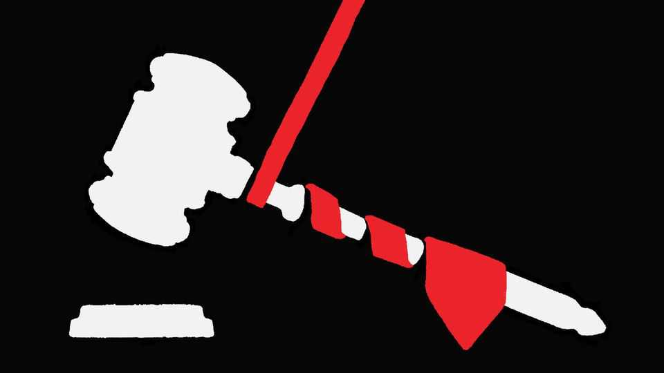

Leaders | Court politics
The new SCOTUS term will reshape America’s constitution
If the justices do not check an overmighty president, the country will suffer
October 2nd 2025

THE PHRASE “checks and balances” does not appear anywhere in the United States constitution; and yet in a manual for Martians on how America governs itself it would be on page one. Those three words are a reminder that the country has an unwritten constitution, which resides in beliefs, behaviour and legal precedents, to go alongside its more celebrated written constitution. They describe how the branches of government compete for power—a contest where, the founding fathers wrote, “Ambition must be made to counteract ambition.” The question for the Supreme Court’s new term, which starts next week, is: how much ambition do the justices have?

Over the course of this century the presidency has accumulated power as Congress has stood aside. The justices have been content to wave through gradual increases in presidential authority, steadily rewriting the unwritten constitution as they went. That sort of incremental change is probably necessary when the written part is not working as it should, because of the partisanship that this week shut down the government once again. Yet Donald Trump is taking this indulgent attitude and exploiting it.

His administration combines the theory that the presidency should be all- powerful with a method that makes it seem so. That method involves stretching presidential authority to its limit, without waiting to see if the courts check it. When they catch up, the administration will obey the law (at least after the Supreme Court has had its say), then try another route to the same end. This is not outright defiance, but neither is it deference to a branch of government that should be coequal.

For the court, this presents a dilemma. Its first job is to define the law. And yet it is unavoidably a political institution, whose members have always quietly taken politics into account when making those judgments. Today’s chief justice, John Roberts, is caught between a desire to prevent the court from being seen as just another partisan institution, and an instinct to avoid a direct confrontation with the administration that the court could lose. Those two impulses are in tension. And so far—whether because of coincidence, ideology or pragmatism—the wish to placate the president is winning.

That was true most clearly in Trump v United States, which expanded presidential immunity from prosecution beyond the expectations of most court-watchers. It has also been true on the shadow docket, where cases are not exposed to a full public hearing. Although the court this week said that Lisa Cook could remain at the Federal Reserve while it considers Mr Trump’s right to sack her, the administration has often got what it sought on the shadow docket with scant, if any, explanation. The term that starts next week looks likely to expand presidential power yet again.

Three cases will be defining. One, the ominously named Trump v Slaughter, touches on whether the president can sack people at independent government agencies. The court seems likely to conclude he does, with the exception of the Fed. Handing this power to the president would overturn a

precedent from the 1930s, when the justices ruled against an overmighty FDR. In another case, on birthright citizenship, the court is likely to resist the president.

And then there are the cases about tariffs, involving importers of wine and toys. Unfortunately for free traders, The Economist’s SCOTUS bot, an AI that has been trained on case filings and previous rulings, thinks the president will get his way here, too (as does our correspondent who trained the bot).

Taken together, these cases do not signal the end of the republic and its replacement with an elected monarchy. The court’s defenders can argue that, by yielding now, the justices will be in a better position to stand firm when they really need to. Maybe. But the court has started along a path that gives a power-hungry executive most of what it wants. If it continues to give ground, by the end of this president’s term America’s constitution—the one that actually describes how the country is run—will look very different. ■

Subscribers to The Economist can sign up to our Opinion newsletter, which brings together the best of our leaders, columns, guest essays and reader correspondence.

This article was downloaded by zlibrary from https://www.economist.com//leaders/2025/10/02/the-new-scotus-term-will-reshape- americas-constitution