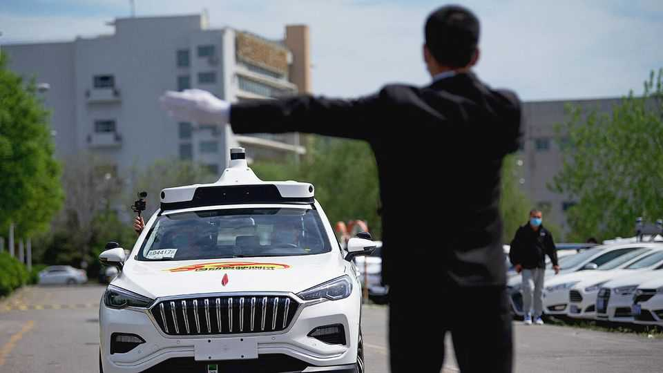

Leaders | Self-driven to despair
Unleash the robotaxi revolution
Across the West, safety rules are standing in the way of progress
October 2nd 2025

In San Francisco and Shenzhen, the future is already here. Between April and June Waymo, an American firm, conducted 2.2m robotaxi trips in California—five times as many as in the same period in 2024. Over the same three months Baidu, a Chinese tech giant, provided 2.2m trips across 16 mostly Chinese cities—a two-fold increase. That is exciting for residents of those places. Since robotaxis have fewer accidents than human drivers, they are almost certainly saving lives. Unlike private cars, they can be in near-continuous use; the more popular they become, the more they will free up space and make urban life more comfortable. Yet city dwellers elsewhere have less to celebrate. In many places, regulation is a roadblock to self-driving taxis.

Some restrictions slow the development of the tech itself. In America firms need approval from the National Highway Traffic Safety Administration to deviate from federal standards by, say, building a car without pedals or a steering wheel, both of which are more useful to a human than to an AI driving system. And the NHTSA can allow each firm to make only 2,500 non-standard cars a year.

Other regulations control or even ban the operations of robotaxis. In New York the Taxi & Limousine Commission prohibits the use of autonomous vehicles in paid for-hire services. City councillors in Boston have proposed legislation that would require a “human-safety operator” in each. Only a few European countries are even testing them. In Germany robocabs must be monitored by a human at all times.

Such policies stem from two concerns: that robotaxis could crash into pedestrians or oncoming traffic; and that they will displace human workers, who must be protected. Neither of these justifications holds water.

Consider safety first. Regulators are right to require that new technology be tested. But the evidence so far is encouraging. A study by Waymo and Swiss Re, a reinsurer, finds that Waymos are involved in 88% fewer property- damage claims and 92% fewer injury claims per mile than humans. Other firms may struggle to match those numbers, and the vehicles have so far been let loose in “easy” cities. Still, the figures suggest that robotaxis will make roads safer. Regulators in the West could follow China and make it easier to run pilot projects.

What about the job-killing effects? Josh Hawley, a Republican senator, wants to ban self-driving cabs because they are “terrible for working people”, since they may lead to job losses among taxi drivers. More often, the concern is unspoken. Protests from drivers sway the calculations of city officials, who then insist on ultra-stringent safety standards. In China, too, fears of job losses have slowed the transition from tests to real-world use.

Yet the impact on taxi drivers must be set against the benefits to a wider group: for every cabbie in San Francisco, there are hundreds of riders and residents. And the relationship between new and old can be surprising. In San Francisco robotaxis are replacing private cars rather than manned taxis.

Although robotaxis have cruised on to the scene, demand for ordinary cabs has held up, perhaps because they are sometimes more available. Human drivers are most useful at peak demand, when fares are highest.

Even with adroit regulation, robotaxis would not be everywhere. The challenge of making them commercially viable would remain. Each Waymo car, with all its sensors and the latest software, is said to cost around $150,000; mapping and testing can be expensive, perhaps forbiddingly so in small European cities with medieval road plans. Remove regulatory roadblocks, though, and firms could at least have the chance to expand their operations, improve the technology and bring down costs—while more consumers enjoy the ride. ■

Subscribers to The Economist can sign up to our Opinion newsletter, which brings together the best of our leaders, columns, guest essays and reader correspondence.

This article was downloaded by zlibrary from [https://www.economist.com//leaders/2025/10/02/unleash-the-robotaxi-revolution](https://www.economist.com//leaders/2025/10/02/unleash-the-robotaxi-revolution)

Letters

Should work restrictions on asylum-seekers in Britain be reformed?