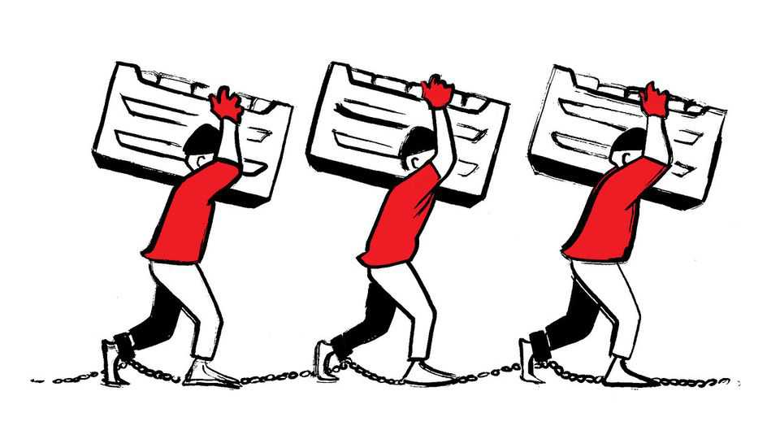

Letters | A selection of correspondence
Should work restrictions on asylum-seekers in Britain be reformed?
Also this week, America’s relations with Israel, the US constitution, cosy crime, the Democrats
October 2nd 2025

Letters are welcome via email to letters@economist.comFind out more about how we process your letter Your article on the work restrictions faced by asylum-seekers in Britain omitted fundamental questions at the heart of the issue (“Wasted talent”, September 20th). What sort of employer would choose to hire an asylum- seeker whose right to remain in the country could be terminated at any moment over employing a local person? Or over any of the large number of migrants whose right to be in the country is not conditional? We know the likely answer.

Legal migrants coming to Britain who do have  work visas, even in the lowest-paid jobs, do so under conditions where the bona fides of employers and minimum pay are monitored. Asylum-seekers who find work are afforded no such oversight and protection. We don’t even know which employers are employing them.

The argument over asylum-seekers having the right to work should not be over whether they have to wait X or Y number of months to do so. Simple comparisons with other countries on this measure are flawed, because in practice there are often other barriers to migrants working in those countries. Rather, the important question is what controls and protections are needed to prevent asylum-seekers who do work from being just a channel for the exploitation of the most vulnerable cohort of potential employees in Britain.

Jonathan ThomasSenior fellowSocial Market FoundationLondon

Britain does indeed receive fewer illegal migrants than other countries and “far-right” agitators do exploit the issue (”On deaf ears”, September 20th). But reducing discontent with mass immigration to the “far-right” is itself populist. The real grievance among the British public lies not in the numbers coming but in perceived unfairness, that the state is more willing to bend for outsiders than it is for its own citizens. The current backlash is better understood as a correction against a wider illiberal-left agenda. For years the concerns of many people were dismissed as bigotry, whether over mixed lavatories in junior schools, parents’ rights to withdraw children from sex education, the removal of historical statues without sanction, high streets where English is absent, or the sense that migrants jump the queue for housing and health care while locals wait. Illegal migration has become a lightning rod for a wider frustration that society’s balance has tilted too far, and the pendulum is now swinging back.

Phillip HarrisonLondon

I am bemused by your description of Reform UK as “hard right” (“The Farage power project”, September 6th). Here I am, a centre-right voter whose opinions have largely unchanged over the past 50 years, pondering whether the centre of British politics has really moved so far to the left in that time that my views are now considered to be hard right.

Nigel Johnson-HillPetersfield, Hampshire

Concerns about America’s shifting support for Israel are not new (“How Israel is losing America”, September 20th). Similar alarms were raised during Israel’s war in Lebanon in 1982 and again during the first intifada, when American opinion cooled towards Israel. These cycles return whenever conflict intensifies and moral questions rise to the fore.

Warnings of this kind should be welcomed. They remind us that the American–Israeli partnership cannot rest on military dependency or partisan loyalty alone. A lasting relationship requires new political thinking. The well-worn mantra of a “two-state solution” is empty of imagination and fails to address the hopes and fears of both peoples. Even ideas that may sound fanciful, such as Donald Trump’s vision of a Gaza riviera, deserve consideration if grounded in strong Arab involvement and real economic opportunity.

Gaza had nearly two decades to develop after Israel withdrew, but instead chose violence. Those mistakes must not be repeated. What is needed now is the courage to explore political and economic constructs that can sustain Israeli security and Palestinian dignity, while keeping America’s support on firm ground.

Dr Henning SteinFinance fellowCambridge Judge Business School

Your review of Jill Lepore’s history of America’s constitution asserts that the country has been “stuck with the electoral college”, implying that the direct election of our presidents is preferable (“The notion of a nation”, September 13th). The electoral college has helped preserve the stability of our system of national government for well over two centuries now. It means that the least populous states have some say in an election (take Iowa). Under direct voting it would be the marginal voters in large states like California that matter, and candidates would have an even greater incentive to ignore smaller states.

The electoral college also serves our strong two-party tradition. Ross Perot got almost 19% of the popular vote in 1992, but zero electoral-college votes. Without the present system we would have factious multiple parties, and

presidents without a consensus to lead. In a large and diverse country such as ours, the electoral college prevents single-issue and geographical fragmentation, leading to a more truly egalitarian election result.

Many have cited the situation in Florida in 2000 as justification for abolishing the electoral college. In fact, this highlights why it is necessary. Many of our presidential elections are close. The electoral college hives off voting disputes like the one in Florida. Without it there could be a “Florida” everywhere, paralysing the government as lawsuits, challenges and recounts in possibly thousands of jurisdictions turned the election into a nightmare.

There have been only five elections where the president won the electoral college but did not gain the popular vote, and each of those was essentially a toss-up. We are the United States of America, not the United People of America. We should be very wary of tinkering with this elegant constitutional establishment.

Paul StaneskiMerry Hill, North Carolina

Although Agatha Christie’s Miss Marple novels match the cosy-crime template (amateur sleuth, small village), a number of her other works do not (“It takes a village”, August 30th). In “Murder on the Orient Express,” she flouts convention when Hercule Poirot lets the murderers go. It’s also

bloody; the victim is stabbed 12 times by 12 people. Moreover, Georges Simenon’s Inspector Maigret is a police detective, not an amateur. Maigret pursues crime down dark Parisian allies, along foreboding canals and in seedy seaside towns, with gangsters, greed, sex, family dysfunction, abuse and psychological torment elements in the novels. The Maigret books are hard-boiled mysteries. In the interwar years, Simenon was ploughing a similar furrow to Dashiell Hammett and Raymond Chandler. Maigret is similar to Chandler’s depiction of his own hero, Philip Marlowe: “Down these mean streets a man must go who is not himself mean, who is neither tarnished nor afraid…He is the hero, he is everything.”

RICH ZAHRADNIKRehoboth Beach, Delaware

Democratic disarray is nothing new (“America’s missing opposition”, September 6th). Just recall the 100-year-old quip by Will Rogers: “I am not a member of any organised political party. I am a Democrat.”

David RaymondSocorro, New Mexico

This article was downloaded by zlibrary from https://www.economist.com//letters/2025/10/02/should-work-restrictions-on-asylum- seekers-in-britain-be-reformed

By Invitation

Kosovo shows that Donald Trump’s Gaza plan can work, writes Petrit Selimi A Nobel laureate on why stablecoins may be nothing of the sort