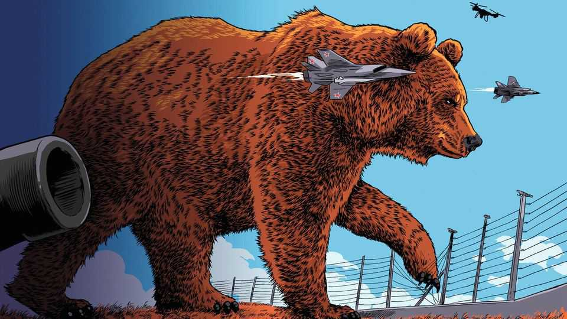
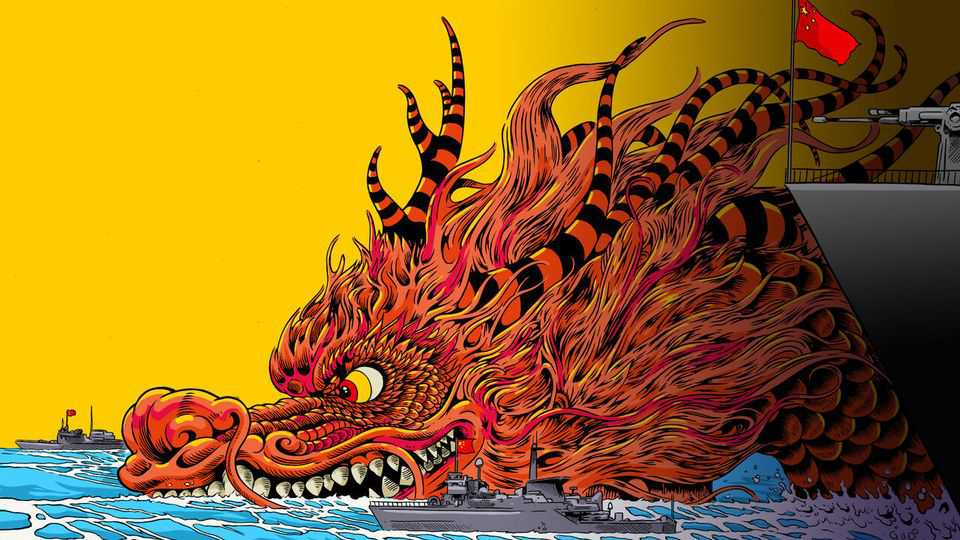

Briefing | Fifty shades of grey-zone
Why Russia’s micro-aggressions against Europe are proliferating
It is hoping to sap support for Ukraine and highlight America’s ambivalence
October 2nd 2025

THE DRONES that appeared late on September 25th over Schleswig- Holstein, Germany’s northernmost state, did not fly the usual erratic routes one might expect from a misguided hobbyist. They flew neat, parallel paths, according to an internal assessment seen by Der Spiegel, a German magazine, as if surveying what was below them. And what was below them was a treasure trove of critical infrastructure. They flew over a power plant and a refinery, a hospital, the state government’s headquarters and an arms factory owned by Thyssenkrupp, a conglomerate.

Later drones would appear over an army base in Mecklenburg-Western Pomerania and the port of Rostock, its capital. Days earlier, a little farther north, drones had been sighted above airports in Copenhagen and Oslo, disrupting flights, as well as over Danish oilfields in the North Sea and around Danish and Swedish military bases. “There can be no doubt that everything points to this being the work of a professional actor,” said Troels Lund Poulsen, Denmark’s defence minister, of the incidents in his own country. “This is what I would define as a hybrid attack.”

Since Russia’s full-scale invasion of Ukraine in February 2022, its intelligence services have led a campaign of sabotage and subversion across Europe. Described variously as “hybrid warfare” or “grey zone” tactics, these hostile acts occupy a hazy space between untroubled peace and open war. They encompass everything from straying fighter jets to cyber-attacks.

Although the concept may be woolly, the threat is real enough. Recent research by the International Institute for Strategic Studies, a British think- tank, found that incidents of confirmed Russian sabotage against European infrastructure more than tripled between 2023 and 2024 (see map). Norway’s intelligence service recently noted that Russian hackers had taken control of a local dam earlier this year, causing water to flow, unnoticed, for hours. On September 17th Lithuanian authorities charged 15 people tied to Russian military intelligence with planting explosive parcels on cargo planes, causing fires in Germany, Poland and Britain last year.

And it is not just Russia that has embraced these micro-aggressions. Chinese sorties into Taiwan’s air-defence identification zone, a self-declared buffer area, have increased relentlessly, from 20 or fewer in 2019 to more than 3,000 last year, according to a tally kept by the Centre for Strategic and International Studies, an American think-tank. Indeed, there is some blurring between Chinese and Russian grey-zone operations. In 2023 a Chinese ship damaged a gas pipeline and telecommunications cables by dragging its anchor in the Baltic Sea (accidentally, it claims; deliberately, the West suspects). In 2024 another Chinese ship severed more undersea cables in the Baltic in the same way.

The proliferation of affronts, many of them difficult to trace back to their probable perpetrators, creates “a defender’s dilemma”, says Elisabeth Braw

of the Atlantic Council, another think-tank: respond harshly and you appear to overreact; let it pass and you lose credibility; retaliate in the grey zone and you instigate “a race to the bottom”. Western countries are conscious that China and Russia are testing them, but unsure or, in some cases, in outright disagreement about how to respond. That is presumably one of the aims of such actions: to sow dissent among allies and raise doubts in particular about America’s willingness to stand up for distant friends. How the West reacts to the current spate of provocations has big implications, therefore, not only for the immediate security of Europe and East Asia, but also for the future of America’s alliances.

The drone sightings over Germany and Scandinavia are just part of a wider aerial challenge. On September 10th Russian decoy drones were shot down deep inside Poland. On September 19th three Russian MiG-31 jets spent 12 minutes in Estonian airspace. Norway has said that Russia has violated its airspace three times this year. Such violations have approximately doubled in the past year, according to a Western official. They have also grown more serious. The breach of Estonian airspace was the most egregious in that country in more than 20 years. The drone barrage into Poland was on an even bigger scale.

The drone sightings around the Baltic are murkier. Some may have been the work of errant hobbyists, but Denmark, at least, seems convinced that the incursions there were no accident. It is unclear where the drones came from, however. A Russian military vessel and various commercial ones have been loitering in nearby waters. The fact that so many sightings have clustered around the Baltic littoral lends strength to the hypothesis that Russia might have launched drones from one of its so-called “shadow fleet” of vessels used to transfer oil. On October 1st French authorities seized one of the suspect ships and arrested two of its crew.

Western countries cannot be certain why Russia has ramped up its poking and prodding. Some believe that both the Polish and Estonian incidents were accidental, a function of Russian sloppiness rather than malfeasance. Others, including Estonia and Poland, insist the incursions were intentional. “In Russia nothing happens by accident,” says Hanno Pevkur, Estonia’s defence minister. “These actions aren’t coincidental, but part of a pattern targeting our airspace, critical infrastructure, and defence readiness,” argued Johann

Wadephul, Germany’s foreign minister, on September 29th. “Russia is testing our resolve and attempting to sow unrest.”

If that is so, then part of the explanation might lie with America’s president. In recent days Donald Trump has sounded much less friendly towards Vladimir Putin, his Russian counterpart. At the same time, however, he appears to be washing his hands of the war in Ukraine, insisting that he will sell—but no longer donate—weapons to Ukraine. A draft of America’s new national defence strategy is also said to downgrade the importance of Europe.

“Now Putin has started making incursions into the NATO border,” noted Scott Bessent, Mr Trump’s treasury secretary, on September 24th. “The one thing I can tell you is that the US is not going to get involved with troops or any of that.” When Mr Trump was asked whether he thought NATO should shoot down Russian planes violating its airspace, he replied bluntly, “Yes, I do.” Moments later, however, when asked whether he would help allies in such a clash, he offered a mealy-mouthed, “It depends on the circumstances.”

America’s ambivalence, in turn, has exposed splits within Europe over how to respond. Some would like NATO to provide a show of strength. Radek Sikorski, Poland’s foreign minister, has delivered a rhetorical broadside to Russia: “If another missile or aircraft enters our space without permission, deliberately or by mistake, and gets shot down…please don’t come here to whine about it. You have been warned.” Some laud the example of Turkey, which shot down a stray Russian jet in 2015.

But Germany’s defence minister, Boris Pistorius, has urged prudence, and warned allies not to fall into “an escalation trap”. Major General Jonas Wikman, the head of the Swedish air force, whose jets were among those that responded to the Estonian incursion, says that he has the delegated authority to shoot down Russian planes if needed. “But we will always refer to the threat level,” he adds. “When we talk about Swedish territory, we talk about proportionality.” In the Estonian incident, NATO was able to track the Russian jets throughout. Moreover, they were armed only with air-to-air missiles, so posed no threat to anything on the ground.

On paper, each member of NATO has the right to shoot down whatever it likes; it need not wait for permission from the alliance’s joint command. The Baltic states do not have fighter jets of their own—they rely on a rotating cast of allies to patrol their airspace—but their neighbours do. Poland is free to incinerate the next stray jet. The problem is a political rather than military one. If Russia chose to escalate in response, one concern would be that Mr Trump might stand back and that Europeans would squabble among themselves over how far to back the ally that had attacked a Russian aircraft.

It is also possible that the combination of Russian risk-taking and the erosion of readiness, maintenance and pilot skill in the Russian air force could result in an accident, such as a collision or inadvertent release of weaponry. In 2022 a Russian fighter pilot, having received an ambiguous message from ground control, thought he had permission to fire at a British spy plane in the Black Sea. He fired two missiles; one missed and the other malfunctioned. Russian officials were chastened by that near-calamity, though it did not stop them from harassing other Western planes in the area. “The risk of an incident is one of the top items that we are tracking and what we are communicating within our own chain of command,” says Major General Wikman. “With more aircraft in the air, also NATO operations and our own [heightened] posture level, that definitely increases the risk of mistakes.”

Naturally, NATO’s European members are beefing up their defences. Five days after the Estonian incident, more than 100 Polish paratroopers landed on Gotland, a Swedish island in a commanding position in the Baltic Sea, as part of a joint exercise. Sweden is also moving ground-based air defences to the island and increasing the readiness of its air force. Britain, France, Germany and Sweden have sent anti-drone equipment to Copenhagen. And in recent days the European Union has also accelerated plans to fund a “drone wall”, formally known as “Eastern Flank Watch”, made up of an array of different systems to detect, track and intercept drones.

But this, too, may be what Mr Putin wants. Boris Bondarev, a former Russian diplomat who resigned to protest against the invasion of Ukraine, says he is hoping in part to distract NATO countries from the task of supporting Ukraine. “The more Europeans perceive the threat to themselves, the more resources they will need for their own rearmament, and the fewer

resources will be available for Ukraine. As a result, Kyiv’s military potential will weaken, and Ukrainians will find it increasingly difficult to maintain their defence.”

Russia may be resorting to more grey-zone intimidation precisely because repeated offensives in Ukraine have made little headway. “I think they are looking for new ways to play because they cannot make even one step ahead in Ukraine,” says Liviu-Ionut Mosteanu, Romania’s defence minister. His Estonian counterpart, Mr Pevkur, echoes the sentiment: “This is probably because they’re not doing well on the battlefield and they need to pressure Europe and the West collectively, so as to say, ‘Deal with your own matters, deal with your own air defence and don’t give air defences to Ukraine.’”

At any rate, Russia’s incursions appear to be aimed specifically at some of the countries that are most helpful to Ukraine. Denmark, for example, will be the first NATO country to host Ukrainian weapons production on its territory. Fire Point, which makes Ukraine’s long-range Flamingo cruise missile, is expected to start making solid rocket fuel near a Danish air base in December. Poland’s Rzeszow airport has long been the main hub for the transfer of military aid to Ukraine. “By sending drones into NATO’s airspace, under the cover of plausible deniability, Putin is showing…that there is a direct cost to the countries directly involved in the production of

Ukrainian long-strike missiles and the transfer of weapons to Ukraine,” says Alexander Gabuev, the head of the Carnegie Russia Eurasia Centre in Berlin.

Mr Putin does not need to frighten politicians or generals with his grey-zone manoeuvres. He can advance his aims simply by alarming the public in the countries he targets and so undermining confidence in their governments. That may make voters think twice about support for Ukraine and a hostile stance towards Russia.

It is in this respect that Russia’s grey-zone tactics have the most in common with China’s. The gradual encirclement of Taiwan with ever bolder and more frequent military exercises appears intended in part to sap the morale of ordinary Taiwanese and make the island’s eventual absorption into China seem inevitable. The difference is that China also has considerable economic clout that can be used to influence its neighbours. It has time on its side, too, notes Michael Mazarr of the RAND Corporation, a think-tank in Washington. “The Chinese leadership feel like history is moving in their direction already, and they’re not quite as paranoid and anxious to lash out. Russia is in the domain of losses and feels it has to take some big risks.”

In either case, however, the best response may be to focus not on the grey- zone tactics themselves, but on the outcomes that China and Russia are trying to avoid by deploying them. Helping Taiwan improve its military readiness through training and arms sales may be more productive than seeking to curb threatening Chinese military exercises directly. As Mr Pevkur says of the Russian incursions, “We need to be more clever and to forget about this. Yes, we will respond militarily, if necessary. We have the necessary means and we will respond. But strategically, we have to put more pressure on Russia with sanctions, with the oil price [cap], with the military assistance to Ukraine.”

Whether the West will coalesce around such a response is far from clear. But the surge in Russian provocations has at least focused minds. As Friedrich Merz, Germany’s chancellor, put it this week, “The threat is real. You read it in the newspapers, you hear it in the news: drone flights, espionage…not only in Germany but in many other European countries—daily acts of

sabotage, attempts to paralyse data centres, cyber-attacks…We are not at war, but we are no longer at peace, either.” ■

This article was downloaded by zlibrary from https://www.economist.com//briefing/2025/10/02/why-russias-micro-aggressions- against-europe-are-proliferating

United States

The president’s agenda looks safe at the Supreme Court—with a few exceptions Your federal government is now closed for business The president tries to enlist the top brass for “the war from within” Republicans in the West want more wolves killed How a MAGA-aligned Republican has put a Democratic state in play