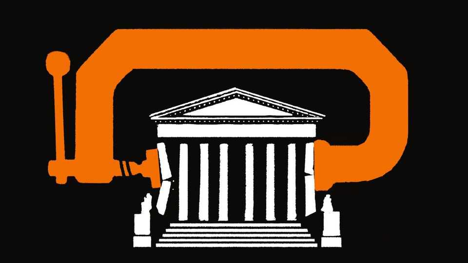

United States | The king and aye
The president’s agenda looks safe at the Supreme Court—with a few exceptions
What to expect from the nine justices, including SCOTUSbot’s predictions
October 2nd 2025

TWENTY-TWO years before he became America’s chief justice, John Roberts, then a junior lawyer in Ronald Reagan’s White House, quipped that “the constitution is safe for the summer” during the Supreme Court’s annual adjournment. No more. What was once a sleepy summer recess, punctuated by the odd execution appeal, is now thick with emergency petitions spurring on-the-fly judgments about core principles of American government. Reckonings over tariffs and presidential control of administrative agencies lie ahead this autumn. But since the last bang of the gavel on June 27th, Donald Trump has racked up eight off-season victories. The supermajority he forged in his first term granted his pleas to gut the Department of

Education, racially profile suspects during ICE arrests, deport men to South Sudan, restructure the federal government and remove Democratic members of the Consumer Product Safety Commission. It also let the president cut nearly $800m in research grants from the National Institutes of Health, sack the last Democrat on the Federal Trade Commission and withhold $4bn in foreign aid that Congress had appropriated.

This string of summer wins (most decided 6-3) followed an equally bright spring for Mr Trump. In all, he has lost only two of his administration’s nearly 30 pleas. This remarkable streak has come on the court’s “emergency” or “shadow” docket: cases resolved briskly, without full briefing or oral argument and with little or no explanation. On September 26th Justice Elena Kagan suggested in her dissent from the foreign-aid decision that this mode of jurisprudence may not meet the gravity of the moment. While “cases of far less import” are given “far more process and reflection”, the court breezily resolves weighty questions of presidential authority without discussion and with barely a word of justification.

The high court’s emergency procedures were not created for a presidency spawning hundreds of lawsuits as it seeks to transform America in many directions at once. Strain within the judiciary is starting to show. After a ruling in August by Justices Neil Gorsuch and Brett Kavanaugh which criticised lower-court judges who “defy” Supreme Court orders, several judges responded in kind, noting that the high court’s emergency orders are often cryptic and leave them at sea.

The 2025-26 Supreme Court term, which begins on October 6th, should clarify a few areas of law that have remained murky while Mr Trump pursues his agenda with nods—but little else—from the conservative supermajority.

Trump v VOS Selections and Learning Resources v Trump, two big tests of the president’s authority over trade policy, will be argued together on November 5th. VOS Selections says Mr Trump’s wide-ranging tariffs “jeopardise” its wine-importing business, while Learning Resources and hand2mind, educational toy companies, contend the duties, in effect, bar the import of some products and “increase their annual costs over 40-fold”. Three federal courts sided with the plaintiffs, concluding that the

International Emergency Economic Powers Act (IEEPA), the law mentioned in Mr Trump’s executive orders, does not authorise him to impose hundreds of billions of dollars of tariffs on dozens of countries.

The case against Mr Trump is straightforward. Article I, section 8 of the constitution gives Congress the power to tax and regulate foreign commerce. In enacting the IEEPA, Congress handed some authority to presidents to “regulate…importation” in the event of a declared emergency stemming from “any unusual and extraordinary threat...to the national security, foreign policy or economy of the United States”. The court rulings against Mr Trump did not second-guess the emergencies he cited as justification for the tariffs—fentanyl trafficking and trade deficits. But they rejected his contention that the IEEPA allows presidents to dramatically rejig America’s import duties. One concluded that the statute, which nowhere mentions “tariffs”, allows no presidential tariff tinkering at all.

The government’s brief to the justices leads with bombast. A year ago America “was a dead country”, it reads (quoting Mr Trump), but today, “because of the trillions of dollars being paid by countries that have so badly abused us, America is a strong, financially viable and respected country again.” The IEEPA, the brief continues, “unambiguously encompasses tariffs” and neither the “major-questions” nor “non-delegation” doctrines— which curbed some of Joe Biden’s more adventurous policies, like vaccine mandates and student-loan forgiveness—apply to presidents when they are conducting foreign affairs.

SCOTUSbot, The Economist’s AI tool to predict Supreme Court rulings, forecasts success for Mr Trump’s tariffs. In ten run-throughs (tapping into the three lower-court opinions, the administration’s opening brief and knowledge of each justice), the president wins nine times by margins of 5-4, 6-3 or 7-2. This more expansive reading of the IEEPA has bipartisan appeal: the Republican-appointed justices tend to defer to presidents, at least Republican ones, and two appointees of Barack Obama sided with Mr Trump at the Federal Circuit Court of Appeals—including Judge Richard Taranto, author of the dissent. Mr Trump’s tariffs on cars, copper and furniture (among other goods) are backed not by IEEPA but by Section 232 of the Trade Expansion Act of 1962 and Section 301 of the Trade Act of 1974. They are not at risk.

Mr Trump will almost certainly prevail in another consequential test of presidential power. In Trump v Slaughter, the court will consider overturning a 90-year-old precedent, Humphrey’s Executor v United States, that stymied Franklin Roosevelt’s plans to remove William Humphrey from the Federal Trade Commission in 1933. Nearly a century later, the Supreme Court seems keen to abandon the principle that congressional statutes can protect heads of independent agencies like the FTC, the Federal Communications Commission and the National Labour Relations Board (NLRB) from direct presidential control.

A sign of the justices’ impatience with Humphrey’s Executor came in May, when the six Republican appointees voted to let Mr Trump sack the heads of the NLRB and the Merit Systems Protection Board, an agency that adjudicates disputes involving federal employees. But that order sought to distinguish the Federal Reserve as a “uniquely structured, quasi-private entity” whose governors should not serve at the pleasure of the president. This suggests the court may be less receptive to Mr Trump’s bid to sack Lisa Cook from her position at the Fed. The court deferred Mr Trump’s plea to remove her in another shadow-docket case and announced it would hear oral argument on the matter in January. She is the only official Mr Trump has tried to sack who gets to stay in her job while the justices mull the challenge.

Mr Trump could falter in cases on the regular docket, too. On September 26th he asked the justices to let him deny birthright citizenship to babies born to non-citizens. The court will probably take up Trump v Washington and rebuff the iconoclastic reading of the 14th Amendment.  Mr Trump’s more extravagant immigration policies—such as using the Alien Enemies Act, an 18th-century law, to whisk purported gang members out of the country—could fail when the issue returns on the regular docket. The White House seems to understand where it skates on thinner ice: it has not rushed the Alien Enemies matter before the justices or tried to revive its attacks on law firms, which remain blocked by lower courts.

SCOTUSbot, the AI we trained to predict the outcomes of cases, forecasts another banner year for conservative causes outside Mr Trump’s orbit (see tables). But SCOTUSbot throws up its hands (five outcomes each way)

when considering whether the court will make it easier for police to enter homes without a search warrant when they suspect an emergency.

Many expect the court to take another bite out of the Voting Rights Act (VRA) in a case challenging the creation of a second majority-black congressional district in Louisiana. Were the challenge to succeed, it could open the door to yet more gerrymandering. But SCOTUSbot is equivocal: in ten simulations of Louisiana v Callais, Section 2 of the VRA—the provision that required the redrawing—survived four times.  With next year’s midterm elections expected to be close, a ruling that averts the loss of Democratic- leaning House districts could be consequential: a consolation for Democrats in what otherwise looks like being a bitter term. ■

How do you think the court will decide its biggest cases this term? We are collaborating with Good Judgment Inc for a SCOTUS forecasting tournament. Can you beat the SCOTUSbot? Make your predictions here.

Stay on top of American politics with The US in brief, our daily newsletter with fast analysis of the most important political news, and Checks and Balance, a weekly note from our Lexington columnist that examines the state of American democracy and the issues that matter to voters.

This article was downloaded by zlibrary from https://www.economist.com//united-states/2025/10/02/the-presidents-agenda-looks- safe-at-the-supreme-court-with-a-few-exceptions