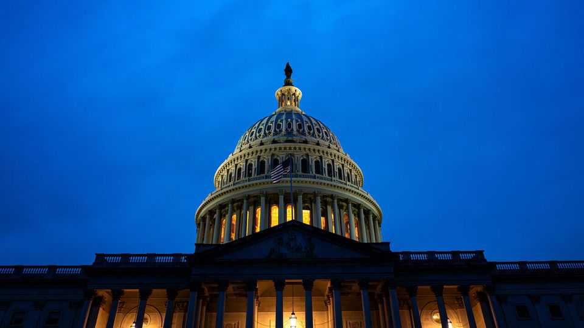
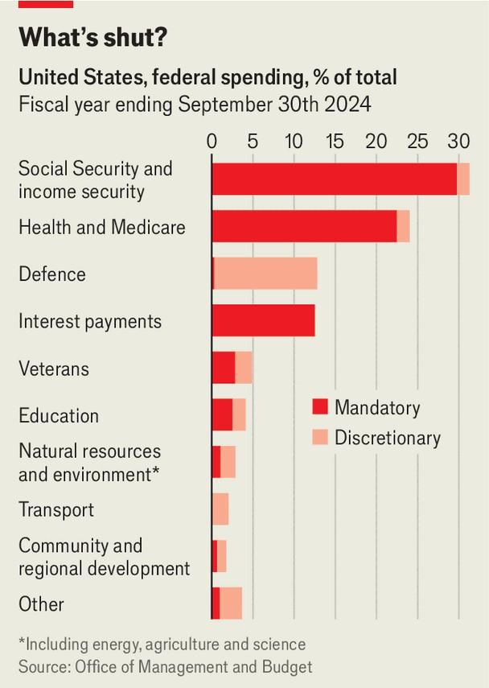

United States | Shutdown rundown
Your federal government is now closed for business
The short- and longer-term consequences of another governing fail in Washington
October 2nd 2025

Editor’s note (October 1st): American lawmakers failed to agree on a spending proposal before the deadline, causing a government shutdown. A government shutdown, to paraphrase Ernest Hemingway’s quip about bankruptcy, happens gradually, then suddenly. After weeks of wrangling on Capitol Hill, Democrats and Republicans failed to agree on a stopgap spending proposal. Democrats refused to support a bill to keep the government running unless Republicans made concessions on health-care funding. Republicans retorted that Democrats were holding the government

“hostage” by refusing to keep spending at current levels. And so, at 12:01am on October 1st, America’s federal government shut down—once again.

What happens next will feel familiar to anyone who followed the three shutdowns in the 2010s. Federal agencies will stop providing non-essential services and federal workers will be furloughed. Employees who work in areas deemed essential, like air-traffic controllers or active-duty soldiers, will continue to work, though without pay. Social Security and Medicare payments, which are considered “mandatory” spending, will keep going (see chart).

It remains unclear how long the shutdown will last. Recent ones have tended to last longer—such as the record 35-day shutdown in 2018-19—but their economic impact was limited. That may well be the case this time, but a few wrinkles in today’s economy and a larger change in politics could complicate things.

A shutdown means that important economic statistics, most notably employment figures from the Bureau of Labour Statistics (BLS), which are due out on October 3rd, will be delayed. At a time when the outlook for the American economy overall is murky and the Federal Reserve’s interest-rate

decisions have been unusually contentious, leaving policymakers to grope in the dark is hardly ideal.

Financial markets tend to treat shutdowns mostly as non-events beneath the noisy politics. But looking across the past few decades’ shutdowns, Goldman Sachs, a bank, does find that the dollar has typically declined following the start of a shutdown. From the tariffs of “Liberation Day” to attacks on the Federal Reserve, the administration has already done plenty this year to ding the dollar. A shutdown would be an unwelcome addition.

Furloughing 750,000 federal employees will also push employment down and growth down in the short term. The government payroll was already expected to shed 300,000 workers by December, mostly as a result of deferred resignation packages offered earlier in the year. The Congressional Budget Office estimates that the shutdown in 2018-19 knocked 0.02% off GDP that year. Should those furloughed seek a new job, they would face a tricky hiring environment: job growth has slowed in recent months, especially in the areas around Washington, where many federal workers live. Usually those effects are swiftly reversed when a shutdown ends, as employees return to work with their pockets stuffed with back pay. That might not be the case this time.

Russell Vought, the director of the Office of Management and Budget (OMB), has encouraged the federal government to use the shutdown as an opportunity to fire thousands of federal workers and gut government programmes. His office circulated a memo urging heads of departments to consider getting rid of all employees working on parts of the budget covered by discretionary spending and which do not align with the president’s priorities. That might be dismissed as a tactic to put pressure on Democratic senators to vote for a budget, except that it aligns both with Mr Vought’s long-held goals and a widely shared antipathy to the federal bureaucracy in the Republican Party.

No black-letter law explicitly provides agencies with the power to fire workers due to a lapse in government funding (but none says it cannot, either). In practice, a shutdown means HR departments inside most federal agencies would go unfunded, stopping them from following procedures to dismiss workers. Yet questions over legality or process are unlikely to stop

the administration, argues Bobby Kogan, a former OMB official now of the Centre for American Progress, a left-of-centre think-tank. One lesson from the DOGE experiment is that the administration moves faster than the courts. By the time the judges decide an institution should not have been gutted, it may already be beyond repair. ■

Stay on top of American politics with The US in brief, our daily newsletter with fast analysis of the most important political news, and Checks and Balance, a weekly note from our Lexington columnist that examines the state of American democracy and the issues that matter to voters.

This article was downloaded by zlibrary from https://www.economist.com//united-states/2025/09/30/your-federal-government-is-now- closed-for-business