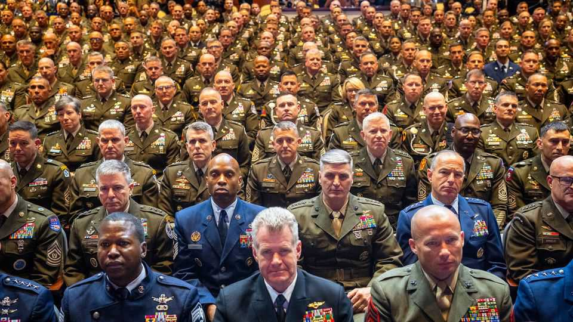

United States | Rank partisanship
The president tries to enlist the top brass for “the war from within”
A gathering of generals turns into a surreal, and worrying, political show
October 2nd 2025

AMERICA’S GENERALS and admirals scrambled home from the four corners of the world, summoned at short notice to hear an urgent message from their leaders on September 30th that was both ludicrous and ominous. Absurdly, President Donald Trump complained about “ugly” modern warships designed for stealth, and called for the return of old-school battleships with big guns rather than missiles. Alarmingly, he said military forces should be deployed at home to help wage “the war from within” against migrants and leftists. He confirmed that the National Guard would soon be sent to Chicago, and he added a chilling note: “We should use some of these dangerous cities as training grounds” for military forces.

As ever with Mr Trump’s rambling speeches, it is difficult to say what is real. But he has repeatedly dispatched military forces for domestic duties. He has deployed the National Guard to Los Angeles and Washington, DC— and plans to send them to Portland, Oregon—ostensibly to deal with crime in Democrat-run cities. Military forces have also been deployed to the southern border to help stop illegal immigrants and even blow up alleged drug-smuggling boats.

The gathering in Quantico, Virginia, was a sea of brass, campaign ribbons and balding heads. Hundreds of senior figures—one- to four-star commanders, along with their senior non-commissioned officers—were told to appear for a mysterious address by Pete Hegseth, now the renamed “war secretary”. Mr Trump was a late addition. The commanders rushed from places such as Honolulu, headquarters of Indo-Pacific Command, and Stuttgart, home to European Command, using military and commercial flights, at a cost probably running into the millions of dollars.

Mr Hegseth, a former major in the Army National Guard, lectured the generals about restoring the “warrior ethos”. The “War Department” had until recently been the “Woke Department”, he averred. He offered his well- known remedy: physical fitness, grooming, restoring “male” standards for combat, and promotions based on merit rather than diversity. More worrying, he advocated relaxing both rules of engagement in combat and measures to stop hazing and toxic behaviour in the barracks. Basic training would be “restored to what it should be, scary, tough and disciplined.” Women would not be excluded from combat units, but would have to meet the same exacting physical standards as men.

Mr Hegseth seemed nostalgic for the 1990s, when America swiftly evicted Iraqi forces from Kuwait, restoring swagger to a military shadowed by Vietnam. (It was also the time of the infamous “Tailhook scandal”, when navy and marine corps officers indecently assaulted scores of women and some men at a lewd convention in Las Vegas.) Above all, Mr Hegseth wants to project the ethos of the infantry platoon to the whole armed forces. He spoke about the “E6 rule”, ie, adopting the worldview of a squad’s staff sergeant. Thus all military personnel, commanders included, would have to do “hard” physical training: “fat generals and admirals” were unacceptable. “It’s a bad look.”

Mr Hegseth yielded to Mr Trump, who delivered a partisan speech to an audience drilled in the art of being apolitical. The commanders’ stony silence seemed to unnerve him. “They did not treat you with respect, the Democrats. They never do,” he said. He poured bile on former presidents, notably “sleepy Joe Biden” and Mr Obama. He boasted of his own brilliance in ending wars. If he did not get the Nobel peace prize, he said, “it would be a big insult to the country”.

Most disturbing was Mr Trump’s talk of using unrestrained force at home, which most senior officers dread. Soldiers had been made to defend “the borders of foreign countries” while America faced an “invasion from within”, Mr Trump said. America’s cities were being ruined by “radical left Democrats”. He would no longer tolerate protesters spitting at troops: “I say: ‘They spit, we hit.’” If vehicles get pelted with stones, “you can do whatever the hell you want to do”.

Despite these worrying exhortations, the event went better than many feared —there was no mass dismissal of officers or pledge of loyalty (though anyone who disagreed with the changes was urged to resign). “The politicians gave partisan speeches, which is their right,” says Peter Feaver of Duke University, a scholar of civil-military relations. “The military listened respectfully, without appearing to be partisan cheerleaders, which is their duty.”

Yet the biggest gathering of top brass that anyone can remember was vacuous. There was no guidance about how to deal with China, say, or how to manage the war in Ukraine. As the brass hurried back to their billets before the looming government shutdown, what would they have made of it all? At best it was a money-wasting pep-talk, at worst an attempt to draw them into the political and culture wars at home. Most alarming, perhaps, the commanders got a close-up view of how erratic their civilian leaders could be. ■

Stay on top of American politics with The US in brief, our daily newsletter with fast analysis of the most important political news, and Checks and Balance, a weekly note from our Lexington columnist that examines the state of American democracy and the issues that matter to voters.

This article was downloaded by zlibrary from https://www.economist.com//united-states/2025/09/30/the-president-tries-to-enlist- the-top-brass-for-the-war-from-within