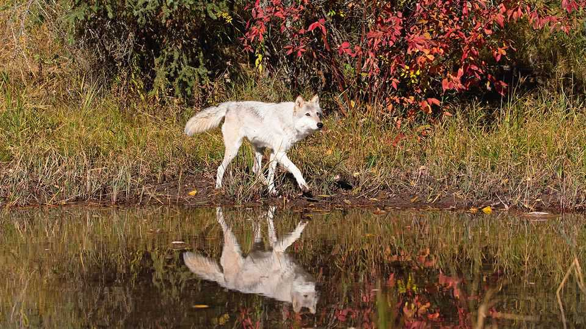
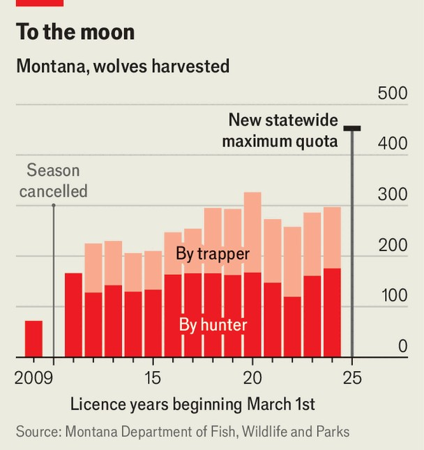

United States | What big quotas!
Republicans in the West want more wolves killed
In the battle between farmers and conservationists, canis lupus is losing
October 2nd 2025

In 1915, with war waging in Europe, America’s Congress had a different conflict in mind. That year it appropriated $125,000 (equivalent to $4m now) for the purpose of “destroying wolves, coyotes, and other animals injurious to agriculture”. By the 1930s there were essentially no wolves in the western United States (some survived in the upper Midwest). It was not until the 1990s that a few—at first imported from Canada—were reintroduced. Around 2,600 now roam between Idaho, Montana and Wyoming. Some would like to wipe them out again. In Montana, after six hours of debate at a meeting in August, the state’s fish and wildlife commission authorised a quota for hunters and trappers of 452 grey wolves. That is equivalent to two-fifths of the state’s estimated canis

lupus population. A single Montanan hunter can now get a licence to kill up to 30 wolves, spread between a 15-wolf hunting and a 15-wolf trapping permit. On private land, hunters can use thermal rifle scopes. The eventual aim is to get the population down to 450 wolves in the state, the lowest sustainable level as determined by a 1987 plan to guide the species’s reintroduction.

What did the wolves do to deserve this? “Every calf lost to wolves is a blow to my family’s livelihood,” said Nancy Conover, a rancher from Dillon, Montana, at the commission hearing (though ranchers do get compensation for livestock). Justin Webb of the Foundation for Wildlife Management in Idaho, a pro-hunting group, accused regulators of “bowing to preservation extremists”. Unless Montana shrinks wolf numbers, he warned, the legislature may strip the wildlife agency of authority altogether.

Conservationists are horrified. The Center for Biological Diversity, a charity, says that “the cruelty in Montana is extreme”. People in the tourist trade are also upset. “A wolf close to Yellowstone National Park has great economic value,” said Jim Bell, a Bozeman business owner, noting that wildlife watching generates far more for the state’s economy than hunting wolves does.

Since the wolf in the Northern Rockies was first delisted from federal protection in 2011, allowing hunting, the population has fallen. In August a federal court ordered the state to do more to protect wolves. To Republicans, that reeks of federal overreach. The spokeswoman for Greg Gianforte, Montana’s governor, said that this was “another activist decision in favour of environmental extremists”. The wolf population, she argued, is “healthy and sustainable”. His administration has backed higher quotas, bounties of up to $1,000 per kill and trapping methods like neck snares. Still, fewer than 2% of licensed hunters kill a wolf. For all the heat, few Montanans actually want to pull the trigger. ■

Stay on top of American politics with The US in brief, our daily newsletter with fast analysis of the most important political news, and Checks and Balance, a weekly note from our Lexington columnist that examines the state of American democracy and the issues that matter to voters.

This article was downloaded by zlibrary from https://www.economist.com//united-states/2025/10/02/republicans-in-the-west-want- more-wolves-killed