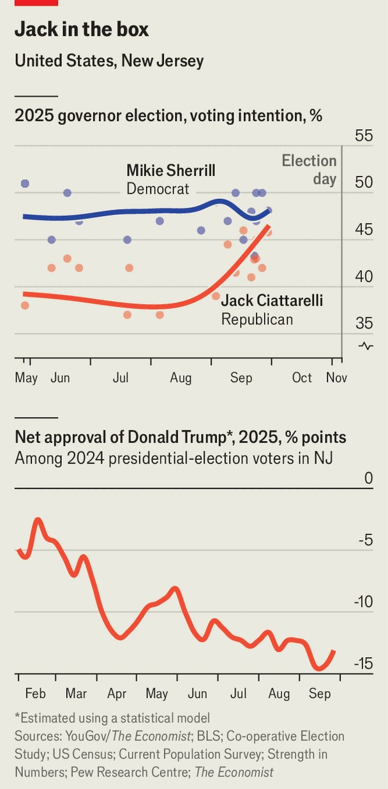

United States | Jersey guys
How a MAGA-aligned Republican has put a Democratic state in play
A bellwether race for governor of New Jersey looks closer than many expected
October 2nd 2025

NEW JERSEY has been unkind to Donald Trump. The Trump Taj Mahal and other hotel-casinos he opened in Atlantic City during the 1980s failed by the early 2000s. His American football team, the New Jersey Generals, played two seasons before its upstart league collapsed. When Mr Trump won the White House in 2016, Hillary Clinton beat him in New Jersey by 14 percentage points, and in 2020 Joe Biden beat him by even more.

Lately, however, things have been looking up. Last November, Mr Trump came within six points of upsetting Kamala Harris in a state that hasn’t voted for a Republican presidential candidate since 1988. And this autumn Jack Ciattarelli, a MAGA-aligned, Trump-endorsed Republican, has moved within striking distance of being elected as New Jersey’s governor on November 4th. Recent polls depict his contest against Mikie Sherrill, the Democratic nominee, as very close (see chart).

Much of this is due to Mr Ciattarelli’s skill as a retail politician. A businessman and former state legislator, he is campaigning as a “Jersey guy” and a change candidate determined to stump in all 564 of the state’s municipalities and several hundred of its greasy diners. On September 26th, in Lumberton, Mr Ciattarelli fist-bumped his way through a sweaty, alcohol- fuelled crowd at Dadz Bar and Grill, a South Jersey fixture that offers $2 beers on Philadelphia Eagles game days. “There are a lot of differences between me and my opponent,” Mr Ciattarelli shouted from a makeshift stage, “but one big one is she doesn’t know where the hell Lumberton is.”

That may not be fair, but unarguably Ms Sherrill is relatively new to the bloodsport that is New Jersey politics, and until recently she ran an aloof front-runner’s campaign. A congresswoman and former navy helicopter pilot, she moved to New Jersey after her military career and entered politics

in 2018, when she deployed her appealing centrist biography to flip a House of Representatives seat long held by Republicans. She comfortably won a crowded primary earlier this year and enjoys the backing of New Jersey’s party machine.

Ms Sherrill wants the race to be a referendum on Mr Trump, whose net approval rating in New Jersey since his re-election has sunk to minus 14 points, according to estimates by The Economist. Her ads relentlessly paint Mr Ciattarelli as “100% MAGA” and warn that he would govern as “Trump in Trenton”. Yet Ms Sherrill is burdened by her own party’s baggage. The outgoing Democratic governor, Phil Murphy, is unpopular after eight years in office. New Jersey voters have been solidly Democratic in national races, but are less predictable in local and governor’s elections. After a two-term governorship like Mr Murphy’s, the state has not elected a successor from the same party since 1961.

As the race has tightened, the candidates increasingly debate rising prices and local energy policy. Mr Ciattarelli promises to cut the state’s notoriously high property taxes and reverse Mr Murphy’s green-energy push; Ms Sherrill promises to quickly cap electricity rates.

It is easy to say that Ms Sherrill should focus even more on affordability issues and less on Mr Trump, yet Mr Ciattarelli, as an outsider unburdened by Mr Murphy’s record of presiding over spiking electricity prices, probably has the edge on that issue. And because the New Jersey legislature is solidly Democratic and its Senate is not on the ballot this year, a vote for Mr Ciattarelli is a vote for divided government, not Republican monopoly power. “When Republicans win in the state it comes down to these kitchen- table issues and the cost of living,” says Ashley Koning, director of a polling centre at Rutgers University.

Whether Ms Sherrill can pull out a victory will depend in part on how many Democrats and left-leaning independents turn up at the polls to express their outrage at Mr Trump’s provocative policies, particularly on immigration. Nearly a quarter of New Jersey’s population is foreign-born and ICE has been a target of protests. Party membership figures favour Ms Sherrill and Democrats “still have a fairly significant advantage in their ground game”,

ensuring voter participation by mail and on election day, says Matthew Hale, a politics professor at Seton Hall University.

New Jersey’s governorship is unusually powerful; the incumbent appoints offices that are elected in other states, such as attorney-general and the state board of education. If Mr Ciattarelli does eek out a victory, expect Mr Trump to identify as a Jersey guy and plant himself more often at the golf club he owns west of Newark, to thumb his nose at New York and make mischief for a city that made him famous but has scorned his presidencies. ■

Stay on top of American politics with The US in brief, our daily newsletter with fast analysis of the most important political news, and Checks and Balance, a weekly note from our Lexington columnist that examines the state of American democracy and the issues that matter to voters.

This article was downloaded by zlibrary from https://www.economist.com//united-states/2025/10/02/how-a-maga-aligned-republican- has-put-a-democratic-state-in-play

The Americas

The deal shielding Mexico and Canada from trade oblivion Jair Bolsonaro is running out of options A German newspaper for Bolivian blondes