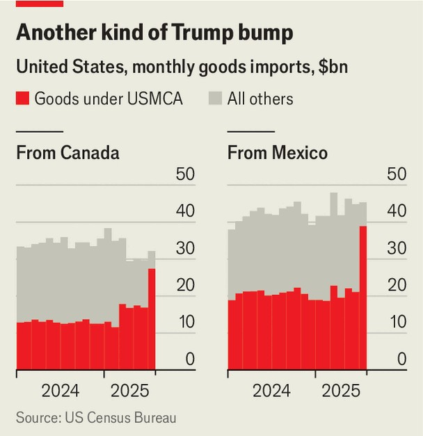

The Americas | Trick or treaty
The deal shielding Mexico and Canada from trade oblivion
Donald Trump’s tariff assault has been eroding the United States-Mexico- Canada Agreement
October 2nd 2025

Mexico and Canada were the first countries that Donald Trump threatened with tariffs when he returned to the White House in January. Ten months later, both enjoy an estimated overall tariff rate of less than 10%, according to Capital Economics, a consultancy based in London—well below the global average of 17%. They have been protected by the United States- Mexico-Canada Agreement (USMCA), a trade deal negotiated by Mr Trump during his first term to replace the similar, longstanding North American Free Trade Agreement. Most products covered by the USMCA have been excluded from tariffs. Without it, Mr Trump would have had freer rein to indulge his impulses.

But the USMCA is coming under pressure. On September 16th Mexico and the United States launched consultations ahead of the deal’s first formal review, which is due to start on July 1st 2026. The review is “the biggest leverage point for the United States”, says Lila Abed of the Inter-American Dialogue, a think-tank in Washington. Despite having negotiated the USMCA himself, Mr Trump could yet blow it up. Whether the agreement is extended, rewritten or scrapped will define North America’s economic future, particularly for Mexico and Canada.

The bloc has done well by free trade. Diego Marroquín Bitar of the Centre for Strategic and International Studies, a think-tank in Washington, reckons trade between the USMCA’s three parties grew by 32% between 2019 and 2024 to reach $2trn a year in nominal terms. Annual foreign direct investment from the rest of the world into North America grew by 21% over that period, bucking a global decline.

For many of Mr Trump’s declared aims—such as competing with China—it seems logical for bloc members to work together. “Mexico is the perfect complement to the United States,” says Luis Rosendo Gutiérrez, Mexico’s undersecretary for foreign trade. Take the production of semiconductors, a strategically important industry mostly concentrated in East Asia. Bringing more of it to North America could mean expanding high-end chipmaking in the United States. Mexico could ramp up the lower-end assembly of chips into working electronic devices.

So far, it seems that economic realities have protected the USMCA. Businesses in the United States have supply chains which are deeply embedded in Mexico and Canada. Ending the agreement would hurt them. But Mr Trump does not respect its letter or spirit. As well as imposing a 25% tariff on Mexican goods not covered by the USMCA, and one of 35% on Canadian goods (both of which will soon come before the Supreme Court), he has also slapped duties on some items which are covered, including cars, steel and aluminium. These tariffs are justified on national- security grounds, which the USMCA allows.

But when the USMCA was agreed in 2018, the United States also decided to give Canada and Mexico an annual quota of duty-free imports of cars and car parts that could be used whenever tariffs are invoked in the name of national security. That quota, which includes some 2.6m passenger vehicles from each of Mexico and Canada, as well as car parts worth many tens of billions, has been ignored by the United States. Instead, a 25% tariff on non- American content in finished vehicles is currently in force, though it is proving to be a highly complex duty to collect.

Firms in Mexico and Canada have been able to limit the damage by ensuring that a larger share of their products comply with USMCA rules (see chart). But the United States has several investigations running which might lead to national-security tariffs being applied to more products, like semiconductors and medical devices, thereby bypassing USMCA protection.  ”The universe of goods that get preferential treatment is getting increasingly small,” says Mr Marroquín. By some estimates, up to a third of all USMCA trade is now affected. Mexican beer, for example, is covered by the USMCA, but exporters must pay Mr Trump’s national-security tariff on the aluminium in the can.

This erosion of USMCA protections is bad for Mexico, Canada and the United States. But scrapping the deal would be much worse. The damage

would be swift, especially for Mexico. Over 80% of its exports go north, equivalent to about a third of GDP. Kenneth Smith Ramos, a former Mexican trade negotiator, notes that Mexico’s advantages—its location, workforce and integration into supply chains—would endure even without a trade deal. But he says the USMCA is a “fundamental piece for Mexico’s competitiveness”.

Canada, meanwhile, sends three-quarters of its exports south, including oil, wood, car parts and aluminium. The United States would not be spared either, as the fifth of its exports which go to Mexico and Canada would be exposed to tariffs without the USMCA. And so most observers expect the USMCA to be renewed in some form in 2026 for 16 years, the term of the first agreement. But few think that will stop Mr Trump from lashing his neighbours with tariffs.

Cars are most likely to become a flashpoint in talks. Canada has already raised official objections over the failure of the United States to honour the quotas. Wrangling over what counts as “regional content” was constant even before Mr Trump returned to the White House.

Reliance on Chinese supply chains will certainly come up. The United States frets also about the activity of Chinese firms in Mexico. And it dislikes that Mexico’s imports from China are large and growing, especially of cars.

Non-tariff barriers bother all three. Mexico’s ban on genetically modified corn enrages American growers. Farmers in Mexico hate America’s use of security to justify suspending fruit imports. Mr Trump thinks Canada’s dairy rules block American products.

It may bolster the USMCA that its two more pro-trade parties say they will work together. On September 18th Mark Carney, Canada’s prime minister, made his first official trip to Mexico and met Claudia Sheinbaum, Mexico’s president. The pair promised to “strengthen” the USMCA.

To date they have adopted very different tactics when dealing with Mr Trump’s tariffs. Canada has been openly critical; Mr Carney won the general election with a strong anti-Trump message.

In contrast, Mexico has embraced American demands and worked hard to build a relationship with Mr Trump and his team. In September, Mexico said it would impose tariffs of 20–50% on 1,463 products from countries with which it has no free-trade deal. Mexico claims these tariffs have been crafted to protect local industries, but they are undeniably also a reaction to Mr Trump’s concerns about China.

Chinese cars, which in 2024 accounted for 20% of new cars sold in Mexico, up from under 1% in 2017, will be subject to a 50% tariff. Moreover, Mexico has drawn up a screening mechanism for foreign direct investment, and passed it to American officials to review. “Mexico has sometimes done more than the United States itself does to protect North American competitiveness,” says Mr Gutiérrez.

In the long run Mr Trump’s constant, erratic attacks can hardly fail to damage the North American trading system. Mexico and Canada both want to diversify their trade away from the United States (even if Mexico’s planned tariffs undermine that goal). Both also say they want to make more goods at home, tilting towards protectionism. Integration and free trade are still by far the best deal for North America. The more that is preserved, the better. ■

Sign up to El Boletín, our subscriber-only newsletter on Latin America, to understand the forces shaping a fascinating and complex region.

This article was downloaded by zlibrary from https://www.economist.com//the-americas/2025/10/02/the-deal-shielding-mexico-and- canada-from-trade-oblivion