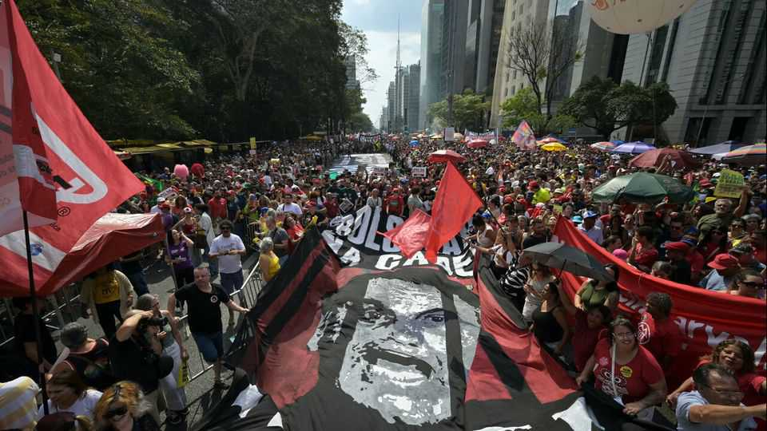

The Americas | Brazilian politics
Jair Bolsonaro is running out of options
Donald Trump’s support has not helped, and hopes of amnesty or pardon have been dashed
October 2nd 2025

Jair Bolsonaro is having a terrible few weeks. On September 29th Tarcísio de Freitas, the right-wing governor of São Paulo, announced that he would not run in next year’s presidential race, and would instead seek a second term as governor. The right’s leading candidate, Mr Freitas had said that if he won, he would pardon Mr Bolsonaro for the crime of plotting a coup, for which the hard-right former president was sentenced to 27 years imprisonment on September 11th. Several centrist governors are now jockeying to take Mr Freitas’s place. None seems keen on a pardon. It is the latest in a string of setbacks for Mr Bolsonaro. Options for softening or eliminating his sentence have evaporated. The United States, which

vowed retaliation for his conviction, has done nothing of substance. An amnesty bill to spring him from prison has fallen through. His family had been in a strong position to anoint a right-winger to face Luiz Inácio Lula da Silva, Brazil’s left-wing president, in October 2026. Now they look irrelevant.

Relations between Mr Trump and Lula, as Brazil’s president is known, thawed after they met at the United Nations General Assembly in New York on September 23rd. Mr Trump later said they had “great chemistry” and that they would talk by phone. The reasons for the change of heart are not clear. Firms affected by Mr Trump’s tariffs have sought to de-escalate the spat. Reuters, a news agency, reports that Mr Trump recently met with Joesley Batista, the co-owner of JBS, a Brazilian meat-processing giant. A JBS subsidiary in the United States was a donor to Mr Trump’s inauguration. JBS was hurt badly by the 50% tariff that Mr Trump placed on Brazilian imports in July. JBS has said that its meetings with public officials adhere to its code of conduct.

Mr Trump has not dished out further economic punishment on Brazil for Mr Bolsonaro’s conviction. Instead, his State Department extended sanctions to the wife of Alexandre de Moraes, a leading supreme-court judge on whom it had placed the same sanctions in July. Mr Trump may have noticed that his assault on Brazil seems to be helping Lula. The Brazilian president’s approval rating has increased from 40% in June to 44% in September, its highest level this year.

The amnesty bill has also disappointed. Mr Bolsonaro’s Liberal party had made a deal with a bloc of ideologically fluid parties known as the centrão (the big centre). It would approve a faster evaluation of the amnesty law in exchange for the Liberal party backing a “shielding amendment” that would insulate lawmakers from supreme-court investigations. Neither group was prepared for the scale of public outrage this prompted. On September 21st 100,000 people marched against the bills, one of the largest protests in years.

Congress backed down. The upper house hastily rejected the shielding amendment. The lower house is heavily diluting the amnesty law. Its speaker, Hugo Motta, declined to protect Mr Bolsonaro’s son Eduardo, a congressman who in March moved to Texas to lobby the Trump

administration on his father’s behalf. The attorney-general has charged Eduardo with seeking to improperly influence his father’s trial, while the supreme court has authorised the police to investigate Eduardo and his father for alleged crimes committed during the covid-19 pandemic.

Complicating matters, the unpopular Eduardo has insisted he will run for president himself, splitting the right and triggering Mr Freitas’s withdrawal. While the São Paulo governor’s decision may not be final, the rift is sapping the Bolsonaro family’s influence and risks condemning its patriarch to a life sentence. ■

Sign up to El Boletín, our subscriber-only newsletter on Latin America, to understand the forces shaping a fascinating and complex region.

This article was downloaded by zlibrary from https://www.economist.com//the-americas/2025/10/02/jair-bolsonaro-is-running-out- of-options