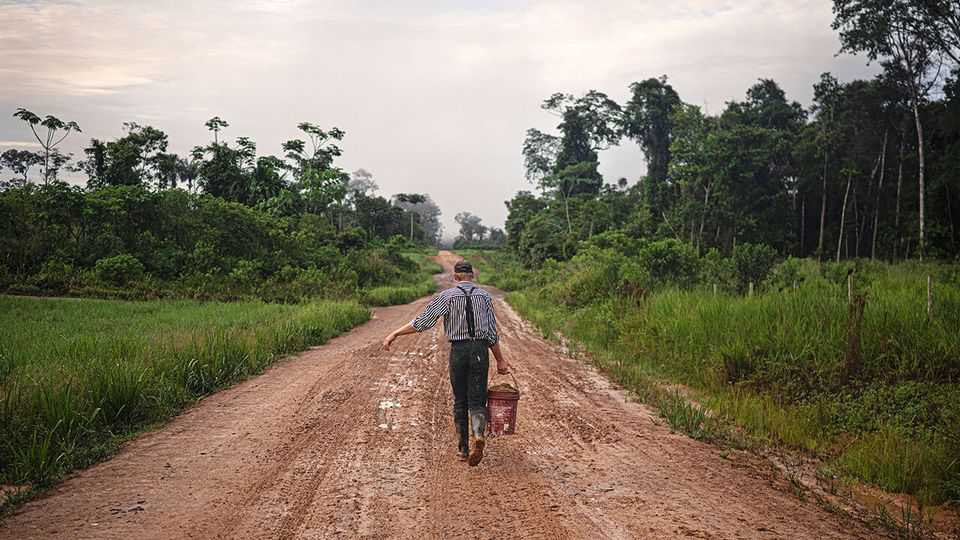

The Americas | The printed word
A German newspaper for Bolivian blondes
For Mennonites from Bolivia to Belize, Die Mennonitische Post is often the only connection to the outside world
October 2nd 2025

Cross the road in Santa Cruz, Bolivia’s largest city, and the pedestrians are suddenly pale, blond and six feet tall. They are Mennonites, a close-knit Christian group, who travel in from their remote farming communities to buy seeds, fertiliser and tractor parts. They also pick up Die Mennonitische Post, a newspaper. “I don’t understand a word of it,” says a local cashier. “But we sell a lot of copies.” Die Mennonitische Post—or simply the Post—is a unique sort of newspaper, written by Mennonites, for Mennonites. It is produced in German in Canada, and distributed across the Americas. And unlike most other media, it is doing just fine in print, thanks to its readership’s distinct preference for the

old ways. For some Mennonites in the Americas, from Belize to Bolivia, it is one of their only links to the wider world. For outsiders, it is a window into a thriving farming diaspora.

Mennonites emerged in Europe after the Reformation, taking their name from a Dutch priest, Menno Simons, who advocated separation from a wicked world. They have roamed in search of hands-off governments and land to farm ever since. In the 20th century they spread across the Americas. Perhaps half a million live there now, speaking Low German, many in remote “colonies”. The Post was set up in 1977 to connect them. It is published twice monthly and sold in almost every colony, says Kennert Giesbrecht, who edited the newspaper for almost 22 years.

Mennonite colonies vary in theology and strictness, but there are common elements. Each has a church and a school. The colony owns the land, but it sells slices to its members. Life revolves around mixed farming; individuals are taxed according to acres farmed and litres of milk sold. There is an administrative leadership, elected by landowning men. But it answers to the bishop, whom pastors elect from their own ranks, either by vote or drawing lots. According to Yann le Polain of McGill University in Montreal, well over 200 colonies are spread across nine Latin American countries covering at least 3.9m hectares, an area greater than the Netherlands.

Both Mr Giesbrecht and the current editor of the Post come from the giant colonies of Paraguay. Mennonites are less than 1% of the population there, but own some 8% of the land. Their colonies are poles of agribusiness, with cheese factories and meat-processing plants. These “progressive” colonies are plugged into the wider world. Their inhabitants go into politics and do consulting for foreign investors. But they are not big readers of the Post. “Progressive colonies have the internet, their own newspapers and tonnes of books,” says Mr Giesbrecht. “It’s the conservative colonies that rely on the Post.”

Bolivia is the heartland for conservative Mennonites. Visiting a colony is like time travel. Transport is limited to horse-drawn carts. Each brick house has a long strip of farmland behind it. Technology—including mobile phones—is mostly shunned. People in such colonies leave school at 13. Some homes have no book apart from the Bible. The Post may be their only link to the wider world. That is why it is written in simple language, says Mr Giesbrecht. Some use it to learn to read.

The paper includes news from the colonies, but about half of each edition is given over to letters. Some handwritten ones take months to arrive. An August issue included a letter from a colony in the Peruvian Amazon that is a 20-hour boat ride from the nearest city. It had another from Angola, where a first African colony was recently set up. The correspondent offered a psalm for reflection, precise details of the weather and harvest, and observations on local customs, such as their taste for a particular kind of worm.

Mr Giesbrecht jokes that the Post must be one of the few printed newspapers on solid ground. In 2002, when he took over, he sold 5,000 copies of each issue; now it’s 10,000. Demography bodes well: a conservative Mennonite couple may have eight children. They will go forth and multiply—and they will buy print. ■

Sign up to El Boletín, our subscriber-only newsletter on Latin America, to understand the forces shaping a fascinating and complex region.

This article was downloaded by zlibrary from https://www.economist.com//the-americas/2025/10/01/a-german-newspaper-for-bolivian- blondes

Asia

Can India strike a deal on Russian oil to appease America? Australia’s post-China hangover South-East Asia is being swamped with Chinese goods Japanese politics heats up Women’s cricket in India is taking off