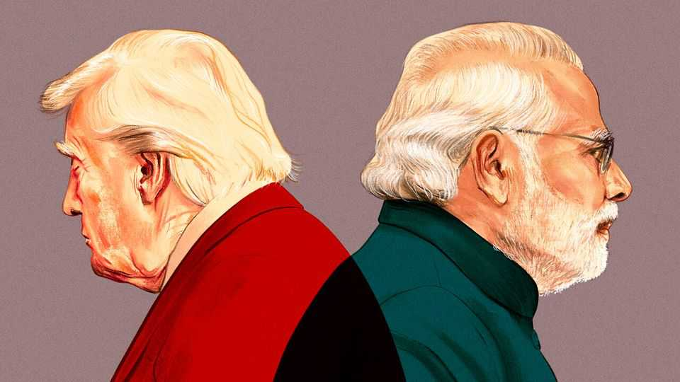

Asia | Crude awakening
Can India strike a deal on Russian oil to appease America?
It could help halt the downward spiral in relations between the two countries
October 2nd 2025

In recent days, Donald Trump has appeared across India. At mass celebrations for the festival of Durga Puja in the states of Bihar and West Bengal, the American president’s effigy has been dressed up as a demon— and has then been slain by a female goddess. This mood of public defiance adds to a growing headache for Narendra Modi, India’s prime minister, who needs to repair relations with Mr Trump. Mr Modi has some reason to be optimistic that a spat between America and India could soon be over. Negotiations on a detailed trade agreement with America are at an advanced stage. India is looking for creative ways around

some of its long-held red lines, for example by relaxing bans on the import of dairy products and genetically modified food. And it is preparing to spend big on aircraft, weapons and oil from America. But officials on both sides agree that nothing will happen until Mr Modi and Mr Trump patch up a much more personal dispute.

The two fell out in spectacular fashion in May after Mr Trump failed to back India in a short conflict with Pakistan. The American president then boasted that he had negotiated a truce between the two countries. Pakistan’s leaders quickly agreed and put Mr Trump up for the Nobel peace prize. In a phone call in June, Mr Trump seemed to expect Mr Modi to do the same. But the proud Mr Modi angered the American president by insisting the ceasefire was not his doing at all.

A month later, Mr Trump demanded that India stop buying oil from Russia, which provides around a third of its crude imports. The president wanted to put pressure on Vladimir Putin, his Russian counterpart, ahead of a summit in Alaska in August. Mr Modi might have been willing to agree to that request, had it been made in private. Russian oil trades at less of a discount than it used to, so India would not take much of an economic hit by weaning itself off it. But when India did not comply, Mr Trump doubled tariffs on most Indian goods exports to America to 50%.

The two strongmen are now locked in a stalemate: Mr Trump insists on a loud win, but Mr Modi can give him only a quiet one. The Indian prime minister wants to appear Mr Trump’s equal in front of his supporters, making a public climbdown hard.

How might India handle Mr Trump’s ultimatum on its oil purchases from Russia? Some analysts hope that Mr Trump’s short attention span might mean that Russian oil becomes less of an issue when another global crisis steals his focus. Others suggest that there is a deal to be done in which Mr Trump lets India buy some sanctioned Russian military kit in exchange for reducing oil purchases. Ashley Tellis of the Carnegie Endowment for International Peace, a think-tank in Washington, hopes a new boss at America’s embassy in Delhi might help. Mr Trump has nominated Sergio Gor, a close aide in charge of hiring MAGA acolytes for the administration,

to be ambassador to India. Once confirmed, Mr Gor could use his ties to Mr Trump to persuade him to moderate his demands.

If the oil spat can be set aside, the two countries could strike a trade deal that would be much deeper than the shallow framework agreements that America has negotiated with others. In July people familiar with the negotiations say that India put on the table historic concessions on agriculture, in what one called a legally enforceable “thousand-line trade deal”. A decrease in tariffs on American industrial goods could also be included. Other issues remain; America wants India to accept genetically modified crops. It also wants to sell Indians milk from cows that are fed non-vegetarian diets. For religious reasons, India has refused. But it might allow the milk in if cartons are labelled as coming from carnivorous cows.

An arms deal could help, too. A team of Boeing executives visited India in September, hoping to sign a contract to sell India $4bn-worth of P-8 maritime surveillance aircraft, which are useful for tracking Chinese subs in the Indian Ocean. But the executives left empty-handed. One insider speculates that India is holding the deal in reserve to sweeten a trade deal later.

The bigger question is whether the damage done to India-America ties is permanent. American officials say that fixing the question of Russian oil will put relations right back on track. Indian officials, putting on a brave face, echo those talking points in public. But dig deeper, and it is apparent that months of diplomatic turbulence have unravelled a quarter-century of painstaking diplomatic work to build trust between the countries. “It will be like if you have long covid,” says Lindsey Ford, who led the White House’s efforts to get closer to India during the Biden administration. “You look normal, but your body doesn’t function the same way. And there will be things internally that make your body more susceptible to illness and disease.”

Mr Trump’s diplomacy has activated India’s muscle memory from the cold war. “For 50 years, we officially hated the US,” says one Indian analyst. Among India’s elite-educated class of post-colonial bureaucrats, many nurtured Soviet sympathies; all pledged solidarity with the global south. Neither main party could fully embrace Uncle Sam. “America never had a

high moral quality, for any of us,” says a former Indian ambassador to America.

The longer the spat persists, the weaker India’s already small pro-America faction will become. Subrahmanyam Jaishankar, the foreign minister, built his reputation as a career diplomat on advancing India’s pivot to America. Now, a reputation for diplomatic foresight looks like a political vulnerability. “Even those who support closer ties with the US and the West are holding their noses,” says Rajesh Rajagopalan of Jawaharlal Nehru University in Delhi.

A cool-headed logic still holds: closer ties let India and America grow more prosperous and could help check China’s rise. America is India’s largest export market. Trade in goods and services between the two was $212bn last year, up 8% from 2023. The two are due to sign an accord governing military ties over the next decade, meaning more joint exercises and snazzier defence kit for India. Mr Modi would like to cap it off by hosting Mr Trump and the leaders of Australia and Japan for a summit of the Quad countries in Delhi in the coming months. But while emotions run hot, such cold logic will hold far less sway with either leader. ■

Stay on top of our India coverage by signing up to Essential India, our free weekly newsletter.

This article was downloaded by zlibrary from https://www.economist.com//asia/2025/10/02/can-india-strike-a-deal-on-russian-oil- to-appease-america