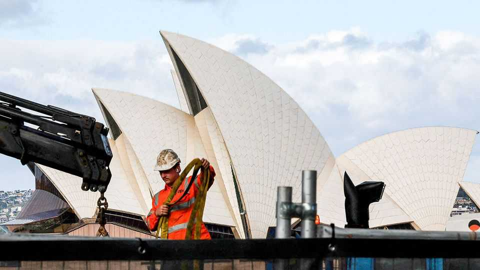
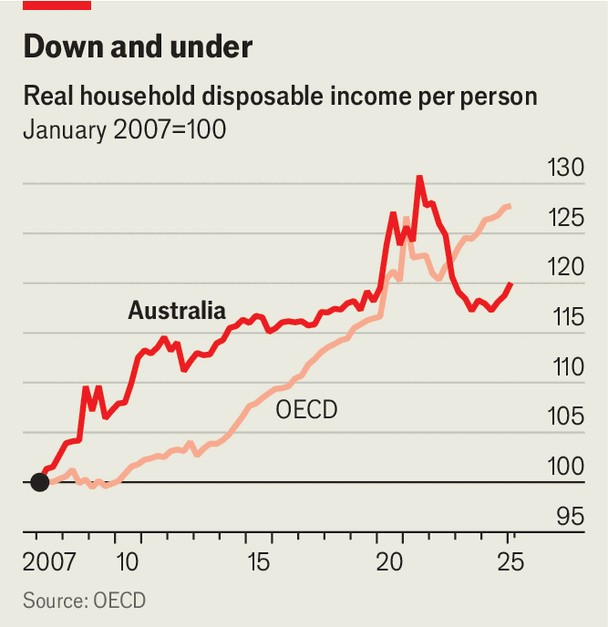

Asia | Boom to bust
Australia’s post-China hangover
The country grew rich on Chinese demand. Now it must find a new model for growth
October 2nd 2025

For years Australia benefited from a booming Chinese economy. Ships full of iron ore and coal streamed out of the country. They not only earned Australia foreign exchange but also held up wages, swelled tax revenues and brought a run of budget surpluses. Yet now those good times are over. China’s economy is slowing; commodity prices are falling. Australia looks punch drunk. Having won re-election in a landslide in May, Australia’s Labor government has a big mandate to do something about this. Jim Chalmers, the treasurer, says driving up productivity is his priority. The question now is whether his

government has the tools—and the gumption—to reverse the country’s economic problems.

The numbers are bleak. Productivity growth slumped between 2019 and 2024: Australia now ranks second-last, ahead only of Mexico, according to the OECD, a club mostly of rich countries. Since 2021 Australians’ disposable incomes have declined, and faster than in any other country in the OECD, partly due to weak wage growth and tax brackets that are not indexed to inflation. Young Australians fear they will not live as well as their parents. They face soaring housing costs as well as bills for tackling climate change and for supporting an ageing population, according to Danielle Wood of the Productivity Commission, a government agency that reviews economic policy. Firms grumble that Australia has the second- highest corporate-tax rate in the rich world and that they must navigate a labyrinth of state and federal regulations.

Mr Chalmers wants this to change. He has complained that Australian firms are not sufficiently innovative, that companies invest too little and that workers lack essential skills. In August the government convened 30 leaders from business, trade unions and community organisations to begin discussing economic reforms.

One of the contentious issues relates to the tax system. Awareness is growing that it unfairly favours older Australians, leaving younger workers to shoulder the burden through income tax. Economists who attended the government’s roundtable called for raising taxes on capital gains. This would be done by trimming big discounts presently offered to people selling properties they have owned for more than a year. They also want to reform family trusts, which allow the well-off to spread income among relatives in lower tax brackets, and to make tax breaks for people with big pensions savings less generous.

Australia’s housing woes do not help matters. Many young workers feel locked out of home ownership. That is true in much of the world, but housing in Australia is especially scarce. Data show it has fewer dwellings per 1,000 people than most other rich countries. Renters spend roughly one- third of their median household income on rent while mortgage-holders spend 50% on repayments. Reform is hard because so many Australian voters have their wealth tied up in housing, says Aruna Sathanapally of the Grattan Institute, a think-tank in Melbourne.

Recent history suggests Australia is capable of making big economic leaps. Governments in the 1980s and 1990s floated the Australian dollar, opened the country up to trade and made saving for retirement compulsory. Yet in the past 15 years Australian governments have become much more cautious. Part of the problem is that they have had their fingers burnt by some high- profile policy failures, including a mining tax and a carbon price.

Today no single change can hoist productivity growth back to its long-term average of 1.6% a year, according to Ms Wood of the Productivity Commission. Instead, the country needs many smaller shifts: faster approvals, simpler rules. “In movie parlance,” she said in a recent speech, “less ‘Oppenheimer’ and more ‘Everything Everywhere All At Once’”. Australia’s future no longer relies on shipping mountains of ore to China— but in chipping away doggedly at the obstacles that hold back its growth. ■

This article was downloaded by zlibrary from [https://www.economist.com//asia/2025/10/02/australias-post-china-hangover](https://www.economist.com//asia/2025/10/02/australias-post-china-hangover)