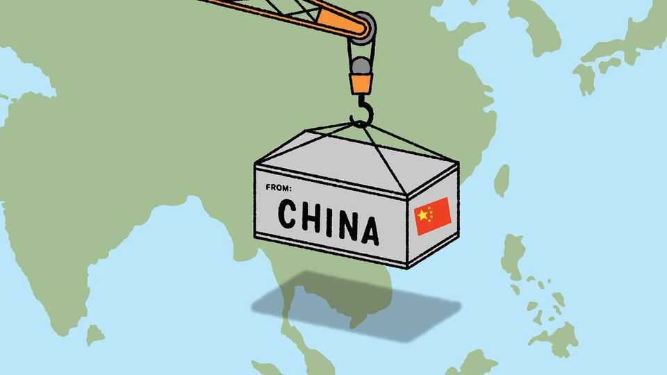

Asia | Banyan
South-East Asia is being swamped with Chinese goods
It is adding to the pain from Trump’s tariffs
October 2nd 2025

Grand promises are standard fare for the Association of South-East Asian Nations (ASEAN). The latest came after a meeting of the bloc’s economic ministers last month in Kuala Lumpur, Malaysia’s capital. It was a vow to build a “trade and investment ecosystem that is open, resilient and future- ready”. This time, though, the lofty goal was rooted in a sense of real urgency. South-East Asia, one of the world’s most trade-dependent regions, is being battered by Donald Trump’s tariffs. They range from 10% for Singapore to 40% for Myanmar and Laos. But bigger threats lurk in sector-specific tariffs and a 40% levy on goods “trans-shipped” to America. That duty’s scope is

unclear, but if enforced strictly it could snag the region’s supply chains, which are deeply entwined with China’s. Economic growth will be hit: ASEAN has downgraded its annual forecast for 2025 to 4.2%, down from 4.8% last year.

Given this, working together to counter the tariff blitz seems like a sound idea, but it is proving difficult. Hours after Mr Trump’s “Liberation Day”, Vietnam rushed to seek concessions from the American president. Other countries quickly followed. On the sidelines of the meeting in Kuala Lumpur, negotiations continued with an American trade representative. Later this month there could be even more kowtowing, as Mr Trump himself is expected to attend a meeting of ASEAN leaders. Deals with America may help countries in the short term, but undermine goals of regional integration.

In theory, ASEAN already has a potentially powerful tool to pivot away from American trade in the form of the Regional Comprehensive Economic Partnership. The agreement, which was signed in 2020, links ASEAN to big economies in the region, including China, Japan and Australia, and is the biggest free-trade deal in the world by GDP. Last week four more countries (Bangladesh, Chile, Hong Kong and Sri Lanka) expressed interest in joining it. But despite its growing attractiveness, the RCEP is still a fledgling initiative, modest in ambition and scope.

One of the biggest proponents of a stronger RCEP, unsurprisingly, is China, which has emerged as the winner from Trump-induced turmoil in the region. In the first eight months of 2025, China exported $435bn worth of stuff—or around 20% of all its exports—to ASEAN countries, up from 13% in 2019. That figure could rise further still. At next month’s summit, ASEAN is expected to upgrade an existing trade agreement with China, lowering yet more barriers.

But the flood of Chinese goods entering South-East Asia is also, for manufacturers, a challenge. Traditionally, these imports were intermediate inputs feeding ASEAN’s own export industries. Increasingly, though, China is exporting finished consumer goods. Shoppers in South-East Asia may delight in Labubu dolls or cheap EVs, but local producers are being crushed by the influx. Manufacturing output is struggling in many parts of the region and lay-offs are widespread.

A few countries are beginning to push back. Indonesia has launched anti- dumping investigations against Chinese products and tightened import rules. But on the whole, ASEAN has been slow to act. New analysis by researchers at IMD Business School found that less than 7% of Chinese exports that received subsidies at home faced defensive measures in South- East Asian countries, other than Indonesia.

The hesitation to take on China is understandable. For most countries, America’s tariffs represent the more pressing and immediate concern. Responding to China is also hard. Few governments want to risk a trade confrontation with their biggest supplier and financier. Between 2015 and 2024, around a fifth of all new project investment in South-East Asia came from China, up from 13% in the decade to 2017, according to data from the Lowy Institute, an Australian think-tank.

Ultimately the best response to both Mr Trump’s tariffs and cheap Chinese imports is greater ASEAN integration. Little over a fifth of South-East Asian exports are shipped within the region, a figure that has decreased over the past decade and remains well below the European Union (60%) and North America (29%). Intra-regional trade has been hindered by non-tariff barriers, infrastructure and lack of political will. For decades, countries in ASEAN have been split by parochial politics. The hope is that the pain from today’s trade turmoil will give the bloc a new lease of life.■

Subscribers to The Economist can sign up to our Opinion newsletter, which brings together the best of our leaders, columns, guest essays and reader correspondence.

This article was downloaded by zlibrary from https://www.economist.com//asia/2025/10/02/south-east-asia-is-being-swamped-with- chinese-goods