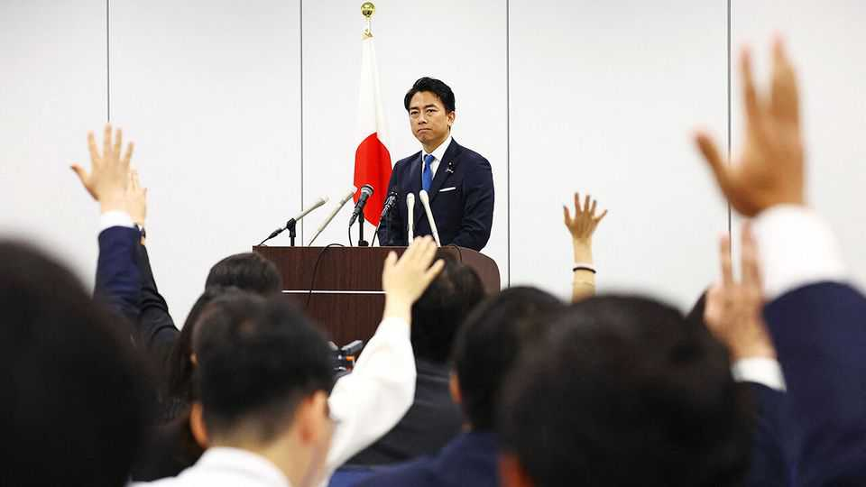

Asia | A tale of two ideologies
Japanese politics heats up
It could get its youngest prime minister, or its first female one
October 2nd 2025

“CHANGE, LDP!” runs the campaign slogan of a leadership race in Japan’s ruling party, which concludes on October 4th. The message may sound a little desperate, but that reflects a crisis in the Liberal Democratic Party (LDP), which has dominated Japan’s politics for seven decades. For the first time, it is governing with a minority in both chambers of the country’s parliament. Two electoral drubbings forced Ishiba Shigeru, the prime minister, to step down in September, less than a year after he took office. The race to replace Mr Ishiba as leader of the LDP has five contenders. Two have led the polls for weeks. Koizumi Shinjiro, a 44-year-old agriculture minister and son of a popular former prime minister, would be Japan’s youngest post-war leader (pictured). Takaichi Sanae, a 64-year-old hardliner,

would be its first female one. They represent rival visions of change. Mr Koizumi’s victory would give the LDP a more moderate image, reviving its claim to be a big-tent party. Ms Takaichi signals greater fidelity to the party’s conservative ideology and hawkish foreign policy. Yet neither may be able to lift the party out of its malaise.

Mr Koizumi also ran in last year’s leadership race, casting himself as a moderniser. But he faced a backlash from the party’s rank-and-file, which skews old and male. This year, he has been more cautious, insisting only that the LDP must remain attuned to “the changing sentiments of the people” and “act on necessary reforms”.

Ms Takaichi is running as heir to the late Abe Shinzo, inheriting his controversial views on history that play down Japan’s wartime aggression. Like Abe, she also staunchly calls for revising Japan’s pacifist constitution. She speaks often of economic security and is fiercely protective of socially conservative values; one of her key pledges is to preserve the male line of Japan’s imperial family. Though she cites Margaret Thatcher as a role model, she is doveish on monetary policy; last year, she caused a stir by saying the Bank of Japan would be “stupid” to raise rates.

In this campaign, she has leant into nationalist rhetoric surrounding foreigners in Japan (who account for only 3% of the total population). Other candidates, including Mr Koizumi, have also toughened their language on immigration, in part a response to the rise of Sanseito, an anti-globalist, hard-right populist outfit. But Ms Takaichi’s remarks have been especially pointed. Her hardline language appeals to conservatives in the grassroots, but worries many colleagues in the LDP.

In the first round of the race, votes from lawmakers and dues-paying members are counted together. If no candidate wins a majority, the top two advance to a run-off in which parliamentary votes carry greater weight. In last year’s contest, Ms Takaichi gained the most grassroots votes but was defeated in the run-off. Whoever wins will face some big challenges. In late October the new leader is due to host Donald Trump in Tokyo. Mr Ishiba had struck a trade deal that lowered American tariffs on Japan to 15%, in exchange for a vague pledge that Japan would invest $550bn in America. At

home, inflation has sparked public anger. Real wages fell for a seventh straight month in July. Many voters now see the party as out of touch.

The LDP is unlikely to lose power because the main centre-left opposition, the Constitutional Democratic Party, has faded into irrelevance. Yet frustration is mounting. Sanseito has expanded its number of seats from two to 15 in the upper chamber. The party’s appeal rests partly on anti-immigrant politics, but also on slick use of social media and an ability to appeal directly to voters—something the LDP struggles to do. Installing a fresh face to revive the party’s popularity has been a favoured tactic of the LDP. But the response to this election is tepid. On social media, the party’s slogan has inspired a mocking rejoinder: “The LDP can’t change”. ■

This article was downloaded by zlibrary from [https://www.economist.com//asia/2025/10/02/japanese-politics-heats-up](https://www.economist.com//asia/2025/10/02/japanese-politics-heats-up)