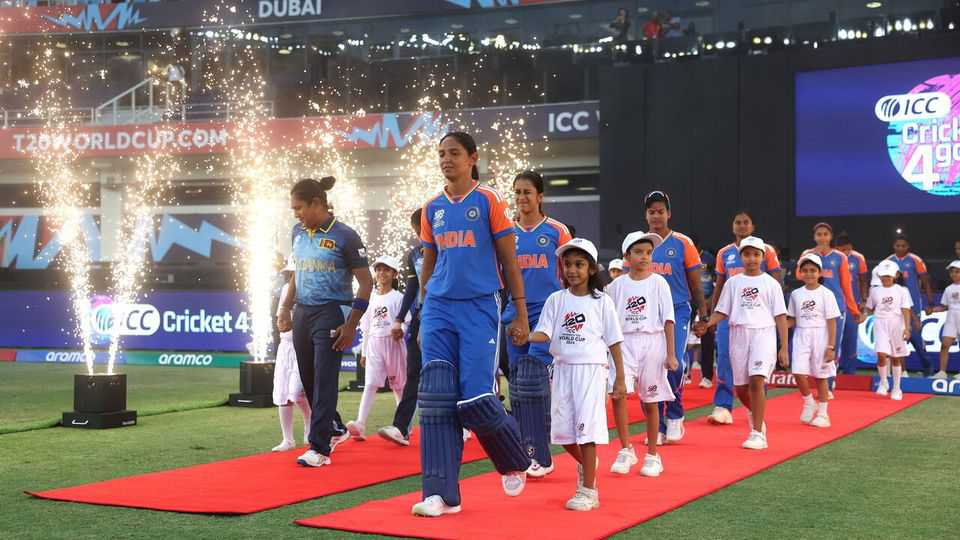

Asia | Wicket woes
Women’s cricket in India is taking off
Despite being neglected
October 2nd 2025

Eight years ago an Indian cricketer, Harmanpreet Kaur, played one of the best innings of all time. Ms Kaur scored an unbeaten 171 runs in the semi- final of the Cricket World Cup, helping India defeat Australia and reach the final for the second time. An estimated 126m people in India watched the final. Women’s cricket was suddenly mainstream. When Ms Kaur began her career “the women played in kit left over from the men’s team,” recalls Sharda Ugra, a cricket analyst. They were put up in budget hotels. Lobbying from fans and players pushed the Board of Control for Cricket in India (BCCI) to launch the Women’s Premier League in 2022. The five city-based franchises were sold to some of India’s biggest conglomerates for $572m. TV and digital rights for the first five years of the

competition raised another $116m. Smriti Mandhana, India’s vice-captain, is sponsored by brands such as Nike, Red Bull and Hyundai. Tens of millions of people follow her on social media.

This year’s edition of the World Cup began in Guwahati, in Assam, on September 30th. But the BCCI’s preparations for the tournament have been chaotic. It announced the schedule only in June. It awarded matches to four cities. (Matches will also be played in Sri Lanka as India refuses to allow Pakistani teams to play games in the country.) But with five weeks to go before the start of the tournament, the BCCI rejigged the schedule. It began to release tickets for the matches only in early September. Promotion of the event has been minimal.

The BCCI presided over similar muddles during its hosting of the men’s event in 2023. But India’s cricket boom is creating new levels of opportunity for young female athletes. Playing cricket professionally is now a viable career; the BCCI is also training new cohorts of female scorers and umpires. The organisation needs to provide its fans with a better experience. Basic facilities, such as the ability to buy food and water and access to clean toilets, are often lacking. Women’s cricket may be thriving, but the BCCI is fumbling in the field.■

Stay on top of our India coverage by signing up to Essential India, our free weekly newsletter.

This article was downloaded by zlibrary from [https://www.economist.com//asia/2025/10/02/womens-cricket-in-india-is-taking-off](https://www.economist.com//asia/2025/10/02/womens-cricket-in-india-is-taking-off)

China

China is the GOAT of engineering. Right? Bitcoin and a Chinese fraudster in London Xi Jinping wants a spot in your inbox Jerome Cohen was China’s most optimistic critic