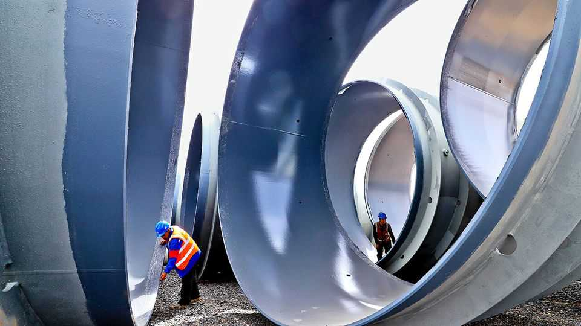
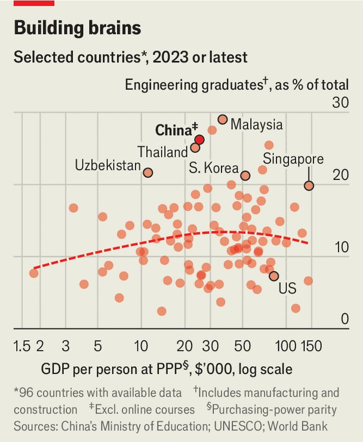

China | The greatest of all time
China is the GOAT of engineering. Right?
Its next five-year plan must contend with a switch from manufacturing to services
October 2nd 2025

CHINA’S RULING Communist Party will hold a giant conclave to review the country’s next five-year plan from October 20th-23rd. That plan will span the rest of the decade and shape decision-making for far longer. About 370 members of the party’s Central Committee will take part. They include ministers, provincial governors, generals, a historian and even a journalist. Of the 200 or so with voting rights, more than 50 have an engineering degree. They will have plenty to mull. The new plan, like the last one, is guaranteed to include a feast of “major engineering projects”, from restoring wetlands to improving high- performance alloys. These initiatives will draw on the world’s biggest

engineering workforce, which numbered over 20m in 2023, according to one estimate. And China hopes to draw on talented foreigners, too. On October 1st it introduced a new “K” visa that will admit science, maths and engineering graduates into the country even without a sponsoring employer. This has offended many among China’s homegrown tech talent, who resent the implication that their own credentials are somehow lacking.

Engineering has become a source of pride and power in China. The country is an “engineering state”, according to Dan Wang, author of “Breakneck”, a lucid new book about the country. Whatever labels the country attracts, its true commitment is to infrastructure and industry, bridges and widgets, building and making—as well as some dystopian exercises in social engineering, such as the former one-child policy and the zero-covid regime.

Mr Wang contrasts China’s urge to remake the world and remould the population with American inertia. The country where he now lives, he says, is a “lawyerly society blocking everything it can, good and bad”. His book is reminiscent of a remark attributed to Bill Clinton. “You have too many engineers,” he is said to have exclaimed on a visit to China in 1998, “and we have too many lawyers…let’s trade!”

China’s predilection for engineering now has fresh urgency. China wants to master “chokehold” technologies, such as advanced chipmaking equipment, that it can no longer count on importing from America and its allies. Students are responding. Among regular undergraduates, 36% sign up for the discipline. The share has been increasing in recent years, even as university enrolments swell. Chinese commentators argue that the country’s advances in technology represent an “engineering dividend” to replace the demographic dividend it reaped in generations past.

But there are some economic forces which even the engineering state cannot bend to its will. A leadership and student body stuffed full of engineers has not prevented manufacturing and construction declining as a share of GDP, the result of deep-seated trends in productivity and demand. Mr Clinton may have been wrong to joke that China had too many engineers. But recent evidence suggests it does have too many builders and makers. “The labels ‘breakneck’ and ‘engineering state’ fit less neatly today than they did in the

1980s through the 2010s,” argues Jonathon Sine, a commentator based in America, in a thoughtful review of Mr Wang’s book.

Economists have long argued that industrialisation is “hump-shaped”. As workers move from farms to factories, manufacturing grows as a share of the economy. But as people grow richer, they tend to switch their spending to services, and manufacturing recedes. These trends can be amplified by price changes. Manufactured goods often become relatively cheap, thanks to rapid gains in productivity that are not matched in other parts of the economy. That reduces their weight in GDP, unless the statisticians hold prices constant.

It seems plausible that engineering’s appeal is also hump-shaped, rising as manufacturing gains in importance, then falling as a country deindustrialises. The discipline does seem most popular in upper-middle- income countries like Malaysia (see chart). It also looms large in countries with a communist legacy, like the former Soviet republics. China is not an outlier in the international data, which also include vocational education. And it, too, seemed to have crossed a hump in this century’s early years: the share of regular undergraduates enrolling in engineering fell from 36% in 2001 to under 32% from 2004 to 2011.

China’s leadership once seemed at peace with this pattern. Its 13th five-year plan, covering the years from 2016-20, set a goal of increasing the share of services in GDP from 50.5% in 2015 to 56% in 2020. Even the leaders themselves seemed to embody this evolution. The number of engineers in the highest ranks of the party declined. They gave way to students of management, social scientists and even lawyers. In 2013 Cheng Li, then of the Brookings Institution, an American think-tank, wrote about the “rapid rise” of the lawyers up China’s political ranks. “This ongoing elite transformation…will likely shape the leadership’s socioeconomic and political policies,” Mr Li wrote.

But it did not. By the end of the decade, China’s leaders became newly determined to resist the turn away from manufacturing. In Donald Trump’s first presidency, export controls almost crippled some of China’s most prominent technology firms, including ZTE and Huawei.

In response Mr Xi insisted that the country must build a “complete” industrial system that would make it less dependent on others and others more reliant on it. The five-year plan approved in early 2021 dropped the commitment to increase services’ share of GDP and promised instead to keep the share of manufacturing stable. The percentage of students enrolling in engineering was already rising again. The number of engineers among full members of the Central Committee also rose.

None of this turn in policy, however, seems to have arrested industrial woes. The prodigious output of China’s manufacturing and construction industries is struggling to find buyers. Newly built homes are sitting on developers’ books unsold. Factory-gate prices for industrial products have been falling for almost three years. And although students are happy to enroll in engineering degrees, that does not mean they are equally keen to get their hands dirty. According to a survey last year by Zhaopin, a recruitment agency, only 8% of students want to enter manufacturing. (Over a quarter want instead to go into IT, betraying a preference for bits over bolts.) Even among those who studied science or engineering, only 37% pursue engineering-related careers, according to an article in 2022 by Qin Fang and her colleagues at the Southwestern University of Finance and Economics in Chengdu.

When the party’s Central Committee, with its big contingent of engineers, reviews China’s next five-year plan later this month, it must decide whether to fight these trends or surrender to them. Recent policy signals suggest China’s leaders may once again emphasise greater consumption of services, as an answer to the economy’s chronic shortage of demand.

If so, they can seek consolation in a Daoist fable that two former leaders, Mao Zedong and Jiang Zemin, both liked to cite. A foolish old man was determined to flatten two inconvenient mountains with little more than a pickaxe. After dedicating himself and his progeny to the task, the gods smiled on his dedication. They shifted the mountains on his behalf, clearing the way for travellers to reach his village. Even this divine engineering project was ultimately in the service of travel and tourism. The mountains moved and a service industry flourished in their place. ■

Subscribers can sign up to Drum Tower, our new weekly newsletter, to understand what the world makes of China—and what China makes of the world.

This article was downloaded by zlibrary from [https://www.economist.com//china/2025/10/02/china-is-the-goat-of-engineering-right](https://www.economist.com//china/2025/10/02/china-is-the-goat-of-engineering-right)