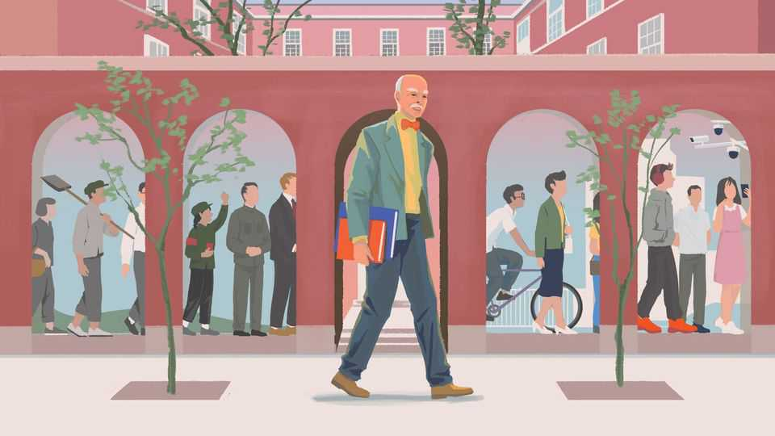

China | Chaguan
Jerome Cohen was China’s most optimistic critic
The American legal scholar kept a liberal vision of China alive
October 2nd 2025

JEROME COHEN could not stay quiet. On a visit to China in 1972, his first of many, he was invited to dinner with Zhou Enlai, Mao Zedong’s lieutenant, a rare honour for foreigners. Rather than stick to pleasantries, Mr Cohen pressed him on a range of concerns. He urged Zhou to release his former college classmate, imprisoned for espionage two decades earlier, and to start sending students to America. A legal scholar, Mr Cohen also encouraged China to join the International Court of Justice. At the time Zhou was not much moved by these suggestions. It was too soon for all of them. The idea of China joining the ICJ got the biggest laugh. Why would a Communist government, then in the throes of the Cultural Revolution, take part in a bourgeois legal institution? But to Mr Cohen it

was only natural: China was a great power, and it should have a seat at the table. When meeting such an important interlocutor, he could not pass up the opportunity to speak his mind about matters of justice—though he consistently leavened his criticism with wry humour.

Mr Cohen, who died on September 22nd aged 95, was more than just a lawyer. He came to personify the value of deep engagement between China and America. He also embodied the associated frustrations. He offered a riposte to both the knee-jerk hawkishness and the wide-eyed optimism that, in turn, have often characterised the West’s approach to China.

The longevity and breadth of his work gave him an unusual perspective. He got interested in China, in part, because of America’s “red scare” of the 1950s. The ranks of China experts had been denuded, and American officials were starting to rebuild them. That gave him an opening: he left a promising, if conventional, academic path focused on American law for a fellowship in Chinese law. In later years he was sometimes called the father of Chinese legal studies in America. More accurately, he transformed an arid, text- heavy field into a living, breathing one. He drew on extensive interviews with refugees from the Chinese mainland in Hong Kong to write a seminal book on Chinese criminal law.

He completed it soon after Mao’s Cultural Revolution erupted, timing that gave him a measure of stoicism about China’s development. He felt “better equipped”, in his words, to hold a patient view, even when China took a dark turn in putting down the Tiananmen uprising of 1989. Although upset by Xi Jinping’s authoritarian revival of recent years, he was not distraught. “His rule will not last for ever, and one can then expect another swing of the political pendulum toward a more moderate polity,” he wrote in a memoir published months before his death.

He was also, in his way, an architect of engagement between China and the West—a project now under great stress. The modern phase of Sino- American relations is usually dated to the secret mission by Henry Kissinger to Beijing in 1971, which set in motion the normalisation of ties between the two countries. But a seed was planted by Mr Cohen and a small group of fellow academics who, a few years earlier, had drafted a confidential

memorandum laying out why rapprochement made sense and how to achieve it.

He then gave the engagement concrete form, leaving academia to practise as one of the first foreign lawyers in China. His client list in the 1980s included giant American companies that invested in China during its high-growth years. Yet he stood out among corporate lawyers because of his simultaneous advocacy for human rights. It came to him personally, starting with people he knew. There was Jack Downey, the college classmate about whom he spoke to Zhou (Downey was released in 1973). In the 1980s he focused on securing the release of Annette Lu, his former student at Harvard, imprisoned under Taiwan’s then-authoritarian regime.

After the Tiananmen massacre, he became increasingly outspoken about China’s repression—a charge that carried more weight coming from such an expert. He returned to academia. At New York University, he hosted lawyers and campaigners from China and beyond. He intervened in individual cases —most notably, helping arrange schooling at NYU for Chen Guangcheng, a blind lawyer and activist (though Mr Chen soon fell out with NYU). In recent years he denounced the Chinese Communist Party’s crackdown in Hong Kong, its repression in Xinjiang and its crushing of independent lawyers. Xu Zhangrun, a Chinese professor arrested in 2020 after criticising Mr Xi, was among the many in the world of law—from scores of dissidents to legions of former students—to offer tributes to Mr Cohen after his death. “A member of my spiritual family has departed,” he wrote.

The question posed by Mr Cohen’s career is whether engagement was a failure and even a mistake. It was something he grappled with, whether he and others like him had helped to create a monster: a Communist Party that uses modern legal tools for control. One answer he gave was that such concerns were deeply ahistorical. In the late 1970s, when China was emerging from the Cultural Revolution, it thirsted for law to get past that deadly chaos and prevent its recurrence. Drawing China closer to the West also added to Russia’s isolation, helping to bring the cold war to an end. And life in China today has dramatically improved for most—though certainly not for all, he hastened to add.

His other answer was that it was premature to arrive at a conclusion. It was not out of the question, he thought, that at some point “an ever more educated and sophisticated public might demand a more open, less controlled society with greater protections for personal freedoms”. That seems heartbreakingly distant today. Mr Cohen, for his part, liked to end his speeches that were critical of China by quoting the title of a popular Taiwanese song from the 1980s: “Tomorrow will be even better”. ■

Subscribers to The Economist can sign up to our Opinion newsletter, which brings together the best of our leaders, columns, guest essays and reader correspondence.

This article was downloaded by zlibrary from https://www.economist.com//china/2025/09/29/jerome-cohen-was-chinas-most- optimistic-critic

Middle East & Africa

Donald Trump reaches for “eternal peace” in Gaza A big majority of Israelis support Donald Trump’s Gaza peace plan Violent hatred flares between Kurdish cousins Why protests are sweeping Madagascar Africa’s most secretive dictatorship faces an existential crisis