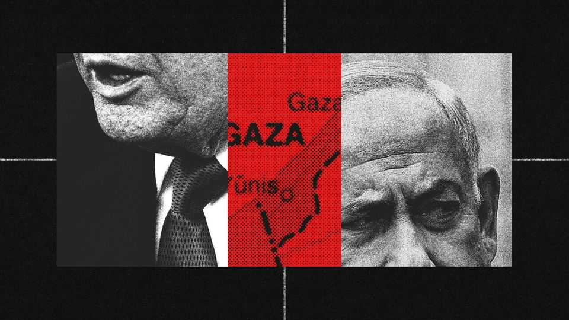

Middle East & Africa | The Israel-Hamas war
Donald Trump reaches for “eternal peace” in Gaza
The president will be the chairman of the strip’s reconstruction board
October 2nd 2025

Speaking from the White House on September 29th, Donald Trump said it was “potentially one of the great days ever in civilisation”, a day which could lead to “eternal peace”. Even putting aside the braggadocio, a surprisingly substantial milestone towards ending the two-year war in Gaza has been reached. Mr Trump has at last got the prevaricating Binyamin Netanyahu, Israel’s prime minister, to commit to a ceasefire plan that has been endorsed by the leaders of many Arab and Muslim countries. It offers a surprisingly nuanced approach to Gaza. The big questions now are whether Hamas will agree to a proposal that requires it to cede power and its weapons, whether Mr Netanyahu will face down his extremist allies, and whether Mr Trump, who would head Gaza’s reconstruction board, is really ready to commit to the world’s hardest turnaround.

The 20-point Trump plan still lacks many details which will have to be worked out in laborious mediation between the sides. But the basics are clear enough. Assuming both sides agree to the deal, military operations will cease and Israel will withdraw from populated areas. Within 72 hours of Israel publicly accepting the deal, all the remaining 48 Israeli hostages— alive and dead—will be released. Aid will be allowed to enter Gaza without any limits. In exchange, Israel will release 1,950 Palestinian prisoners, including 250 serving life sentences for killing Israelis.

A later stage sets out the disarmament of Hamas. Then Israeli troops will withdraw in phases. Israel has insisted until now that it will retain responsibility for security in Gaza. Under the plan it will control the strip’s perimeter, including the border with Egypt. That will continue “until Gaza is properly secure from any resurgent terror threat”. Security inside Gaza will fall to an “International Stabilisation Force” and a Palestinian police force. A “technocratic apolitical Palestinian committee” will run the civil government. Mr Trump will lead a “Board of Peace”, with such luminaries as Sir Tony Blair, Britain’s former prime minister. The board will oversee reconstruction, for the benefit of Gazans, who will enjoy “preferred” tariff rates.

The first barrier to this plan is whether the remnants of Hamas’s leadership agree. The release of the hostages at the start is a difficult concession, since they are Hamas’s main bargaining chip. “What guarantee is there that after Hamas frees all the hostages, Israel will stop firing, withdraw and free Palestinian prisoners?” asks a former Hamas official. The group sees its weapons as an integral part of its identity as a “resistance” movement and is unlikely to relinquish its stockpiles voluntarily, especially while Israel remains in Gaza. But one observer in Gaza who talks to Hamas suggests that it might agree to put them under Qatari or Egyptian supervision.

If Israel withdraws and Hamas at least partly disarms, much then depends on the new stabilisation force. So far, no country has definitely promised to send troops. Egypt will be involved; other countries are being mentioned, including Indonesia and Azerbaijan. This force will rely on the tacit co- operation of Hamas. While Israel has killed most of the militia’s leaders and thousands of its fighters, thousands more are still carrying out guerrilla attacks and hiding in Gaza’s tunnels. The territory’s “technocratic” civilian

government will supposedly have no Hamas involvement. But what about civil servants who worked for Hamas? Under the plan, Hamas’s leaders in Gaza may seek exile abroad. But if they refuse to leave, will they really eschew trying to influence politics in the strip?

The second big barrier is Israel. On paper the plan achieves Israel’s official war aims—to dismantle Hamas’s army and governing structures in Gaza and get back the hostages. But Mr Netanyahu has opposed a return of the Ramallah-based Palestinian Authority (pa) to Gaza, accusing it of supporting terrorism. Even if Gaza’s new administration is officially non-aligned with any Palestinian faction, the new deal includes, at the demand of Arab countries, the return of the pa after it “has completed its reform programme” and a nod to a future peace process that could lead to Palestinian statehood. Mr Netanyahu has repeatedly ruled these out.

At the press conference he expressed scepticism that “the pa leopard can change its spots” as well as his opposition to a Palestinian state. That hurdle is in the distant future. The more immediate problem is that the plan runs against the wishes of Mr Netanyahu’s ultranationalist allies so he may still backtrack..

What happens next depends on how much pressure can be applied to both sides. Hamas’s patrons, Qatar and Turkey, will press it to accept, but the group may be split. Some are sticking to a hardline position. “As long as there’s occupation, all forms of resistance are legitimate, including armed resistance,” insists Taha al-Nounou, a Hamas official in Qatar. Others favour a qualified acceptance of Mr Trump’s plan, but recognise that the president would see that as a refusal. As the former Hamas official puts it, “It’s difficult to say yes, but it’s even more difficult to say no.”

In the press conference Mr Trump said that if Hamas rejects the deal, “Israel would have my full backing to finish the job of destroying the threat of Hamas.” Yet that goal is likely to prove elusive and, without an agreement, the more likely scenario is that the war drags on and the colossal death count soars even higher.

For any deal to happen, Mr Trump will also have to keep up relentless pressure on Mr Netanyahu. There are signs that the president is ready to do

so. On the same day as the press conference he brokered a call between Mr Netanyahu and the prime minister of Qatar in which Israel’s prime minister apologised for its recent botched air strike on Hamas leaders in Qatar, which had enraged America’s Gulf allies.

The Trump plan has many elements of one presented by the previous president, Joe Biden, in May 2024. It is also similar to the second phase of the ceasefire agreement that Israel abandoned earlier this year, with Mr Trump appearing indifferent at the time. Yet the president has managed to push Mr Netanyahu further than anyone else. He has got Israel’s leader to accept the plan in principle and in public, and, crucially, to accept that there will be no Israeli annexation or occupation of Gaza. Hamas has brought death and destruction to Gaza, while Israel has brought itself isolation and condemnation. It seems hard to imagine that Hamas will now embrace Mr Trump’s pragmatic vision, or that Mr Netanyahu will abandon his forever war. But even if Mr Trump’s “eternal peace” ends up being out of reach, he has created the best chance so far for ending this war. ■

Sign up to the Middle East Dispatch, a weekly newsletter that keeps you in the loop on a fascinating, complex and consequential part of the world.

This article was downloaded by zlibrary from https://www.economist.com//middle-east-and-africa/2025/09/29/donald-trump-reaches- for-eternal-peace-in-gaza