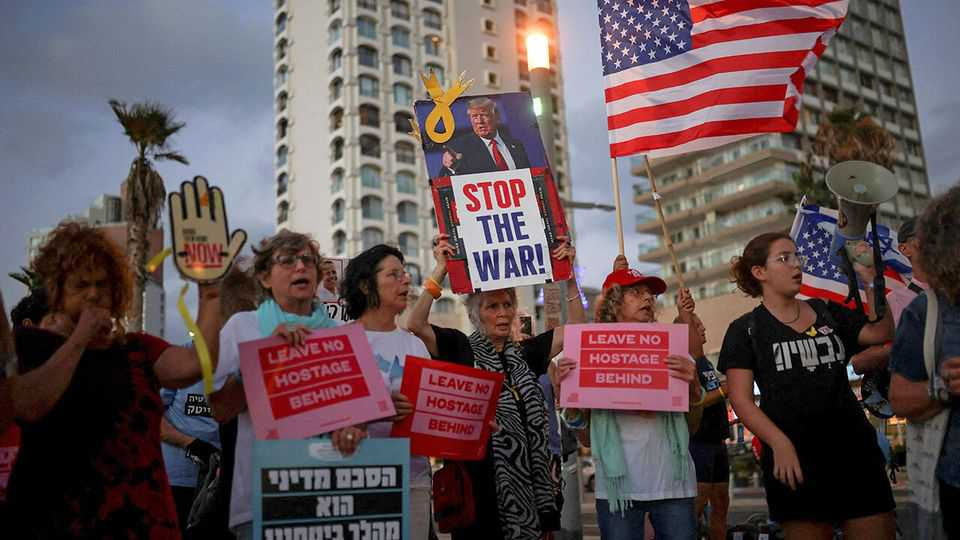

Middle East & Africa | Politics and peace
A big majority of Israelis support Donald Trump’s Gaza peace plan
Binyamin Netanyahu hopes he can use this to hold on to office
October 2nd 2025

THE PLAN presented on September 29th by Donald Trump to end the war in Gaza was received rapturously by the Israeli people. In the first opinion poll on it, 72% of those asked said they supported Mr Trump’s proposal; only 8% opposed it (20% have yet to make up their minds). The deal was also greeted by rises in the Tel Aviv stockmarket and the shekel. At first glance the results should have cheered Binyamin Netanyahu, Israel’s prime minister, who stood beside the president and hailed his peace plan. Yet for Mr Netanyahu, who has been plummeting in the polls since the massacre of October 7th 2023, there has been no boost. If Hamas, the Islamist group responsible for the attack, accepts the plan and releases the remaining

hostages, he will probably enjoy a temporary rise in support. But his coalition remains on track to lose the next election.

The strongest backing for the Trump plan comes mostly from Israelis who are unlikely to vote for Mr Netanyahu in next year’s election. Meanwhile, some of his supporters adamantly oppose it. Mr Netanyahu’s former communications chief, Omer Dostri, posted online that the Trump plan was a “total failure” that would allow Hamas to remain in Gaza while Israeli troops withdraw, to be replaced by a foreign security force and then the Palestinian Authority. “The prime minister has no mandate to hoist a white flag,” he wrote.

For much of the past two years Mr Netanyahu has avoided a ceasefire to keep his hard-right partners from bolting and forcing an early election. But pressure from Mr Trump and the Israeli public may have changed his calculations. Israel has to hold elections by October 27th 2026. He wants to present himself to Israelis as a successful war-time leader who has “redrawn the map” of the Middle East, in his words, with victories against Hamas in Gaza, Hizbullah in Lebanon and against Iran. That is harder with hostages still trapped in Gaza and the war continuing.

Whatever they think of Mr Trump’s proposal, serious dissent among Mr Netanyahu’s Likud party is unlikely. That is partly pragmatic. “There are pluses and minuses to the Trump plan,” says a veteran Likud lawmaker. “But ultimately it’s clear to everyone that Netanyahu…can’t say no to him as he did with previous presidents.” It is also self-serving. Loyalty to Mr Netanyahu is a key consideration in determining who gets to stand on the Likud ticket.

But under Israel’s multi-party electoral system it is not enough to secure votes just for his own Likud party. The success of the hard-right parties that make up his current coalition and will, he hopes, form the next one, is also vital. They have both ideological and political reasons for opposing the Trump plan. Bezalel Smotrich, the finance minister and leader of the Religious Zionism party, posted that the plan was “an echoing diplomatic failure”, which “will end in tears”. Mr Smotrich is in favour of Israel resettling the Gaza Strip. Itamar Ben-Gvir, the national-security minister and

leader of the Jewish Power party, shares his views. Both are expected to leave the coalition if the Trump plan is implemented.

That would leave Mr Netanyahu without a majority—at least for now. But he might be able to use these divisions to his advantage in the elections. Likud and its far-right partners will be competing for the same nationalist voters. In the run-up to elections Likud will present itself as the “responsible” right-wing option, while Religious Zionism and Jewish Power will market themselves as the “authentic” right. This range of options is probably capable of capturing almost the entire right-wing vote. So there is still a strong incentive for tacit collusion between Likud and its more extreme counterparts. One right-wing campaign strategist speculates that “while Ben-Gvir and Smotrich are criticising Netanyahu in public, in private they work out a convenient election date and co-ordinate their campaign plans, so as not to waste any potential votes”. Whatever the outcome in Gaza, Mr Netanyahu and his radical partners may have no option but to try to cling to power together. ■

Sign up to the Middle East Dispatch, a weekly newsletter that keeps you in the loop on a fascinating, complex and consequential part of the world.

This article was downloaded by zlibrary from https://www.economist.com//middle-east-and-africa/2025/09/30/a-big-majority-of- israelis-support-donald-trumps-gaza-peace-plan