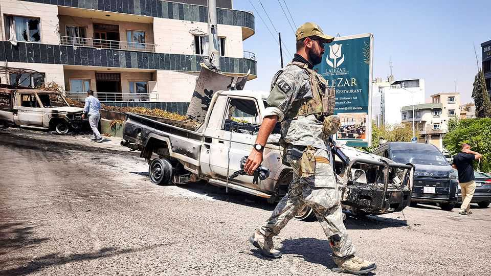
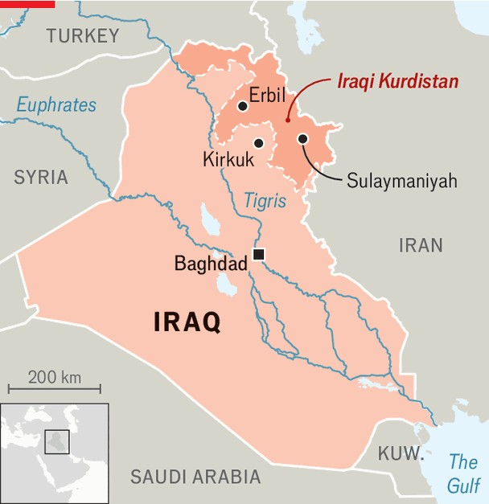

Middle East & Africa | Iraqi Kurdistan
Violent hatred flares between Kurdish cousins
Corruption and factionalism are prevailing
October 2nd 2025

Armed drones and tanks in the streets of Sulaymaniyah, the second city of Iraq’s semi-autonomous Kurdish region, were a shocking sight in August in what was once the most stable part of Iraq. The Lalezar Hotel had been turned into a smouldering wreck. It was caught in the midst of a bitter power struggle between two cousins from one of Iraqi Kurdistan’s top families. After the smoke had cleared, at least five were dead, Sulaymaniyah had been shaken to the core, and rancour within the Patriotic Union of Kurdistan (puk), one of the region’s two main parties, was more raw than ever. In his compound on Sulaymaniyah’s outskirts Bafel Talabani calls the operation that caused the fracas the “execution of an arrest warrant” following what he claimed was plot by his cousin, Lahur Talabani, to kill

him. “This is the second concerted attempt to assassinate me,” he says. “The first was three and a half years ago, when I was poisoned with dioxin.”

Bafel says Lahur’s men tried to shoot him, while their drones were programmed to hit the home of his ex-wife and children. “If you go back to the worst time in Kurdish history, our civil war, we never did this,” he says, referring to old battles for regional supremacy between the two leading Kurdish clans, the Talabanis and the Barzanis. Lahur is also accused of planning to kill Bafel’s brother, Qubad, the deputy prime minister of the Kurdistan Regional Government (KRG). The aim, says Bafel, was to seize control of the PUK’s political machine and its Sulaymaniyah stronghold.

The cousins hail from the family that has long dominated the eastern half of Iraqi Kurdistan. Bafel’s father, Jalal Talabani, was the PUK’s revered co- founder and a president of Iraq. While Saddam Hussein clobbered the Kurds in the 1980s, Jalal waged guerrilla war from the mountains, before sending his family into exile in Britain. Bafel and Lahur grew up in London, acquiring thick English accents and admiration for the late Queen Elizabeth. “We were hard-working guys,” Bafel recalls. “He [Lahur] had the cafeteria. I was the doorman. We’ve been friends for decades.”

The camaraderie is no more. After America invaded Iraq in 2003, Bafel returned to help form an elite Kurdish group that became an ally of Western forces fighting against al-Qaeda and, later, the Islamic State (IS). Lahur rose to head one of the KRG’s intelligence agencies. But relations frayed after Jalal’s death in 2017, prompting a power struggle within the PUK. By 2021 Lahur had been ousted from the party and the security apparatus after his first attempt to kill Bafel, according to the latter. Now Lahur is in jail awaiting trial, says Bafel. A wider purge has ensued. In September, in what critics call a broader crackdown on dissent, a court in Sulaymaniyah sentenced the leader of a Kurdish opposition party to five months in prison.

For many Kurds the ructions are dispiriting. The KRG was once seen as “the other Iraq”: a haven of stability and economic growth, as the rest of the country fell into chaos. Its autonomy was enshrined in Iraq’s 2005 constitution, while its fighters helped defeat IS. Today the Kurds are beset by internal rivalries, economic strife and creeping authoritarianism. As a result, their cherished autonomy is under threat.

“The balance of power in Iraq has completely shifted,” says Renad Mansour of Chatham House, a think-tank in London. “This is the first time since 2003 that the KRG has lost this much autonomy.” The malaise goes beyond the PUK. Its rival, the Kurdistan Democratic Party (KDP), based in Erbil, the region’s biggest city, and dominated by the Barzanis, has presided over rampant corruption. Business is suffocated by nepotism and cronyism.

An independence referendum in 2017, strongly backed by the KDP, backfired badly, prompting the central Iraqi authorities in Baghdad to recapture the oil-rich district of Kirkuk from the Kurds. A Kurdish decision to export oil directly to Turkey, bypassing the powers in Baghdad, had briefly boosted revenue. But in 2022 Iraq’s federal court ruled the scheme illegal. Budget disputes between the Kurds and the central government in Baghdad persist.

For the past few years the KRG has been broke. Public salaries go unpaid for months. The authorities have only just coughed up to cover July’s payroll. While ordinary Kurds live in cramped conditions, the ruling families invest in fancy high-rises and gated compounds. Foreigners have begun to pull out. Baghdad, once viewed as chaotic and dangerous, is now a safer bet.

Amid this dysfunction, both the PUK and the KDP are looking for allies there. Bafel Talabani’s crackdown may help his faction win more seats in November’s Iraqi general election, giving him greater leverage in negotiations expected to precede the formation of a federal government. Whether that leads to increased stability in Kurdistan or across Iraq at large is moot.

“There’s no media outlet [in Kurdistan] to report any of this—everything is party-controlled,” laments Winthrop Rodgers, an American researcher in Sulaymaniyah. “You can’t talk about it on social media: it’s monitored. You can’t protest: you’ll be arrested or tear-gassed. You can’t vote for change: the opposition is a mess. There’s no political outlet, no accountability.” ■

Sign up to the Middle East Dispatch, a weekly newsletter that keeps you in the loop on a fascinating, complex and consequential part of the world.

This article was downloaded by zlibrary from https://www.economist.com//middle-east-and-africa/2025/10/02/violent-hatred-flares- between-kurdish-cousins