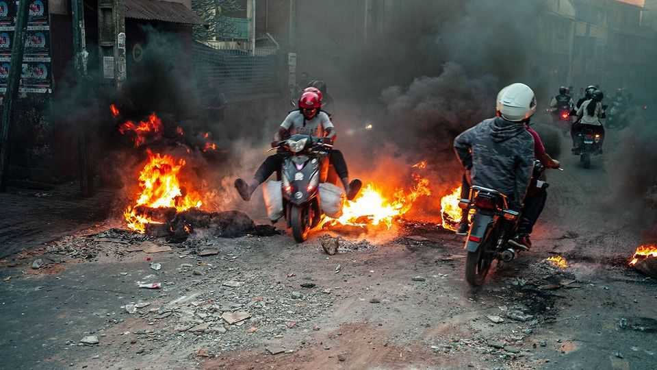
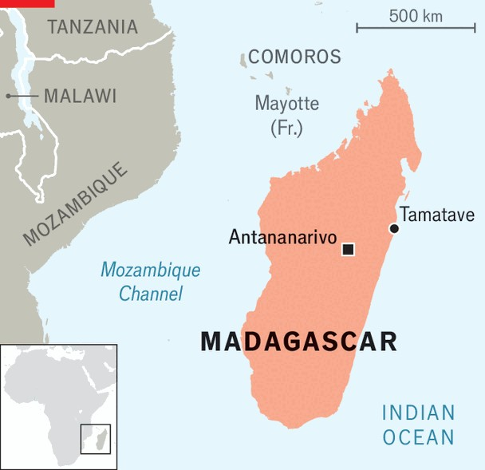

Middle East & Africa | Treasure island
Why protests are sweeping Madagascar
Anti-government protests reflect profound frustration about poverty and corruption
October 2nd 2025

To see why thousands have taken to the streets of Antananarivo, the capital of Madagascar, in recent days, look up from the demonstrations to the cable car that dangles above the city. The line, which was finished this year thanks to financing from France, is meant to ease congestion. But repeated power cuts mean it rarely works. As a result, the city resembles the world’s worst ski resort. Even when electricity is flowing, at the equivalent of one euro for a short ride the cable cars are about six times the cost of a bus ride and more than many Malagasy people spend on food in a day. “It has become an attraction, not a mode of transport,” admits an official.

Several cable-car stations were set on fire during the largest protests the country has seen in more than 15 years. The demonstrators say they are fed up with persistent power cuts, water shortages and rampant corruption. They want Andry Rajoelina, the president, a pedlar of herbal cures for covid-19 and former dj, to resign. Mamy Ravatomanga, a businessman seen by protesters as the power behind the throne, is another target. So far, Mr Rajoelina has responded by sacking his entire cabinet, imposing a dawn-to- dusk curfew and having security forces crack down on crowds.

The protesters feel a kinship with other youthful activists. Some invoke anti- government movements in Kenya. Others wave the same pirate flag used recently in Indonesia and Nepal. Yet their frustrations stem from home- grown problems. Since 1960, when French rule ended, gdp per person has shrunk by almost a half, the largest fall of any nation without a civil war. The demonstrations are the work of Generation z, but their grievances have been decades in the making.

On the face of it, there are simple economic explanations for why Madagascar is so poor. The vast majority of workers are subsistence farmers. Their productivity and incomes are “trending down”, notes the World Bank, partly because of deteriorating soil conditions brought on by drought and deforestation. While the population has grown from 5m to 32m

since 1960, forest coverage has fallen from 33m hectares to 6m, according to a diplomat.

To visit a village in Madagascar can involve not only a journey of several miles from a main road but also, seemingly, in time. Ox-carts trundle past, occasionally overtaking girls carrying pails of water. A straw poll by your correspondent suggests many Malagasy have not heard of Mr Rajoelina or Donald Trump. It would take more than 70 years at recent growth rates for Madagascan living standards to catch up with those of Rwanda and Uganda, which are in the bottom half of African countries by gdp per person.

Basic infrastructure is calamitous. There are perhaps half as many paved roads as there were in 1960. On a recent journey around the north of the country two dry riverbeds had to be driven across because bridges were out of action. It costs more to take goods from Antananarivo to Tamatave, a port 200km away, than it does to then ship the produce to France.

Worsening rural poverty and fast population growth have caused a surge of migration to cities, especially the capital. That has added to pressure on ageing power and water systems as well as on housing. On the outskirts of Antananarivo ad hoc developers are building amphibious slums on top of paddy fields.

Many of Madagascar’s difficulties stem from the disastrous socialist experiments under Didier Ratsiraka, president from 1975 to 1993 (and again from 1997 to 2002), whom the cia thought wanted to turn the island into North Korea. “But the problem goes beyond economics,” says an economist in Antananarivo.

Madagascar, argues Denis Alexandre Lahiniriko of the University of Antananarivo, has failed to do two big things. The first is to foster a common identity among its roughly 20 ethnic groups, which can be crudely divided between those of south-east Asian origin in the interior and coastal peoples with mainland African roots. The second is to build a state that benefits ordinary people, not just a narrow elite. One civil servant says that corruption is so routine that she regularly has to decline envelopes of cash from businessmen from China or other African countries. A politician says that his family would disown him if he did not steer patronage their way.

“We are a mafia state,” adds Ketakandriana Rafitoson, an anti-graft campaigner. One consequence of Madagascar’s renowned natural splendour is that there is no end to the things that can be trafficked through deals between corrupt locals and foreign buyers. The goods that have reportedly been part of criminal enterprises include gold, lychees, vanilla, rosewood, tortoises and the island’s endemic lemurs. In 2023 a British court found Mr Rajoelina’s former chief of staff guilty of soliciting bribes from a gem- mining firm. “It is a treasure island plundered by pirates,” says a locally based analyst.

Given the poverty, some visitors wonder why Malagasy have put up with their lot for so long. One reason is surely the repression that can be meted out to those who upset the powerful. But another theory is that some Malagasy care more about the afterlife than life on earth. In the south it is common for people to spend more on their tombs than their houses and to kill herds of zebu (cattle) upon death. “The attitude is that you can be poor until you are dead,” says a journalist from the region. In the central highlands the practice of famadihana (“turning of the bones”), where corpses are exhumed from tombs in costly ceremonies to appease the family’s ancestors, is another example of how rituals related to death can eat into household budgets.

Yet such practices may be more of an effect of poverty than a cause. The protests that threaten to topple the government are a reminder that Malagasy are willing to take to the streets. In 2009 demonstrations against the elected president,  Marc Ravalomanana, led indirectly to a military coup that ultimately brought Mr Rajoelina to power for the first of three terms in office.

Is Mr Rajoelina heading for a similar fate? At the time of writing there were reports of some soldiers joining the protests. Much depends on whether the army’s leaders side with the street or the president. Like his beloved cable cars, the president’s reign appears to be hanging by a thread. ■

Sign up to the Analysing Africa, a weekly newsletter that keeps you in the loop about the world’s youngest—and least understood—continent.

This article was downloaded by zlibrary from https://www.economist.com//middle-east-and-africa/2025/09/30/why-protests-are- sweeping-madagascar