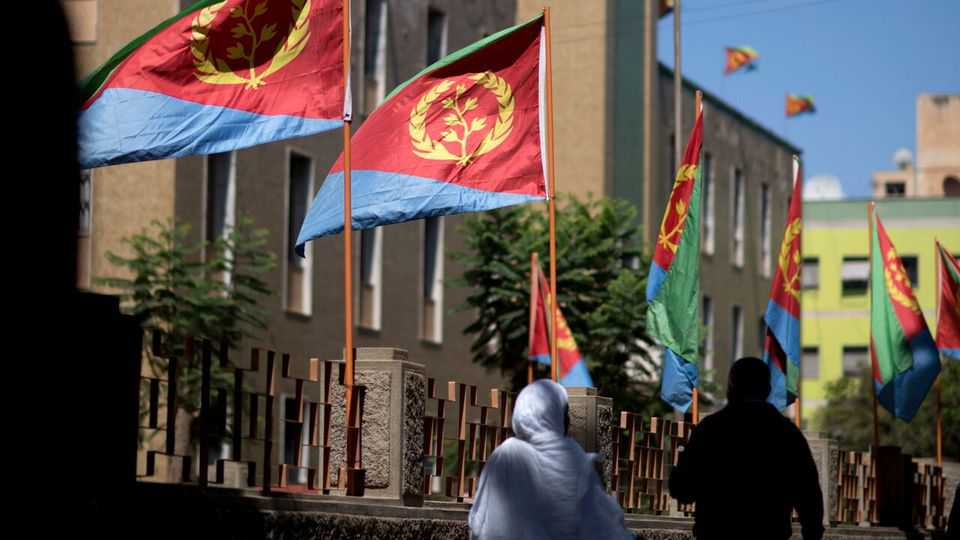
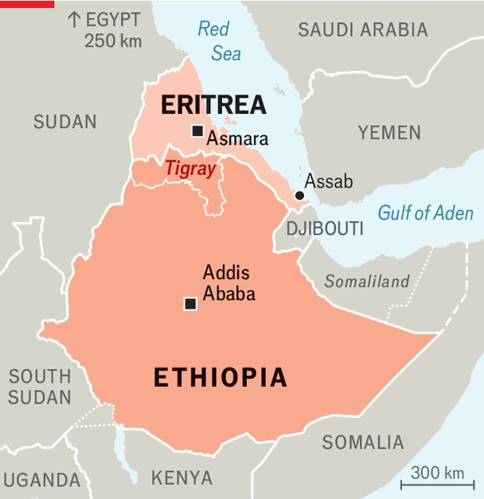

Middle East & Africa | Eritrea and Ethiopia
Africa’s most secretive dictatorship faces an existential crisis
Eritrea’s sovereignty is under threat from an expansionist Ethiopia
October 2nd 2025

If the past is a foreign country, its name is surely Eritrea. Residents of Asmara, its capital, pootle around in ancient Fiat 500s, wistfully gliding past art-deco cinemas, ornate villas and grand colonnades. These are (or were) the architectural triumphs of long-vanquished Italian colonists, whose peeling walls seem poetical in their decline. Equally anachronistic, if rather less endearing, is Isaias Afwerki, Eritrea’s dictator since 1991. Soon to be 80, he still regularly denounces the “misguided policies” of John Foster Dulles, a former American secretary of state, as if Dwight Eisenhower were still president.

Mr Isaias has almost single-handedly turned back the clock on his country’s development. Eritrea was once one of Africa’s most industrialised parts. Now even the most basic goods, like soap or bottled water, have to be imported. Perhaps a third of the population has fled abroad to escape Mr Isaias’s system of indefinite military conscription, which the UN has compared to mass enslavement, leaving empty villages, shuttered shops and derelict farms.

Its enemies sense weakness, especially a newly irredentist Ethiopia, from which Eritrea seceded in 1993 after a three-decade armed struggle led by Mr Isaias. Abiy Ahmed, Ethiopia’s messianic prime minister, has openly declared that he intends to gain control over one of Eritrea’s Red Sea ports. Many suspect his real ambition is to overthrow Mr Isaias and perhaps even reannex Eritrea. Ethiopia has amassed a menacing new arsenal of missiles, fighter jets and drones. “They can turn Asmara into Gaza if they want,” says a former Western diplomat.

Can Eritrea survive? More than most places, its past is prologue. It was a late 19th-century Italian colony, its name deriving from “Erythra Thalassa”, ancient Greek for the Red Sea. In 1935 Benito Mussolini used it as a base for invading Ethiopia, which his fascist forces occupied until British troops

booted them out in the second world war, restoring Haile Selassie, Ethiopia’s exiled emperor, to his throne.

But what then to do with Eritrea? One plan involved partition. The Muslim lowlands in Eritrea’s west would be annexed to Sudan, while the central Christian highlands would form a new state with Tigray, a region in northern Ethiopia to whose people Eritrean highlanders are close kin. Haile Selassie, however, was hostile to the idea of a “Greater Tigray”, which would have shrunk his empire. He also coveted access to the Red Sea. Insisting that Eritrea belonged to Ethiopia, he annexed it in 1962. A guerrilla insurgency ensued. Mr Isaias’s rebels won independence in 1993.

Like Haile Selassie, Mr Abiy seems in thrall to imperial dreams of controlling the Red Sea—and therefore Eritrea. On September 27th the Ethiopian army declared it would “pay any sacrifice” to win back the port of Assab. In July one of Mr Abiy’s circle called for the two countries to be joined in a “supranational union”.

Mr Abiy reckons his drones can deliver victory. Yet an invasion would be fiercely resisted. Mr Isaias may be hated, but few Eritreans “would like to see Ethiopia back”, says Mohamed Kheir Omer, an exiled Eritrean scholar. Eritrea would also probably get support from Egypt and the Sudanese Armed Forces (SAF), which it has backed in Sudan’s current civil war, as well as from the Tigray People’s Liberation Front (TPLF), the party that rules Tigray.

This coalition could still deter Mr Abiy. But Eritrea’s rapprochement with Tigray, in particular, may prove consequential in other ways, too. In a bloody border war between 1998 and 2000, the Ethiopian army, then led by the TPLF, trounced Eritrea. Though Ethiopia refrained from advancing to Asmara to topple his government, the humiliation left Mr Isaias and many of his countrymen with an enduring hatred for the TPLF. When Mr Abiy himself went to war against the group, between 2020 and 2022, Mr Isaias sent troops into Tigray to fight on the Ethiopian government’s side, where they massacred civilians, raped women and looted widely.

But since then, Mr Isaias and the TPLF appear to have struck up a tactical alliance against Mr Abiy. Some influential Tigrayans want more than a

temporary military pact. “The border [between Tigray and Eritrea] was imposed on us by colonialism,” says a senior TPLF official. “I see every reason for a serious reconfiguration.”

So “Greater Tigray” is back on the agenda. The violence Mr Abiy unleashed in 2020 led many in Tigray to demand secession from Ethiopia. While most Tigrayans despise Mr Isaias, some reckon his regime is doomed. Uniting with their Tigrinya-speaking cousins in Eritrea would boost an independent Tigray—and give access to the sea. Many Tigrayans have relatives in Eritrea (Mr Isaias’s own mother was of Tigrayan descent). “If there is any logic in history, they should reunite,” says Haggai Erlich, a prominent historian of Ethiopia and Eritrea.

Other experts consider this fanciful. “Do you think the fact that the British and the Irish speak English,” scoffs a sceptical Tigrayan, “is enough to make them one country?” Realistic or not, long-buried questions of history are being dug up and re-examined. From such bloodstained soil further havoc may yet spring. ■

Sign up to the Analysing Africa, a weekly newsletter that keeps you in the loop about the world’s youngest—and least understood—continent.

This article was downloaded by zlibrary from https://www.economist.com//middle-east-and-africa/2025/10/02/africas-most- secretive-dictatorship-faces-an-existential-crisis

Europe

The unravelling of France’s centrist project Europe’s biggest military project could collapse Italy’s regions are creating a right to die Moldova defies Russia by re-electing its pro-European government The chilling exception to Trumpian protectionism How Europe crushes innovation