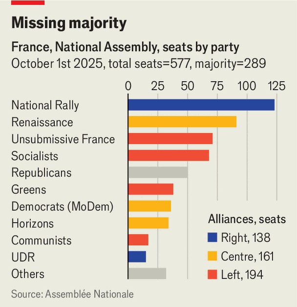

Europe | French politics
The unravelling of France’s centrist project
There is a real chance that power will fall into the hands of the extremes
October 2nd 2025

When Emmanuel Macron took to the stage at the United Nations in New York on September 22nd and 23rd he made one landmark speech to declare France’s recognition of a Palestinian state, and another in defence of multilateralism. The first earned him warm applause; the second reminded his remaining supporters why they voted for him. “We have no right to cynicism. We have no right to fatigue. We have no right to the spirit of defeat,” he declared. Mr Macron remains a vigorous figure in foreign affairs. Yet no amount of energetic diplomacy abroad can mask what is happening at home: the unravelling of his great centrist venture. Appointed on September 9th, Sébastien Lecornu, France’s new prime minister, has spent weeks trying to form a functioning government. When

his new team takes office, it will be the country’s fifth government in two years, a rate of turnover not seen in France for over half a century. France still plays an outsize part in shaping Europe’s future. But its political instability, deadlocked parliament and stretched public finances are creating a worrying hole at the centre of the continent. If the parties of the broad centre cannot overcome their differences, there is a real chance that power will fall at the next opportunity into the hands of the extremes.

This is a concern for centrists well beyond France. When the 39-year-old electoral debutant became president in 2017, Mr Macron vowed “to ensure that there is no longer any reason to vote for the extremes”. By bringing moderates from both left and right together in a new post-partisan movement, Mr Macron sought to forge a bulwark against the hard left and hard right, and end the ideological quarrels that blocked reform. Framing the stakes as a near-existential moment for the upholding of democratic values, Mr Macron twice kept the hard-right Marine Le Pen out of the presidency, beating her in presidential run-off votes in 2017 and 2022.

Today, however, support for the centre is collapsing. The number of parliamentary seats in the 577-seat lower house held by Ms Le Pen’s National Rally (RN) has shot up from eight in 2017 to 123; those held by Jean-Luc Mélenchon’s hard-left Unsubmissive France from 17 to 71. The RN currently tops first-round parliamentary voting intentions with 32%; the left-wing group comes next, on 25%; Mr Macron’s centrists trail in third place, on just 15%. For the presidential vote, not due until 2027, an Ifop poll on September 29th suggested that Ms Le Pen would sail into the second- round run-off with 33%; the best-placed centrist candidate—Edouard Philippe, a former prime minister—on 16% would only just qualify for the run-off at all.

Centrists are despondent. This was captured in a recent acceptance speech for the Légion d’honneur by Jean Pisani-Ferry, an economist who was in charge of Mr Macron’s manifesto in 2017. Describing himself as “the grumpy old man” of macronisme, he recalled how he had first joined the project as a response to the “role-playing” by the left and the right, which “fuelled democratic disenchantment and extremism”. Yet today, he said, France faced “the ultimate threat of a swing into authoritarianism”. To a hushed audience, he went on: “I don’t know what happened.”

One answer is a series of miscalculations. In 2022 Mr Macron was re- elected, but failed to campaign convincingly for the legislative election that followed, and lost his parliamentary majority. “That was the real turning point,” says Alexandre Holroyd, one of his former deputies. Instead of seeking a coalition with the centre-right Republicans, he pressed ahead with an enfeebled minority government, ramming pension reform through parliament without a vote and stirring popular resentment. His rash decision last year to dissolve parliament shrank his minority further, and entrenched a three-way deadlock. In September Mr Macron’s popularity fell to 22%, a record low. Support has shifted to the left and right. “The centre is squeezed by both sides of the vice,” says Mathieu Gallard at Ipsos, a polling group.

Another reason is the broad shift in Europe to the right, powered by identity politics. In Britain the rise of Nigel Farage’s right-wing party, Reform, is recent. In France the RN has been preparing for power for years. Ms Le Pen’s party is a rebranded, scrubbed-up version of the one her father co- founded back in 1972. The more the RN makes itself appear respectable, the more the cordon sanitaire is fraying.

This puts the centre on the defensive. Many of those who came from the left are uneasy taking a hard line on immigration. The centre’s component parties are divided over other matters too, and struggling to sound relevant

to voters. Like centrists everywhere, Mr Macron’s technocratic moderates find themselves with a blunt toolkit to use against the populists’ raw indignation and defiant certainties, so much easier to turn into viral TikTok clips.

A final problem is budgetary drift. Mr Macron’s existential appeal for a vote against the RN in the past was about competence as well as values. That case is harder to make today, when the budget deficit is running at 5.4% of GDP, and bond markets are edgy. Polls suggest that voters are still wary about the competence of the RN. But public opinion is increasingly unconvinced by the centrists’ claim that only they can provide shelter from chaos.

This does not mean that centrism in France is finished. Much can happen in 18 months. But the centre’s unravelling does mean that the coming months are at best likely to consist of muddling through. “Don’t expect a German- style grand bargain,” says Roland Lescure, a centrist deputy. He still thinks there is a narrow path to a pragmatic parliamentary compromise on fiscal policy and deficit-cutting.

Yet France lacks a culture of political compromise. Even Mr Lecornu has called himself the “weakest prime minister under the Fifth Republic”. If bond markets lose confidence, or if he fails to get a budget through, a messy situation could become a crisis. France was once a case study in how to fend off the extremes. Today the centre ground looks more fragile than ever. ■

To stay on top of the biggest European stories, sign up to Café Europa, our weekly subscriber-only newsletter.

This article was downloaded by zlibrary from https://www.economist.com//europe/2025/10/02/the-unravelling-of-frances-centrist- project