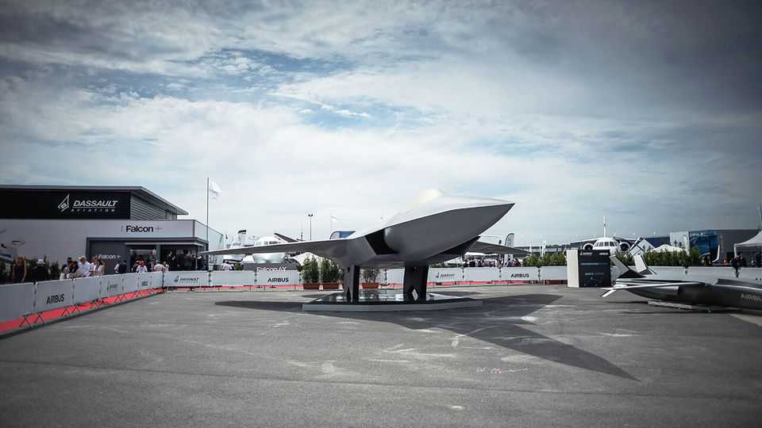

Europe | Defence drift
Europe’s biggest military project could collapse
Industrial bickering is putting the Future Combat Air System at risk
October 2nd 2025

WILL IT EVER get off the ground? It was never going to be easy for France and Germany, two big countries with wildly differing political and strategic cultures, to collaborate on one of the most complex weapons projects in European history. The Future Combat Air System (fcas)—comprising a “sixth-generation” fighter jet, a swarm of autonomous drones and a communications “combat cloud”—has repeatedly stumbled since its conception in 2017. But now, as a deadline looms to move fcas to its second phase, in which a prototype of the New Generation Fighter (ngf) jet must be built, many fear it may fall apart entirely. “We are not making any progress with this project,” sighed Friedrich Merz, Germany’s chancellor, recently. “Things cannot continue as they are.”

The case for fcas, which is supposed to come on stream by 2040, has only grown since it was dreamed up by Emmanuel Macron and Angela Merkel. Modern fighter jets are too expensive and complex for any European country to build alone. Vladimir Putin’s war on Ukraine, and the fraying of America’s security guarantee, have strengthened the case for bolstering Europe’s defence sovereignty. The sheer scale of fcas should also foster defence and technological innovation, and create a lot of jobs, across Europe.

But industrial bickering is putting it all at risk. Dassault, the French aerospace company leading the construction of the ngf, regards the project’s governance structure as hopelessly bureaucratic. “I will not accept three people sitting around a table deciding on all the technical aspects required to fly a high-performance aircraft,” grumbled Eric Trappier, Dassault’s outspoken ceo, last week. “Give us the ability to manage this programme.” But Dassault is outnumbered by Airbus, which represents both Germany and Spain, the project’s third partner, and does not want to find itself in a subordinate role.

The French government fears failing to change the rules would endanger the deadline. It needs a new jet by 2040 to replace the Rafale fighters that carry part of its nuclear deterrent. Germany’s participation in nato “nuclear sharing” means it also needs nuclear-capable jets. But the Luftwaffe’s growing fleet of American f-35s makes the deadline less urgent. Moreover, the Germans and Spanish note that the distribution of work was agreed years ago.

Patience is fraying on all sides. “Dassault does not treat fcas as a strategic necessity but as an industrial trophy,” says Volker Mayer-Lay, an mp from Mr Merz’s Christian Democrats who sits on the Bundestag’s defence committee. He wants Germany to walk away if Mr Trappier does not give ground. German officials think their French counterparts have lost their grip on industry. Some in France suspect that German firms just want to acquire their know-how. A Franco-German cabinet meeting in August was supposed to put fcas back on track, but the mood has only deteriorated since. “My impression is that everyone is walking away from this project,” says Christian Mölling, an adviser to the European Policy Centre think-tank.

Contingency plans are taking flight. On the German side, one alternative to fcas would be simply to buy more f-35s, pair them with drones, and hope AI and tech will eventually solve the problem. Yet that would hardly reduce dependence on America. Another would be to join the Global Combat Air Programme (gcap), a British-Italian-Japanese project. But since gcap is well advanced, the Germans would be forced into a junior role.

As for France, Mr Trappier says he can go it alone if necessary. No one doubts Dassault’s technical chops. But a cash-strapped French government is hardly in a position to finance a system as elaborate as fcas. More broadly, a collapse of the project would be a devastating blow both to Franco-German relations and to the European “strategic autonomy” Mr Macron has long sought to foster. “It’s still in each country’s interests to produce this,” says Emil Archambault, a defence expert at the German Council on Foreign Relations.

So the partners may be stuck with each other. Unhelpfully, France has no government. Once it gets one, the three countries’ defence ministers will meet to try to chart a way ahead. Mr Merz has promised a resolution by the end of the year. Officials still speak the language of compromise; some are thinking about stripping back some of the project’s more complex elements. But technical solutions can go only so far. In the end it will probably fall to Messrs Merz and Macron to find a way through—or declare fcas dead. ■

To stay on top of the biggest European stories, sign up to Café Europa, our weekly subscriber-only newsletter.

This article was downloaded by zlibrary from https://www.economist.com//europe/2025/10/02/europes-biggest-military-project- could-collapse