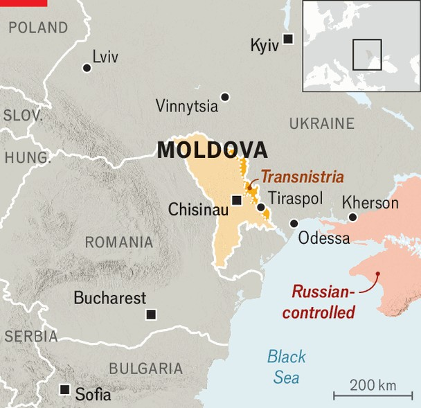

Europe | Bad news for Putin
Moldova defies Russia by re-electing its pro- European government
Russian election subversion fails to beat President Maia Sandu’s party
October 2nd 2025

THE KREMLIN spent tens of millions of dollars trying to subvert the elections held on September 28th in Moldova, a former Soviet republic of 2.4m people squeezed between Ukraine and Romania. Russia-friendly opposition parties promised cheap Russian gas and stoked fears that NATO would drag the country into a war with the country that long ruled it, or that the European Union would force it to recognise same-sex marriages. But in the end, the fear of being subjugated to Russia and of losing European support won Moldova’s ruling Party of Action and Solidarity (PAS), led by President Maia Sandu, a slim majority in parliament.

PAS, which promises to take Moldova into the EU as soon as 2028 (though that will be up to the bloc’s members), won 50.2% of the votes. It was aided by voters in the diaspora, most of them working in EU countries. The Patriotic Bloc, a Russia-friendly coalition of left-wing parties, got 24.2%. (Three smaller opposition parties also made it over the 5% threshold.) The result gives PAS enough seats to form a new government, but the country remains polarised and economically weak.

The result was probably less a sign of approval for the ruling party’s policies than of fear of losing the country’s independence to Russia. Moldova is one of the poorest countries in Europe. Its economy has been stagnant since it emerged from covid-19. Inflation is running at over 7% year on year and the annual trade deficit amounts to $4bn, or 20% of GDP. But it was geopolitics, rather than the economy, that dominated the campaign.

Moldova became a vital frontier in the contest between Russia and Europe after Vladimir Putin’s full-scale invasion of Ukraine in February 2022. In June of that year the EU granted both Moldova and Ukraine candidate status, and started accession negotiations two years later.

The war in Ukraine also made Moldova much more important to Russia. According to Moldova’s government, the Kremlin spent $200m—the

equivalent of 1% of Moldova’s annual GDP—on disinformation and bribing voters. On election day, bomb scares were reported at polling stations for expatriates in Italy, Romania, Spain and America. One of Russia’s banks is said by the government to have been opening accounts and transferring money to Moldovans in pro-Russian parts of the country.

But the charges go both ways. The opposition accuses the government of fearmongering and undermining the democratic process. The accusations are not baseless. The government shut down opposition television channels without court authorisation. It portrayed its political opponents as traitors and Russian stooges, and withheld economic statistics during the campaign. Residents of Transnistria, a breakaway pro-Russian enclave that hosts no polling stations for Moldovan elections, normally vote in neighbouring regions. But Moldovan authorities slashed the number of voting locations for Transnistrians by more than half. On election day they closed several bridges connecting Transnistria to Moldova proper, causing traffic queues that hampered them. ■

To stay on top of the biggest European stories, sign up to Café Europa, our weekly subscriber-only newsletter.

This article was downloaded by zlibrary from https://www.economist.com//europe/2025/09/29/moldova-defies-russia-by-re-electing- its-pro-european-government