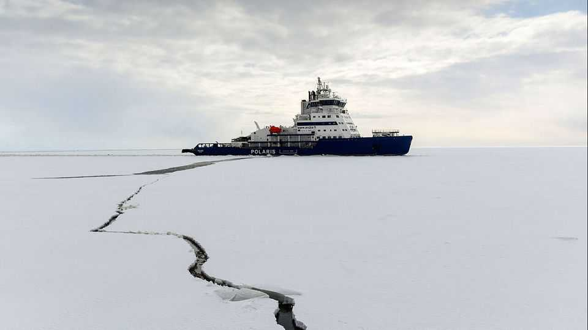
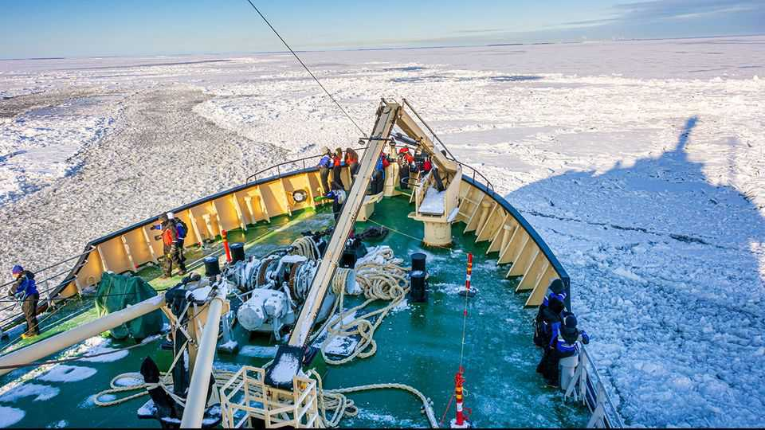

Europe | Cracking stuff
The chilling exception to Trumpian protectionism
Finland has something special that America wants
October 2nd 2025

IN A BOXY building near the docks of Helsinki, Finnish engineers are testing icebreaker designs. At the rim of a giant ice tank your correspondent shivers. A siren blares. A model ship, three metres long, surges forwards, splitting a sheet of ice with its orange bow. “Ice is a kind of mystery,” says Jari Hurttia of Aker Arctic, Finland’s leading designer of icebreakers. Yet the Finns have just about solved it. The country’s firms have designed four-fifths and built more than half of the world’s icebreakers. As competition over the Arctic grows, America’s president is taking notice. In June Donald Trump said he was negotiating with Finland to buy 15 of the vessels. He has previously mused about acquiring 40 “big ones”. To counter Russia and China in the high north,

America must expand its icebreaker fleet. To do it quickly, it will need Finland’s help.

Necessity bred Finnish expertise. As the only country whose ports can all freeze in winter, Finland needs icebreakers to keep the Baltic Sea open. Since building Sisu, its first diesel-electric icebreaker, in the 1930s, it has developed a domestic supply-chain stretching from design firms to shipyards. Throughout its period of non-alignment during the cold war, Finland honed its industry building icebreakers for Russia. That trade ended in 2022, after the Kremlin’s full-scale invasion of Ukraine. Finland joined NATO the following year. Now its shipyards want Western buyers.

The country’s industry is tight-knit. That has helped it carve out a niche. Icebreakers need thick hulls, powerful engines and complicated vibration- control and ice-proofing systems to survive extreme conditions. Most are made to order, meaning they are ill-suited to being built in the large production runs common in the giant shipyards of East Asia. Baltika, a rescue ship completed for Russia in 2014, has an asymmetrical hull that lets it sail sideways, carving a 50-metre path through the ice. Other designs serve as bulk carriers, oil tankers or support ships.

The contrast with America is stark. Its coastguard, part of the armed forces, says it needs around ten polar icebreakers. It has three. The last that America’s government had built for the coastguard, Healy, was finished in 1997. A plan to build new ones is delayed and its budget has ballooned. Its first ship, originally due in 2024, will not arrive before 2029 and will cost $1.9bn. Polaris, Finland’s newest icebreaker, was built in three years for €125m ($147m). It is a smaller ship than America wants. Still, it is proof of Finland’s ability to build icebreakers quickly, at low cost.

Talk of America’s “icebreaker gap” with Russia—which has around 50 polar icebreakers, including nuclear-powered behemoths—is overdone. Russia’s long northern coast and over 2m Arctic residents mean it will always need more than America. The real worry is the gap between the capabilities of America’s coastguard and the role it must play in Arctic security. Russia and China are vying for the Arctic, and northern shipping routes are growing busier. “America managed to get by without enough icebreakers because there were so few ships going through the Bering Strait,” says Peter Rybski, a former naval attaché at America’s embassy in Helsinki. “But that is changing fast.” In August two Chinese icebreakers sailed over an area of American-claimed seabed off Alaska. The coastguard sent Healy to monitor them. Such provocations could become more common.

To plug the gap, America is looking to Finland. Mr Trump first floated the idea of buying its ships in his first term. In 2024 the Biden administration signed an agreement with Canada and Finland, named the ICE Pact, to expand capacity. In August the Helsinki shipyard began work on the first ship under the scheme, an icebreaker for Canada named Polar Max. Finnish shipbuilders have drawn up designs for America’s coastguard and are eager for the Trump administration to commission them. Finland’s government is hopeful, too. “We have a lot of capacity to deliver these vessels,” says Pasi Rajala, Finland’s deputy foreign minister. “It is in our interest that our allies have Arctic capabilities.”

Mr Rybski thinks Finnish shipyards could deliver for America this decade. But obstacles loom. One is opposition from American shipyards, which look to the president as their defender. Procurement laws that require military vessels to be built in America are another, though these can be waived for national-security reasons. That Mr Trump seems willing to look past his protectionist instincts suggests he has registered the urgency of expanding the coastguard’s Arctic fleet. ■

To stay on top of the biggest European stories, sign up to Café Europa, our weekly subscriber-only newsletter.

This article was downloaded by zlibrary from https://www.economist.com//europe/2025/10/02/the-chilling-exception-to-trumpian- protectionism