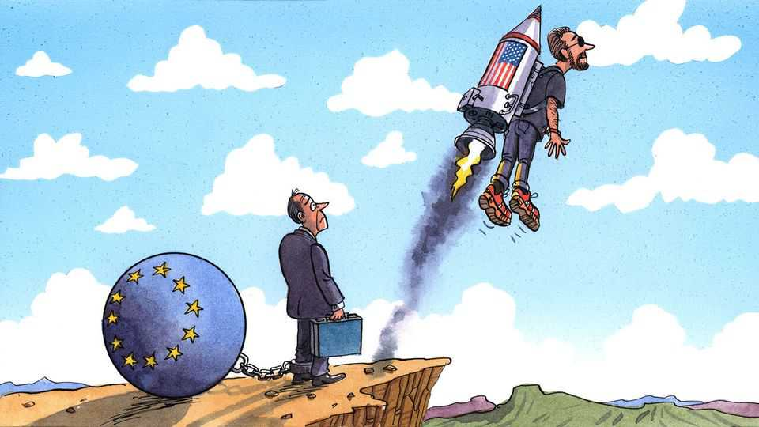

Europe | Charlemagne
How Europe crushes innovation
Labour rules devised in the 20th century are hobbling Europe in the 21st
October 2nd 2025

There are two ways for Western companies to sack lots of people. The American one involves the boss inviting hundreds of unsuspecting employees on a Zoom call, offering them a few months’ wages as severance and insincerely wishing them luck in their future endeavours (oh, and to have their desk cleared by lunchtime). The European method is more circuitous. Companies wanting to enact mass lay-offs typically start with consultations with unions, representatives of which sit on companies’ boards in Germany. A plan social is drafted. Strikes inevitably ensue. Politicians get involved, and badger the employer into firing fewer people than it had originally planned, or to pay for its soon-to-be-ex staff to be retrained. The full cost of downsizing is only known once labour courts are called to rule

on the matter, years later. Meanwhile the company in question often cannot hire more employees lest it be made to hire those who were just let go.

The European system may feel kinder. In fact, the cumbersome process for letting go workers comes with hidden costs. It is not just that the expense and hassle of occasionally firing employees weighs on firms’ long-term profitability. Rather, the sheer difficulty of shedding staff en masse—a reality of corporate life—steers Europe’s biggest companies away from making risky bets in innovative fields. In particular, investments in disruptive breakthroughs (think of the kinds of whizzy products that mostly come out of Silicon Valley, from artificial-intelligence models to driverless cars) require the ability for big companies to hire lots of staff, then later fire most of them if the projects don’t pan out. High restructuring costs in Europe make such investments unviable—with a catastrophic knock-on impact on the continent’s economy.

“When firing is costly, as it is in most of Europe, employers are reluctant to invest in risky ventures,” says Olivier Coste, a former EU official turned tech entrepreneur. Alongside Yann Coatanlem, another entrepreneur and economist, they have tracked the (often opaque) costs of corporate restructurings. An American firm shedding workers will incur costs equivalent to paying those sacked for seven months and be done with it. In Germany costs amount to 31 months of wages for each employee let go; in France 38 months. Beyond severance pay and sops to keep unions happy, the biggest expense is firms keeping unproductive workers on their books they would rather be rid of. New investments are delayed for years as dismissed employees are gradually replaced. American firms quickly pivot to new moon-shot opportunities; Europeans ones are stuck in the same old mire as they haggle with unions, due often to laws devised nearly a century ago.

Large restructuring costs skew the kinds of investments that executives in America and Europe might make. Take a large company financing ten risky projects. Even at well-run firms, typically eight of them will fail, Mr Coste says, resulting in large redundancies (Apple tried for years to develop a self- driving car, for example, but fired 600 employees when it gave up last year). The remaining two projects will generate profits worth many times the invested sums. When the cost of failure is low, as in America, that is a handsome bet for any firm. If sacking workers is expensive, as in Europe, it

is simply not worth it. The effect can be seen on the continent’s corporate landscape. Many of Europe’s blue-chip firms sell products that are essentially improved versions of what they were selling in the 20th century, whether that be turbines, shampoos, vaccines or jetliners. In contrast America’s star firms peddle AI chatbots, cloud computers and reusable rockets.

For decades Europe did fine with its incremental-but-likely-to-pay-off innovation model. Century-old firms show there is still money to be made in developing a slightly better tyre or a faster train. But in recent years the rewards flowing to companies making bold bets have ballooned. Tech firms that pursued disruptive innovation have turned into trillion-dollar behemoths. None of them is in Europe. Nvidia, an American chipmaker, is worth more than the European Union’s 20 biggest listed firms combined. Some of that may be a bubble whose popping may splatter American business. But lacking companies in such superstar sectors is one reason why output per hour worked by Europeans has slumped in comparison with America in recent decades.

European businesses face a multitude of problems. Smothering regulations, expensive energy, high taxes and a fragmented single market are all known hindrances. Yet few think labour-market legislation is much of an issue. For why would successful companies, if they could be fostered in Europe, ever need to downsize? And yet they do. Microsoft, Google and Meta have all sacked over 10,000 staff in one fell swoop in recent years, despite doing roaring business. Satya Nadella, the boss of Microsoft, said firing people even as his company was thriving was the “enigma of success”. Try telling European politicians that. When Bosch and Volkswagen, two German industrial titans, recently announced their own lay-offs, the timelines stretched to 2030.

Europeans are attached to their cuddlier form of capitalism. Being somewhat poorer than America but with fewer working hours and more job security is part of the continental social compact. But tweaks to European employment rules could foster innovation while preserving valued rights. Messrs Coste and Coatanlem suggest Europe’s best-paid workers—often tech types who need little social protection anyway—should be as easy to fire as in America. Scandinavian countries have made it easier for firms to sack

workers while still ensuring generous unemployment benefits. The trick is to balance the need for social welfare with the existential imperative for innovation. Job security was once Europe’s comfort blanket. It now feels more like a straitjacket. ■

Subscribers to The Economist can sign up to our Opinion newsletter, which brings together the best of our leaders, columns, guest essays and reader correspondence.

This article was downloaded by zlibrary from [https://www.economist.com//europe/2025/10/02/how-europe-crushes-innovation](https://www.economist.com//europe/2025/10/02/how-europe-crushes-innovation)

Britain

Sir Keir Starmer declares a battle for the soul of Britain British men are driving less, and a culture is vanishing Britain’s strict new curbs on junk-food marketing The gold of County Tyrone shows Britain’s barriers to development Britain is trying to create a digital identity system, again A $2bn AI unicorn tests London’s nerve Labour has decided to stop punching its own voters