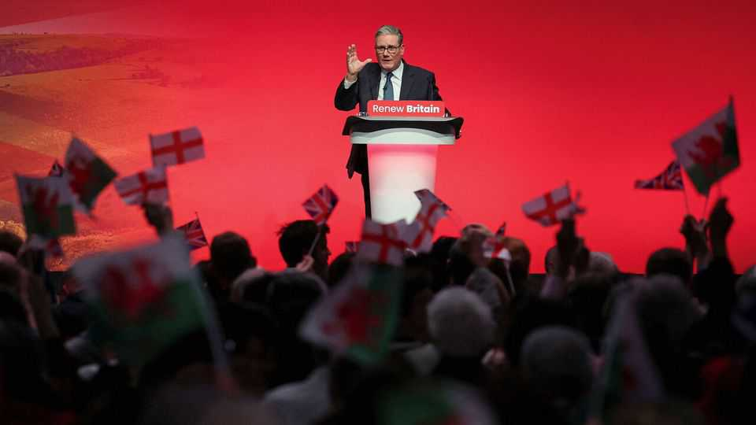
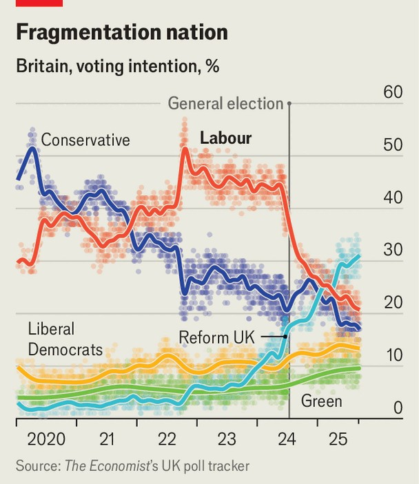

Britain | Starmer’s Macron strategy
Sir Keir Starmer declares a battle for the soul of Britain
The Labour Party takes aim at Nigel Farage and Reform UK
October 2nd 2025

BRITAIN’S NEXT general election may have something of a French feel to it. The Labour Party, Sir Keir Starmer told its conference in Liverpool on September 30th, was locked in a “fight for the soul of the country”. In the summer, thugs had twisted the Union flag into a symbol of intimidation, he said. Nigel Farage, the leader of Reform UK, a populist right-wing party, has promised to end “indefinite leave to remain” for immigrants with retroactive effect; Sir Keir termed it a racist scheme that would result in people’s neighbours being deported. It would take patriots of left and right, even those who did not share Labour’s worldview, to rally to the defence of their beautiful, tolerant, diverse country, he said. “In the end, we really are all in it together,” the Labour leader declared.

It was, by the prime minister’s pedestrian standards, rousing. It was also an act of political artifice. Sir Keir wants Britons to confront an urgent, binary choice: between him or Mr Farage. Voters don’t see it that way. The electorate has fragmented: support is split between more competitive parties than ever in the modern era. And although Reform now leads in the polls, at 31%, according to our tracker (see chart), there is a long way to go: the next general election need not be held until the summer of 2029.

Still, to have a hope of defeating Mr Farage, Sir Keir calculates that he must build him up. In Liverpool, some Labour-watchers dubbed it the “Macron strategy”. In 2017 and again in 2022, the centrist Emmanuel Macron beat Marine Le Pen, the candidate of the hard right, to the French presidency by drawing in the votes of those on the left and centre-right who disliked him but found her intolerable.

Mr Macron characterised the contest in 2022 as a referendum on the character of France and a fight between progressive liberalism and racist extremism. He was assisted by France’s two-round voting system, which mechanistically forces a choice between two candidates in the second-round run-off. Sir Keir is attempting to conjure up something similar through the force of argument.

His party’s conference revealed a head-spinning change of strategy. A month ago Sir Keir would have winced at lofty soul-of-the-nation talk, and referred to Mr Farage’s plans merely as “unworkable”. He won in 2024 by targeting, in joyless and austere terms, a tranche of Brexit-leaning working-class swing voters dubbed “hero voters”. The assumption was that the progressive urbanites who make up the party’s base would stay loyal no matter how much they were disdained.

Yet that strategy has collapsed: since the election, Labour has bled support in greater numbers to the Liberal Democrats and the Greens on the left than to Reform. Advisers who once preached an ultra-targeted strategy now talk of mobilising voters of all stripes to make Labour’s coalition as broad as possible.

“This week has definitely been a shift,” said Rachel Reeves, the chancellor, who had discussed Labour’s predicament over the summer with the prime minister. “I think our people want to hear us call it out and take [Mr Farage] on.”

Sir Keir feels “liberated” by the fight with Reform, says Tom Baldwin, his biographer. “The handbrake has been taken off.” The contest, says Parth Patel of the Institute for Public Policy Research, a left-leaning think-tank, is now between two ideas of the British nation: one civic, which newcomers can join if they contribute, and a narrower project built along ethnic lines.

A Macron strategy may bolster Labour’s otherwise grim prospects, says Luke Tryl of More in Common, a pollster. Current polling would see Labour cut from its tally of 411 seats in 2024 to just 90, according to the pollster’s modelling, while Reform would surge from five MPs to a governing majority with 373 seats. However, when told it is a close contest between Labour and Reform in local races, left-wing voters swing behind Sir Keir— giving Labour a notional tally of 196 seats.

Mr Farage has probably overreached. Whereas 44% of Britons support ending indefinite leave to remain, only 6% would support the deportation of someone who had spent a decade in Britain. Voters like Farageism more in theory than in practice.

But that may not be enough to save Labour, for three main reasons. First, most Labour MPs think that to halt the populist right they must lavish money on public services. That looks unlikely. Rising borrowing costs, an unreformed welfare system and a downgrade in Britain’s long-term growth prospects mean that Ms Reeves will need to cut spending or raise taxes by around 1% of gdp in the budget on November 26th to stay within her self- imposed fiscal rules. The gulf between rhetoric and reality is brutal: in Liverpool, Ms Reeves promised “nothing less than the abolition of long- term youth unemployment” via a work scheme that must be funded from existing budgets.

Second, appeals to values have limits. Matthew Doyle, who used to advise Sir Keir, thinks his former boss got the balance right but notes a warning from America’s presidential election. Kamala Harris urged Americans to save democracy; the public cared most about grocery prices and immigration. “Voters pick the issues,” he says. “You can add, but you can never replace.”

The third, and perhaps biggest, problem is Sir Keir himself. Mr Macron’s movement redrew French politics, consolidated the centre and saw off Ms Le Pen twice, even if his popularity has waned. Sir Keir is no Macron. That it has taken him weeks to find the words to respond to the summer’s disorder is proof of the problem.

The prime minister now has the lowest satisfaction ratings of any leader since 1977, according to Ipsos, a pollster. And his speech to the conference delighted many MPs but alarmed others. It sounded, said some who fear losing their seats to Reform, rather too much as if Sir Keir was calling their constituents racist, and a sign that the party was retreating once more to its progressive comfort zone. Perhaps Sir Keir’s Macron gambit may prove to be a masterstroke, by a prime minister with a record of ruthless self- reinventions. More likely, it will resemble a spasm by a party in crisis, unsure of what best to say or who its supporters are, and grasping for a strategy to rescue its faltering fortunes. ■

Correction (October 1st 2025): an earlier version of this article incorrectly stated the level by which Rachel Reeves would need to cut spending or raise taxes to stay within her fiscal rules. Sorry.

For more expert analysis of the biggest stories in Britain, sign up to Blighty, our weekly subscriber-only newsletter.

This article was downloaded by zlibrary from https://www.economist.com//britain/2025/10/01/sir-keir-starmer-declares-a-battle- for-the-soul-of-britain