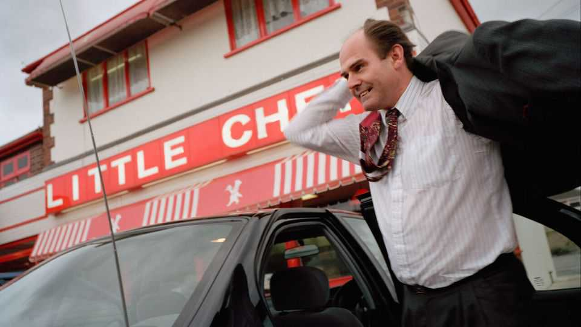
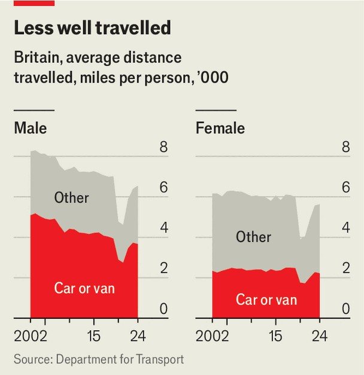
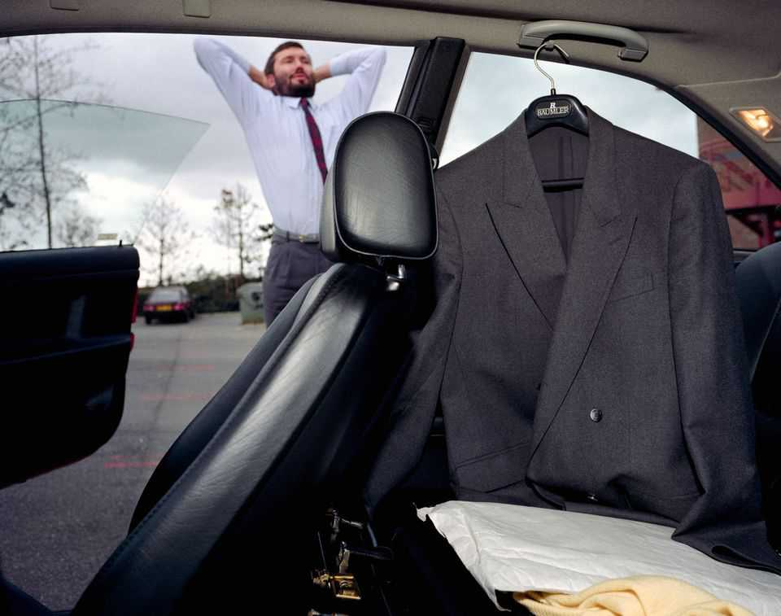
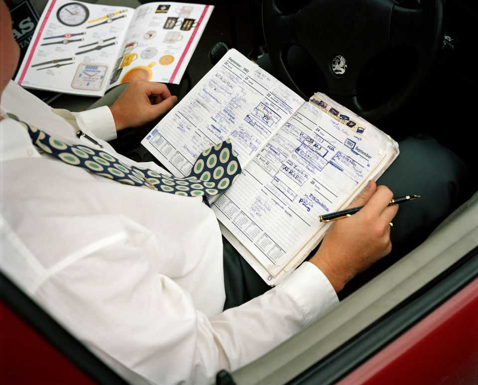

Britain | Peak car
British men are driving less, and a culture is vanishing
Farewell to the road warriors
October 2nd 2025

Vic wilcox has lazy colleagues, a crabby father and an unromantic, arm’s- length marriage. On the bright side, he has a Jaguar. The protagonist of David Lodge’s 1988 novel “Nice Work” invariably drives to his job as head of an engineering firm in the West Midlands. He thinks nothing of driving hundreds of miles for a meeting. He is happiest when behind the wheel. The novel is a dispatch from a vanishing world. The National Travel Survey, which tracks journeys in England, shows that people are travelling less far than they did two decades ago (see chart). That reverses a long trend. David Metz of University College London points out that travel distances grew

strongly in the late 20th century. He thinks the growth began two centuries ago, with the introduction of passenger-railway services.

Wilcox and his ilk are driving the change. The average man travelled 8,245 miles in 2002 and 6,549 miles in 2024—a drop of 21%. Almost the entire fall was caused by a decline in driving. Women travelled 5,633 miles in 2024, 9% fewer than in 2002. Men and women alike are commuting less far and travelling less far for shopping than they used to. But few things have fallen as much as men travelling for work. That is down by 45%.

“I used to do 30,000 or 35,000 miles a year,” says Cliff Jackson of the Professional Sales Association, who has spent much of his life selling engineering products. In the 1980s and 1990s he and other salesmen slogged up and down Britain’s motorways, meeting clients and occasionally ringing the office from pay phones. “You were a free bird,” he says, a little ruefully.

That “road-warrior” lifestyle, as Clive Wratten of the Business Travel Association calls it, has disappeared for several reasons. The tax authorities cracked down on company cars. The growth of the internet and video- conferencing has made routine sales trips unnecessary. Companies and public-sector organisations have nudged workers to use public transport.

The consequences can be seen on the roads. Data from the Department for Transport show that in 2024 Britain’s motorways contained fewer cars on Mondays, Tuesdays, Wednesdays or Thursdays than they did on Saturdays or Sundays (Friday was the busiest day). Or look at a suburban street, where many cars seldom move. The rac Foundation, a research group, reports that the average new car is driven 8,460 miles a year, down from 9,648 in 2015.

An entire road-based culture has all but disappeared. It is preserved in novels and in a superb bbc documentary, released in 1993 and easily found online. “Over the Moon With the Cavalier” consists of interviews with corporate managers, all men, who talk about their cars while driving. They describe a rigid hierarchy, expressed by the model numbers displayed on the backs of cars. One explains that the letter “i”, which is supposed to stand for “fuel injection”, actually means “important”.

Mr Wratten, who represents people who travel for work, does not mourn the road warriors. He thinks that travel has become more purposeful, and the better for it. Companies have become more concerned about the health and happiness of their employees, and that concern extends to travel. Mr Wratten notes that firms increasingly tolerate or even encourage staff to take their partners on business trips. Vic Wilcox would be horrified. ■

For more expert analysis of the biggest stories in Britain, sign up to Blighty, our weekly subscriber-only newsletter.

This article was downloaded by zlibrary from https://www.economist.com//britain/2025/09/27/british-men-are-driving-less-and-a- culture-is-vanishing