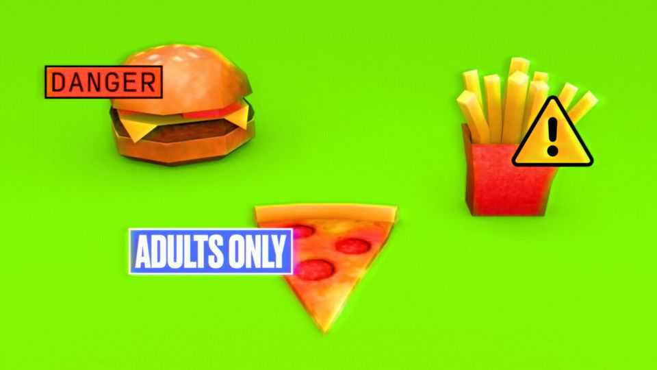

Britain | Fighting flab
Britain’s strict new curbs on junk-food marketing
Will they work?
October 2nd 2025

“Fancy a McMuffin in the morning? McNuggets for lunch? Or a big night in with a Big Mac? Get them delivered right here.” Ads like this, served on social media just when you are getting hungry, have made fast food a click away. Offline, too, temptation and convenience help peddle junk food. New restrictions on food marketing in Britain aim to change that. From October 1st thousands of unhealthy foods and drinks can no longer be advertised online and before 9pm on television. (The ban, the most sweeping of its kind in the world, will officially come into force in January, but the food sector has agreed to comply earlier.) Big supermarkets are banned from selling such stuff using volume-based promotions such as “Buy one, get one

free”. “If you have two packs of biscuits at home you probably go through them a bit quicker,” says Hugo Harper of Nesta, a think-tank.

The restrictions apply to food designated as high in saturated fat, salt and sugar (or HFSS). More than 20% of food-and-drink purchases in British supermarkets are HFSS. Online, 60% of food-and-drink ads have been for HFSS items.

Going after these could, in theory, make a big difference. According to Nesta, obesity in Britain could drop by half if everyone who is overweight cut their daily calories by 8.5% for more than two years. Such sustained calorie reductions are feasible if they involve subtle changes in several things a person eats, says Mr Harper. The idea is to avoid removing the joy from food. Marginal changes in around a quarter of the items in a typical shopping basket could do the trick: slightly smaller packs of desserts, say, and lower-fat versions of products. Some of these tweaks require product reformulations by food companies; others are changes in consumers’ choices that can be steered by marketing.

Food companies have already tweaked lots of HFSS products to shield them from the marketing restrictions. It is a “health by stealth” approach, says Lauren Woodley, the chief nutritionist of Nomad Foods, a frozen-food firm. A pepperoni pizza that is not HFSS is still a greasy pepperoni pizza, but the sauce may have less sugar, the cheese a bit less fat and the base some extra fibre (which makes stomachs feel fuller, so people may eat smaller portions).

Since 2022 big supermarkets have been banned from putting HFSS products near entrances, checkouts and aisle-ends. According to data from three big supermarket chains, the share of packaged HFSS items in total products sold fell by about 7%. Whether that moved the needle on health is unclear. KitKats disappeared from checkout lanes but racks of freshly baked doughnuts and flapjacks appeared near entrances (exempt from the ban because they are not pre-packaged).

What might workarounds for online ads look like? Brands can still be advertised, as long as HFSS products are not shown. That opens the door for all sorts of gimmicks. Moreover the process of investigating potential advertising transgressions is long, and typically ends with food companies

simply agreeing to take down an offending ad. Making regulations work, like sticking to a healthy diet, is not easy.■

For more expert analysis of the biggest stories in Britain, sign up to Blighty, our weekly subscriber-only newsletter.

This article was downloaded by zlibrary from https://www.economist.com//britain/2025/09/29/britains-strict-new-curbs-on-junk- food-marketing