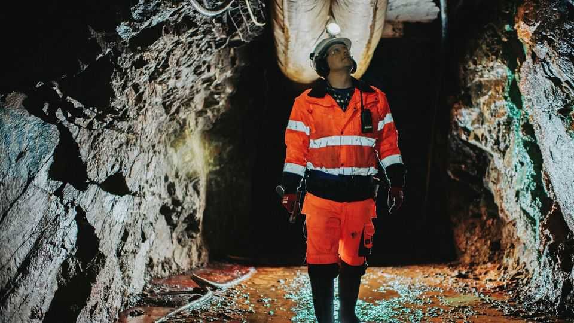
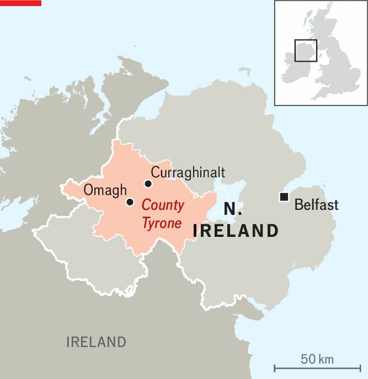
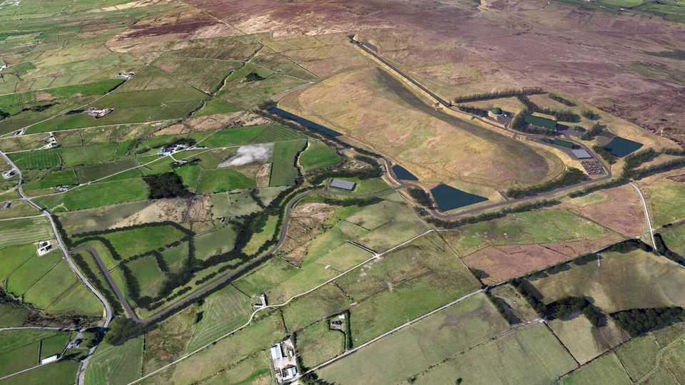

Britain | Bogged down
The gold of County Tyrone shows Britain’s barriers to development
Despite the central government’s wish to get digging, a potentially lucrative gold mine remains stuck
October 2nd 2025

In the walls, floor and ceilings of squelching tunnels deep beneath a hill in County Tyrone lie minerals that may be worth more than $20bn (£15bn). The hoard is mostly gold and silver but also antimony, bismuth, cobalt, copper and tellurium. Such are the riches that developers claim could be unearthed at Curraghinalt in rural Northern Ireland. Yet the plan to extract them is so bogged down in government bureaucracy that the mine may never produce an ounce of gold. The British government’s critical-minerals strategy recognises that the economy relies on minerals typically mined in far-off lands in often dubious

conditions. China’s huge role alarms Western policymakers. Britain’s strategy promises support, financial backing and even subsidised electricity to restart domestic production.

The strategy was published three years ago. At the time those behind the Northern Irish mine proposal had been waiting five years for a planning decision. They have now been waiting eight years, and still do not know when an answer will come.

Since starting exploratory work at the site in 2009 Dalradian Gold, an American-owned company, has spent £250m on the project. Its managing director, Brian Kelly, says it expected planning permission to take no more than two years. Instead, environmental opposition, disquiet from the local council and bungling by Northern Ireland’s devolved government in Belfast have combined to stall progress. Dalradian’s ultimate owner is an American investment fund, Orion Resource Partners. Mr Kelly says Orion has built more than 80 mines in 50 countries but “this is by far and away the worst experience they’ve had.”

The developers underestimated local opposition. A plan to use cyanide to process gold has now been ditched after a ferocious backlash. But many locals remain vehemently opposed to a major industrial operation in what is

an Area of Outstanding Natural Beauty. Foes have set up a camp near the site and posters around the area proclaim the company unwelcome.

Dalradian says the deposits it has identified make it one of the world’s highest-grade undeveloped gold reserves. Beside vein V75 far beneath the boggy earth, a geologist’s sign fixed to the tunnel wall records that it contains 234 grams of gold per tonne of rock. Mr Kelly says that typically as little as a gram or half a gram a tonne would be worth the effort. At V75, Mr Kelly says, one cubic metre of rock would yield up to $100,000-worth of gold.

Adrian Boyce, a geochemist at the University of Glasgow, says Curraghinalt is “far and away the biggest” gold deposit ever found in the UK. Gold has quadrupled in value since Dalradian arrived at the site: this week the price reached a new record of more than $3,800 per troy ounce. The company’s gamble has not yet paid off, but the jackpot is even more enticing.

Curraghinalt illustrates how the fragmentation of power in Britain means that what the national government wants can be almost irrelevant to what actually happens. The critical-minerals strategy promises to “reduce barriers to domestic exploration and extraction”. But in Northern Ireland it has no power to do so. It has devolved control over mining to the power-sharing

government in Belfast, whose incompetence is surpassed only by its indecisiveness. And that body has to grapple with the local council to which it has in turn devolved many planning powers and over which it has almost no control.

This sharing out of power could in theory be healthy, preventing a single point of failure or one individual who could be bribed. In practice it has created multiple points of failure and become a structural impediment to rapid decision-making.

Devolution is not the only modern shackle on the power of a prime minister, but it is a particularly immovable one. Giving Scotland, Wales and Northern Ireland their own legislatures and governments has cross-party support, and the trend is towards more power shifting to the regions. Curraghinalt’s gold may yet be extracted. If so, it will be despite rather than because of how Britain is governed.■

For more expert analysis of the biggest stories in Britain, sign up to Blighty, our weekly subscriber-only newsletter.

This article was downloaded by zlibrary from https://www.economist.com//britain/2025/09/30/the-gold-of-county-tyrone-shows- britains-barriers-to-development