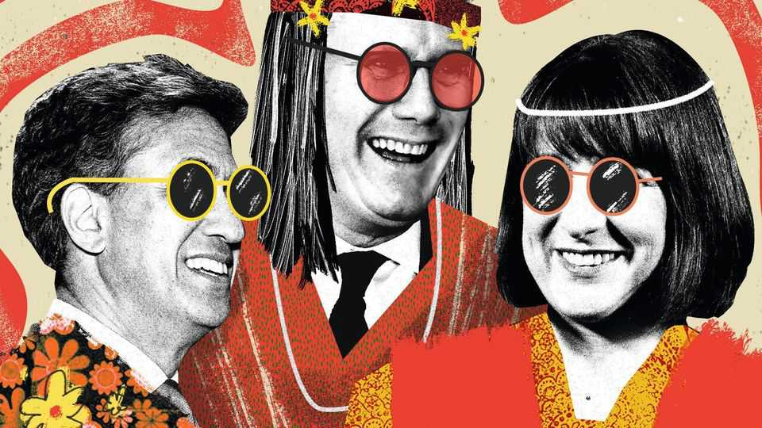

Britain | Bagehot
Labour has decided to stop punching its own voters
Sir Keir Starmer has embraced peace and love of the party’s hippy base
October 2nd 2025

Holding a Palestine flag above his head, a bald, bearded protester in a suit began shouting at Rachel Reeves, the chancellor, as she spoke at Labour’s annual conference in Liverpool. “After two years of genocide, mass starvation of Palestinians”, he bellowed, before Ms Reeves cut him off. When something similar happened in 2024 during Sir Keir Starmer’s speech, the heckler was manhandled out of the conference hall while the prime minister berated him as an out-of-touch hippy, divorced from the wants and needs of real Britain. This year, Ms Reeves took a different approach: the chancellor more or less agreed with him. “We understand your cause,” replied Ms Reeves, “and we are recognising a Palestinian state.”

A funny thing has overcome the Labour Party’s leadership: it has decided to stop attacking its own supporters. It is a remarkable shift. Since 2020 the leadership has enthusiastically punched anything even vaguely left-wing. Sir Keir sought to exorcise memories of Jeremy Corbyn, his lefty predecessor who crashed at the 2019 general election. Palestine-flag-wavers, Remainers, child-poverty campaigners—anyone with what were once considered bog- standard progressive views was whacked. That policy, dubbed hippy- punching, helped lead the party to an enormous majority at the last general election. But now, after a miserable first year in power, hippy-hugging is in vogue.

When not agreeing with Palestine protesters, Ms Reeves ticked off the left- wing things the government has done in office. She boasted about public spending and state intervention. Steel plants? Quasi-nationalised. A loan for cyber-stricken Jaguar Land Rover? Guaranteed. It was a stark contrast to when the chancellor took office and any largesse was a dirty secret. A £9bn ($12bn) pay rise for doctors and nurses was described as a black hole left by reckless Tories, rather than a message that Labour would support nhs heroes. Psst. Here is a pay rise. Don’t tell anyone.

Hippies who had previously been battered are now held tight. Labour kicked out seven mps after they backed an amendment calling for the government to scrap its two-child benefit cap, which keeps about 300,000 children in poverty. Today all but one are back in the fold and the government is briefing that the cap is to go. The hippies won. Ed Miliband, the lefty environment secretary, called for activists to protest at fracking sites. Hippies are being recruited on the sites where they were once beaten to a pulp.

Labour’s fists are aimed elsewhere. Until now, Labour has attempted to accommodate rather than fight Nigel Farage’s Reform UK. Critics summed up the strategy: Reform is right—do not vote for it. No more. Sir Keir, apparently improvising, labelled Reform’s immigration policy “racist”. The R-word is a potent one in British politics. No one likes being called a racist. Even racists. Hippies, however, have always been happy to use it. When the prime minister doubled down on his accidental intervention in his conference speech, the hall of hippies cheered.

Another R-word—“Remainer”—was almost a slur among the Labour Party leadership, even though eight out of ten Labour voters support returning to the European Union. A majority position in Britain was dismissed as a metropolitan affectation. Now the prime minister rages against the “lies on the side of that bus” like any other 60-something radicalised by Britain’s exit from the EU. The small boats crossing the channel? Would not have happened had Britain stayed party to the EU’s deportation agreements. Those are “Farage boats”, says the prime minister, caused by blimmin’ Brexit.

How come Labour’s leaders have embraced peace and love of its hippy base? They have little choice. Labour’s polling ranges from poor to apocalyptic. The party has lost support to its left rather than to its right. Hippies, tired of being punched, left the party. For each departure to Reform, two voters left for the Greens or the Liberal Democrats. Come 2029, Sir Keir is more likely to be writing his political memoirs than Labour’s election manifesto.

Internal politics play a part. If there is a leadership contest, then Labour members—that army of union officials, retired teachers and slightly odd students—will probably pick the next prime minister. And so any ambitious cabinet minister with half a brain spent the conference arguing that Angela Rayner, the recently departed left-wing deputy prime minister, was a good thing while Donald Trump was a bad one.

A number of departures from Downing Street mean that the most enthusiastic hippy-punchers have left government. For these self-styled hard men and women—dubbed “goons” by one of their colleagues—such violence was a virtue. Partly it was politics, partly it was pleasure. In a time of political flux, there will always be debate about who is the true enemy of Labour. Is it Reform? Is it the Conservative Party? For the goons, the answer was easy: Labour members who voted for Mr Miliband in the 2010 leadership contest. The Labour Party is a place where memories are long and perspective is absent.

Sir Keir is a cynical man, not a stupid one. He was happy to be moulded by goons if it resulted in power, which it did. Attacking his own supporters was a strategy that the competitive prime minister was willing to follow to win.

But that same strategy had now put him on the path to defeat, and so he ditched it.

By accident, this cynicism has led him to sincerity. Sir Keir, the politician, is belatedly trying to create a Labour Party that Keir Starmer, a Remain-voting social-democrat human-rights lawyer from north London, would support. He is not so different from the plain old progressives he once beat up. Often, when Sir Keir was hippy-punching, he was punching a mirror. ■

Subscribers to The Economist can sign up to our Opinion newsletter, which brings together the best of our leaders, columns, guest essays and reader correspondence.

This article was downloaded by zlibrary from https://www.economist.com//britain/2025/10/01/labour-has-decided-to-stop-punching- its-own-voters

International

The flashing red threat from Russia’s dark fleet Can the West survive an age of brinkmanship?